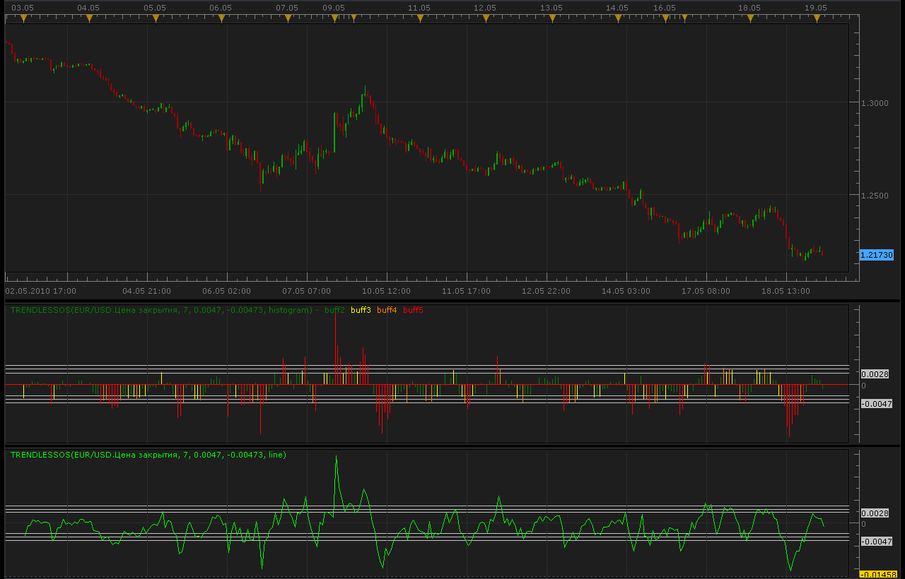

# Trendless OS oscillator

> Source: https://fxcodebase.com/code/viewtopic.php?f=17&t=1057  
> Forum: 17 · Topic 1057 · 5 post(s)

---

## Trendless OS oscillator

**Alexander.Gettinger** · Wed May 19, 2010 1:14 am

DiNapoli indicator with colored histogram.

 

 [TrendlessOS.lua](files/2003/TrendlessOS.lua)

 [TrendlessOS with Alert.lua](files/2003/TrendlessOS%20with%20Alert.lua)

Compatibility issue fixed.
_Alert Helper is not longer needed.

---

## Re: Trendless OS oscillator

**Coondawg71** · Fri Apr 03, 2015 4:33 am

Can we please request Alert function capabilities added to the Trendless OS oscillator.

Alert on each buffer breach would be ideal.

Thanks!!!

sjc

---

## Re: Trendless OS oscillator

**Apprentice** · Fri Apr 03, 2015 7:03 am

TrendlessOS with Alert.lua Added.

---

## Re: Trendless OS oscillator

**Apprentice** · Sun Dec 06, 2015 5:10 am

Compatibility issue fixed.
_Alert Helper is not longer needed.

---

## Re: Trendless OS oscillator

**Apprentice** · Mon Oct 29, 2018 7:01 am

The indicator was revised and updated.
