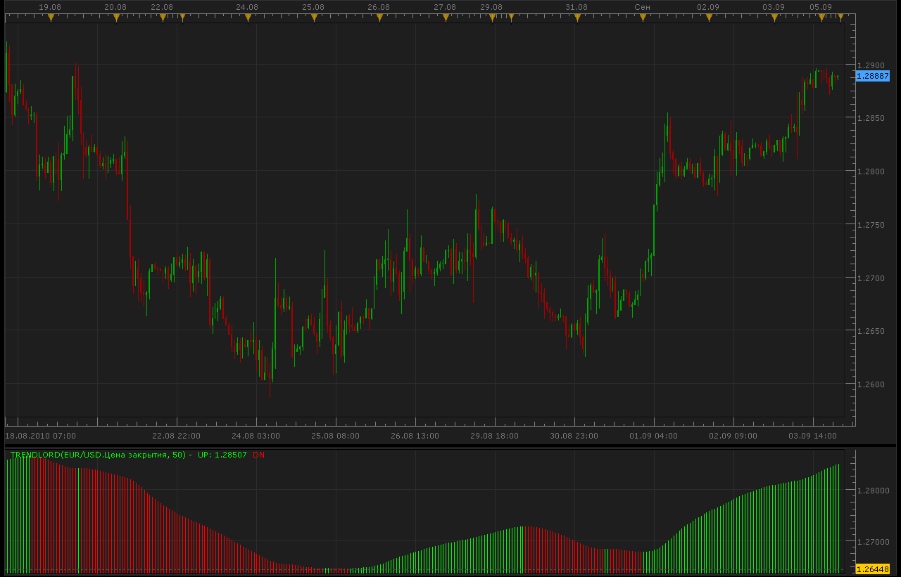
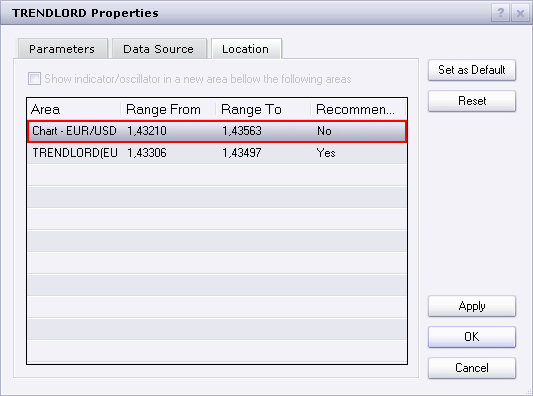
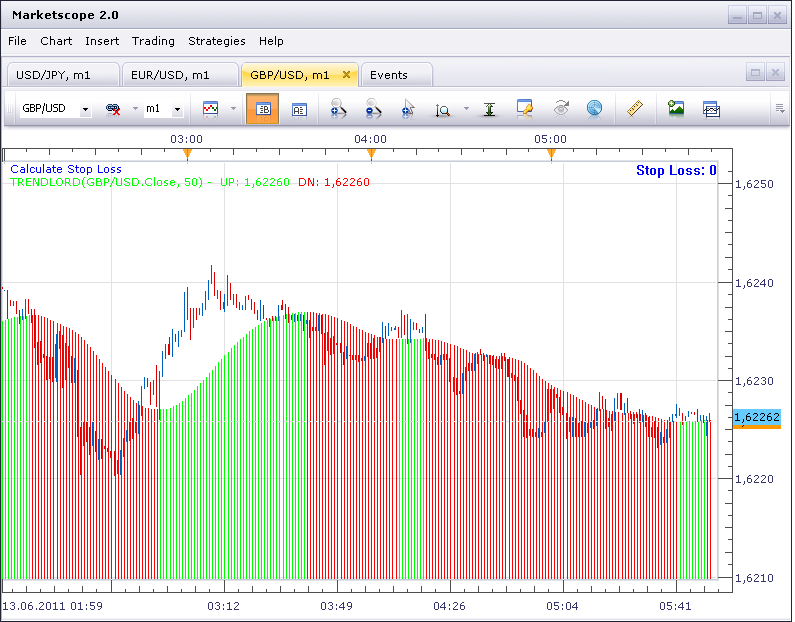

# TrendLord Indicator [Upd Oct, 05]

> Source: https://fxcodebase.com/code/viewtopic.php?f=17&t=2068  
> Forum: 17 · Topic 2068 · 16 post(s)

---

## TrendLord Indicator [Upd Oct, 05]

**Alexander.Gettinger** · Sun Sep 05, 2010 10:29 pm

Update Oct, 05 2010. The indicator performance is improved and additional features are provided for in-strategies and in-signal usage.

The indicator is a port of Metatrader TrendLord indicator.

Trendlord indicator shows the trend direction. A green bar means uptrend and a red bar means down trend.

A green bar appears when TrendLordFunction is above the previous value and a red bar appears when it's below the previous value.

**Important!** The indicator **repaints** one bar back when direction is switched. So, the signal and/or strategy will show the signal **two** bars back against the displayed value.

The function is
LWMA(LWMA(close, N), SquareRoot(N))
where N is the indicator parameters.

 



Download indicator:

```lua
function Init()
    indicator:name("Trend lord");
    indicator:description("Trend lord");
    indicator:requiredSource(core.Tick);
    indicator:type(core.Oscillator);

    indicator.parameters:addGroup("Calculation");
    indicator.parameters:addInteger("Period", "Period", "Period", 50);
    indicator.parameters:addBoolean("StrategyMode", "Don't change, parameter is for strategies only!!!", "", false);

    indicator.parameters:addGroup("Style");
    indicator.parameters:addColor("clrUP", "UP color", "UP color", core.rgb(0, 255, 0));
    indicator.parameters:addColor("clrDN", "DN color", "DN color", core.rgb(255, 0, 0));
end

local first;
local source = nil;
local Period;
local MA;
local buffUP=nil;
local buffDN=nil;
local array1;
local array2;

function Prepare(onlyName)
    source = instance.source;
    Period=instance.parameters.Period;

    local name = profile:id() .. "(" .. source:name() .. ", " .. instance.parameters.Period .. ")";
    instance:name(name);

    if onlyName then
        return ;
    end

    MA = core.indicators:create("LWMA", source, Period);
    firstMA = MA.DATA:first();
    MA2 = core.indicators:create("LWMA", MA.DATA, math.sqrt(Period));
    array1 = MA2.DATA;
    first = array1:first() + 1;

    if instance.parameters.StrategyMode then
        array2 = instance:addStream("D", core.Line, name .. ".D", "D", core.rgb(0, 0, 0), first);
        array2:setStyle(core.LINE_NONE);
    else
        array2 = instance:addInternalStream(first, 0);
    end

    buffUP = instance:addStream("UP", core.Bar, name .. ".UP", "UP", instance.parameters.clrUP, first);
    buffDN = instance:addStream("DN", core.Bar, name .. ".DN", "DN", instance.parameters.clrDN, first);
end

function Update(period, mode)
    MA:update(mode);
    MA2:update(mode);

    if period >= first then
        array2[period] = array2[period - 1];
        if array1[period] > array1[period - 1] then
            array2[period] = 1;
        elseif array1[period] < array1[period - 1] then
            array2[period] = -1;
        end

        if array2[period] > 0 then
            buffUP[period] = array1[period];
            if array2[period - 1] < 0 then
                buffUP[period - 1] = array1[period - 1];
                buffDN[period - 1] = nil;
            end
        elseif array2[period] < 0 then
            buffDN[period]=array1[period];
            if array2[period - 1] > 0 then
                buffDN[period - 1] = array1[period - 1];
                buffUP[period - 1] = nil;
            end
        end
     end
end
```

 [TrendLord.lua](files/4233/TrendLord.lua)

 


TrendLord with Higher Time Frame Confirmation will add Higher Time Frame TrendLord,
to confirm the chart time frame indications.

 [TrendLord with Higher Time Frame Confirmation.lua](files/4233/TrendLord%20with%20Higher%20Time%20Frame%20Confirmation.lua)

TrendLord.lua based strategy.
[viewtopic.php?f=31&t=2262](https://fxcodebase.com/code/viewtopic.php?f=31&t=2262)

---

## Re: TrendLord Indicator (make a signal?)

**virgilio** · Fri Sep 24, 2010 4:37 pm

Is it possible to create a signal for this indicator with a sound associated to buys and sells?

---

## Re: TrendLord Indicator

**Apprentice** · Sat Sep 25, 2010 4:42 am

Added to development cue.

---

## Re: TrendLord Indicator

**Apprentice** · Sat Sep 25, 2010 5:02 pm

This Signal / Strategy can be found here.
[viewtopic.php?f=31&t=2262&p=4786#p4786](https://fxcodebase.com/code/viewtopic.php?f=31&t=2262&p=4786#p4786)

---

## Re: TrendLord Indicator [Upd Oct, 05]

**ancient-school** · Thu Jun 09, 2011 2:59 pm

Is it possible to plot this Indicator on Price?

---

## Re: TrendLord Indicator [Upd Oct, 05]

**sunshine** · Sun Jun 12, 2011 11:58 pm

> **ancient-school wrote:**
> Is it possible to plot this Indicator on Price?

To place the indicator on main chart area:
1) Double-click the indicator line. The Properties dialog will appear.
2) In the Properties dialog, go to the Location tab. Select the chart area in the list of available areas:

 



3) The confirmation box will appear. Click OK.
4) In the dialog click OK.
Your indicator will be moved to the main chart area:

 



---

## Re: TrendLord Indicator [Upd Oct, 05]

**davidnwatson** · Thu Oct 02, 2014 2:12 pm

Can you add a MA timeframe confirmation?

Thank you

---

## Re: TrendLord Indicator [Upd Oct, 05]

**Apprentice** · Sat Oct 04, 2014 2:36 am

Sure. Will try to write something for you tomorrow.

---

## Re: TrendLord Indicator [Upd Oct, 05]

**Apprentice** · Mon Oct 06, 2014 12:06 pm

TrendLord with Higher Time Frame Confirmation Added.

> by davidnwatson » Thu Oct 02, 2014 9:12 pm
> Can you add a MA timeframe confirmation?

Something like this.
Your request is not eloquent at best,
and It is difficult to decipher it.

---

## Re: TrendLord Indicator [Upd Oct, 05]

**davidnwatson** · Mon Oct 06, 2014 1:27 pm

> Something like this.
> Your request is not eloquent at best,
> and It is hard to difficult to decipher it.

Sorry about that...
1. I download the new file and it will not show up under my strategies.. check it on your end..

2. After looking at other strategies I think I was asking for was a MA Filter based on a timeframe..This may be what you did, once I can load it and look..

So a Buy trade would be as (1 min chart)
Trendlord green
if price above 1hr 50 MA
Buy

Trendlord green
if price below 1hr 50 MA
do nothing

Trendlord red
if price below 1hr 50 MA
sell

Trendlord red
if price above 1hr 50 MA
do nothing

---

## Re: TrendLord Indicator [Upd Oct, 05]

**davidnwatson** · Mon Oct 06, 2014 4:21 pm

My bad. just realized that it was an indicator not a strategy.. a strategy would be nice!!!

Trading base on timeframe version!

Your awesome!

Dave

---

## Re: TrendLord Indicator [Upd Oct, 05]

**Apprentice** · Wed Nov 26, 2014 5:25 am

Requested can be found here.
[viewtopic.php?f=31&t=61543](https://fxcodebase.com/code/viewtopic.php?f=31&t=61543)

---

## Re: TrendLord Indicator [Upd Oct, 05]

**Apprentice** · Tue Jul 18, 2017 7:34 am

The indicator was revised and updated.

---

## Re: TrendLord Indicator [Upd Oct, 05]

**Recursive Trendline** · Wed Aug 30, 2017 12:55 am

Hi Apprentice,

Will the indicator still repaint if the data source is set to 'open' price? Asking because the 'open' price does not repaint in general.

Regards,

---

## Re: TrendLord Indicator [Upd Oct, 05]

**Apprentice** · Wed Aug 30, 2017 4:29 am

LWMA MA is used.
LWMA repaint for Current candle only.
If open price is used, this will NOT be the case.

---

## Re: TrendLord Indicator [Upd Oct, 05]

**Apprentice** · Fri Sep 14, 2018 5:34 am

The indicator was revised and updated.
