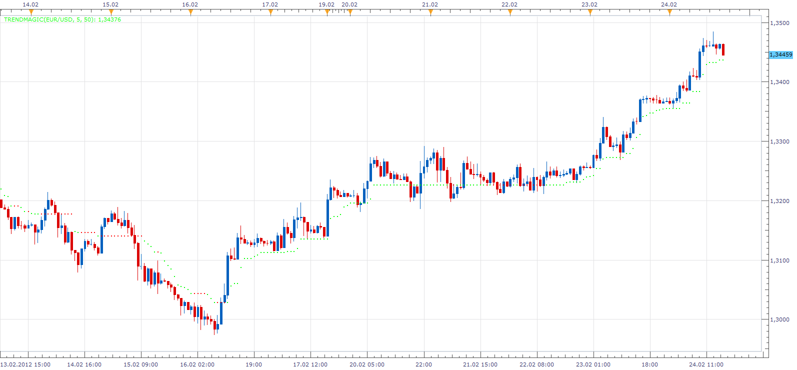
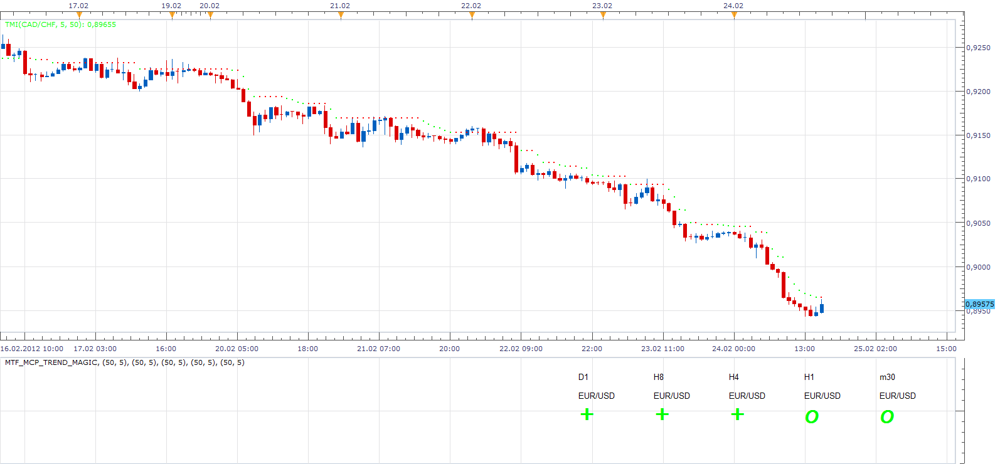
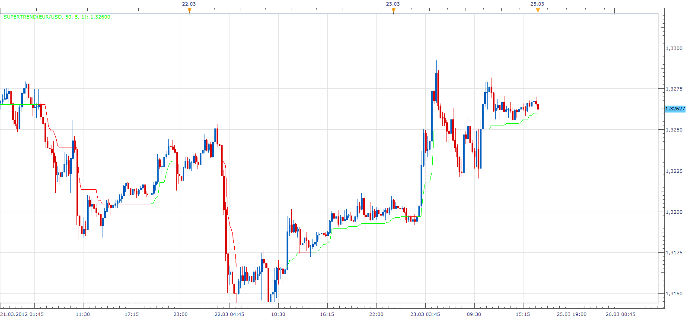

# TrendMagic indicator

> Source: https://fxcodebase.com/code/viewtopic.php?f=17&t=563  
> Forum: 17 · Topic 563 · 21 post(s)

---

## TrendMagic indicator

**Alexander.Gettinger** · Sun Apr 04, 2010 9:29 pm

New Version (2.26.2012.) by Apprentice

 [TMI.lua](files/989/TMI.lua)

Note: NG, Oct 11 2010: A new version is available here: [viewtopic.php?f=17&t=2374](https://fxcodebase.com/code/viewtopic.php?f=17&t=2374)

Old Version

 [TrendMagic.lua](files/989/TrendMagic.lua)

 

 [MTF_Trend_Magic.lua](files/989/MTF_Trend_Magic.lua)

 [MTF_MCP_Trend_Magic.lua](files/989/MTF_MCP_Trend_Magic.lua)

For both MTF indicators, install TSI Indicator.

---

## Re: TrendMagic indicator

**michaelwen** · Sun Apr 04, 2010 11:18 pm

thanks for your indicator.

---

## Re: TrendMagic indicator

**michaelwen** · Sun Apr 04, 2010 11:26 pm

could you explain how to use it? thanks

---

## Re: TrendMagic indicator

**WWMMACAU** · Mon Apr 12, 2010 6:00 pm

> **michaelwen wrote:**
> could you explain how to use it? thanks

Thanks Alexander.Gettinger.

Just attach this indicator to the chart as usual.
It is also trend indicator.
Green color is uptrend.
Red color is downtrend.[http://www303.lunapic.com/editor/?action=url&url=852/822/19401530503479550&s=www305&files=1](http://www303.lunapic.com/editor/?action=url&url=852/822/19401530503479550&s=www305&files=1)

---

## Re: TrendMagic indicator

**michaelwen** · Sat Apr 24, 2010 3:45 am

thanks for the information. good job.

---

## Re: TrendMagic indicator

**fxcatty** · Sun Aug 22, 2010 11:16 am

Hello, What exactly is TrendMagic? I guess to be more specific on what I am asking is what determines if the line is Green or ReD?

I see that it is somehow determined by the CCI and Average True Range, but what is the system code actually looking for?

Thanks,

---

## Re: TrendMagic indicator

**Apprentice** · Mon Aug 23, 2010 3:59 am

Down=High[period]+ATR[period];
 Up=Low[period]-ATR[period];

if CCI>=0 then Line is Green

 if CCI<0 then Line is Red

IF Up[period]< Up[period-1]) then
Up[period]=Up[period-1];

IF Down[period]> Down[period-1]) then
Down[period]=Down[period-1];

I do not know if you understand this code.
In short, the growing trend is always growing,
falling tend always to fall.

Thanks to your request I found a bug in the code indicator.

---

## Re: TrendMagic indicator

**7510109079** · Fri Oct 21, 2011 8:22 am

Is this indicator a combination of the ZIGZAG and HA indicators or are the calcs used within different somehow and if so how?, thx

---

## Re: TrendMagic indicator

**Marekk** · Sat Feb 25, 2012 7:33 am

Can someone The Trend Magic indicator as a multi-timeframe make

---

## Re: TrendMagic indicator

**Apprentice** · Sun Feb 26, 2012 4:59 am

Your request is added to the developmental cue.

---

## Re: TrendMagic indicator

**Apprentice** · Sun Feb 26, 2012 5:57 am

 [MTF_MCP_Trend_Magic.lua](files/26990/MTF_MCP_Trend_Magic.lua)

 [MTF_Trend_Magic.lua](files/26990/MTF_Trend_Magic.lua)

For both indicators, install TSI. Indicator (first post in this topic).

---

## Re: TrendMagic indicator

**Marekk** · Sun Feb 26, 2012 6:27 am

Many thanks for the quick response

---

## Re: TrendMagic indicator

**Marekk** · Sun Mar 25, 2012 10:59 am

If possible to convert the indicator into lua.
[http://www.forexfactory.com/attachment. ... 1324313904](http://www.forexfactory.com/attachment.php?attachmentid=859588&d=1324313904)
I combine 15M and 4H

---

## Re: TrendMagic indicator

**Apprentice** · Sun Mar 25, 2012 2:07 pm

Try this Version

 

 [TM.lua](files/28667/TM.lua)

 

 [TM Overlay.lua](files/28667/TM%20Overlay.lua)

---

## Re: TrendMagic indicator

**trendwatch** · Sat Nov 03, 2012 10:16 am

I was wondering what the difference is between 0 and + in the mtf mcp indicator?
Thanks

---

## Re: TrendMagic indicator

**Apprentice** · Sun Nov 04, 2012 7:47 am

TMI > TMI[period]
+
TMI < TMI[period-1]
-
TMI = TMI[period-1]
o

---

## Re: TrendMagic indicator

**easytrading** · Sun Jul 17, 2016 6:11 pm

kindly Apprentice,
could we have overlay for TM.lua please ? with many thanks.

---

## Re: TrendMagic indicator

**Apprentice** · Mon Jul 18, 2016 5:45 am

TM Overlay added.

---

## Re: TrendMagic indicator

**easytrading** · Wed Jul 20, 2016 10:16 pm

the overlay is not matching with the indicator line when i plot them together on the chart. i am using the last indicator version in this post TM.lua . could you check it please ? many thanks

---

## Re: TrendMagic indicator

**Apprentice** · Sun Jul 24, 2016 8:06 am

Fixed.

---

## Re: TrendMagic indicator

**Apprentice** · Sat Sep 08, 2018 10:02 am

The indicator was revised and updated.
