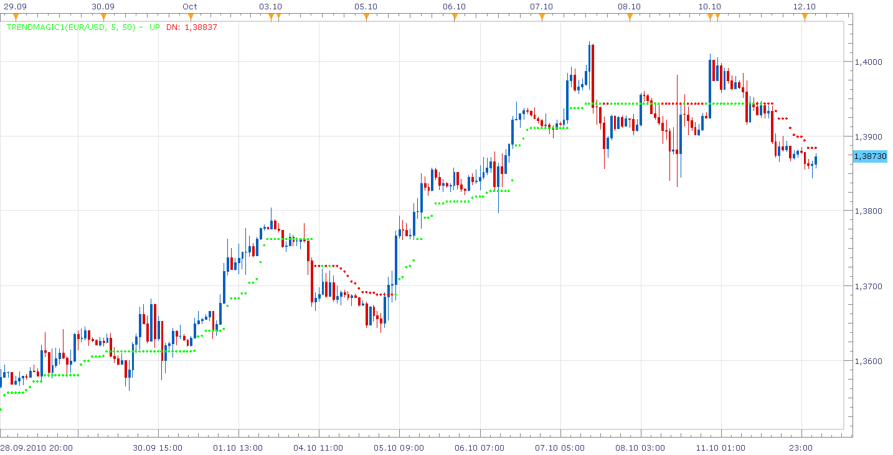
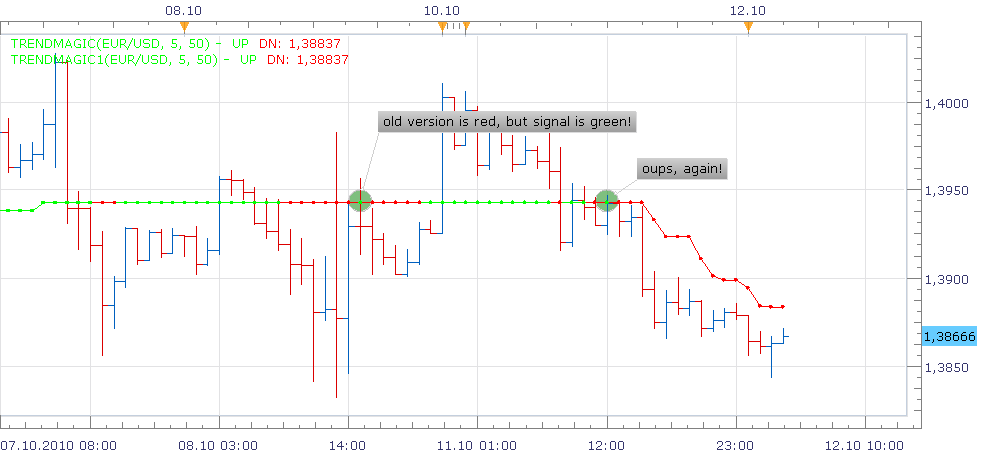

# TrendMagic new version

> Source: https://fxcodebase.com/code/viewtopic.php?f=17&t=2374  
> Forum: 17 · Topic 2374 · 4 post(s)

---

## TrendMagic new version

**Nikolay.Gekht** · Mon Oct 11, 2010 9:51 pm

This is new version of the TrendMagic indicator (see [viewtopic.php?f=17&t=563](https://fxcodebase.com/code/viewtopic.php?f=17&t=563) for the original version)

Brief description:

The indicator was originally developed for MT4 by TudorGirl ([[email protected]](https://fxcodebase.com/cdn-cgi/l/email-protection#85c4ebebe0d1f0e1eaf7c5fce8e4ece9abe6eae8)).

The indicator detects the trend using CCI indicator. If CCI value is bigger than the previous the trend is recognized as up trend. If CCI value is smaller than the previous value, the trend is recognized as down trend. If line goes up or down - the trend is strong. If the line is straight - the trend is weak.

Formula:

```
if CCI[0] >= CCI[-1]
 UP[0] = MAX(UP[-1], LOW[0] - ATR)
else
 DN[0] = MIN(DN[1], HIGH[0] + ATR)
end
```

Preview indicator:

 



Changes in this version comparing the previous version:

1) The lines are replaced with dots. Unfortunately, the original indicator due to implementation issues (however, exactly the same issues as for MT4 implementation) "hides" short-term switches of the trend on the flat market. Please take a look at snapshot below with both indicators applied. There is at least two points when old implementation draws continuous red line while new implementation exactly shows that the indicator switched back and forth.

 



2) A few changes for better usage in signals are introduced.

Download the indicator:

 [TrendMagic1.lua](files/5121/TrendMagic1.lua)

See also TrendMagic + Sar strategy and signal here:
[viewtopic.php?f=31&t=2375](https://fxcodebase.com/code/viewtopic.php?f=31&t=2375)

As you can see, I renamed the indicator, so you can use both versions, whichever is more convenient for you at the moment.

Source code:

```lua
-- original MT4 implementation (c) TudorGirl ([[email protected]](https://fxcodebase.com/cdn-cgi/l/email-protection)).

function Init()
    indicator:name("TrendMagic Indicator (new version)");
    indicator:description("");
    indicator:requiredSource(core.Bar);
    indicator:type(core.Indicator);

    indicator.parameters:addGroup("Parameters");
    indicator.parameters:addInteger("CCI", "CCI", "", 50);
    indicator.parameters:addInteger("ATR", "ATR", "", 5);
    indicator.parameters:addBoolean("Signal", "Signal Mode", "Don't change this parameter when use indicator on chart", false);

    indicator.parameters:addGroup("Style");
    indicator.parameters:addColor("UP_color", "Color of UP", "Color of UP", core.rgb(0, 255, 0));
    indicator.parameters:addColor("DN_color", "Color of DN", "Color of DN", core.rgb(255, 0, 0));
    indicator.parameters:addInteger("width", "Dot Size", "", 2, 1, 5);
end

local pCCI;
local pATR;

local first;
local source = nil;
local ATR = nil;
local CCI = nil;
local SIG = nil;
local dotUp, dotDown;
local bufferUp, bufferDown;

function Prepare(onlyName)
    pCCI = instance.parameters.CCI;
    pATR = instance.parameters.ATR;
    source = instance.source;
    local name = profile:id() .. "(" .. source:name() .. ", " .. pATR .. ", " .. pCCI .. ")";
    instance:name(name);
    if onlyName then
        return ;
    end

    ATR = core.indicators:create("ATR", source, pATR);
    CCI = core.indicators:create("CCI", source, pCCI);
    first = math.max(ATR.DATA:first(), CCI.DATA:first()) + 1;

    dotUp = instance:addStream("UP", core.Dot, name .. ".UP", "UP", instance.parameters.UP_color, first);
    dotUp:setWidth(instance.parameters.width);

    dotDn = instance:addStream("DN", core.Dot, name .. ".DN", "DN", instance.parameters.DN_color, first);
    dotDn:setWidth(instance.parameters.width);

    bufferUp = instance:addInternalStream(first, 0);
    bufferDn = instance:addInternalStream(first, 0);

    if instance.parameters.Signal then
        SIG = instance:addStream("SIG", core.Line, name .. ".SIG", "SIG", core.rgb(0, 0, 0), first);
    else
        SIG = instance:addInternalStream(0, 0);
    end
end

function Update(period, mode)
    ATR:update(mode);
    CCI:update(mode);

    if period >= first then
        local thisCCI, v;
        thisCCI = CCI.DATA[period];

        if thisCCI >= 0 then
            SIG[period] = 1;
        else
            SIG[period] = -1;
        end

        if SIG[period] == 1 and SIG[period - 1] == -1 then
            bufferUp[period - 1] = bufferDn[period - 1];
        end

        if SIG[period] == -1 and SIG[period - 1] == 1 then
            bufferDn[period - 1] = bufferUp[period - 1];
        end

        if SIG[period] == 1 then
            v = source.low[period] - ATR.DATA[period];
            if SIG[period - 1] ~= 0 and v < bufferUp[period - 1] then
                v = bufferUp[period - 1];
            end
            bufferUp[period] = v;
            dotUp[period] = v;
        elseif SIG[period] == -1 then
            v = source.high[period] + ATR.DATA[period];
            if SIG[period - 1] ~= 0 and v > bufferDn[period - 1] then
                v = bufferDn[period - 1];
            end
            bufferDn[period] = v;
            dotDn[period] = v;
        end

    else
        SIG[period] = 0;
    end
end
```

---

## Re: TrendMagic new version

**tmdabc** · Fri Oct 23, 2015 2:00 pm

looks good，thanks

---

## Re: TrendMagic new version

**Apprentice** · Tue Oct 23, 2018 6:38 am

The indicator was revised and updated.

---

## Re: TrendMagic new version

**woroyet570** · Wed Jul 24, 2024 1:57 am

Thanks
