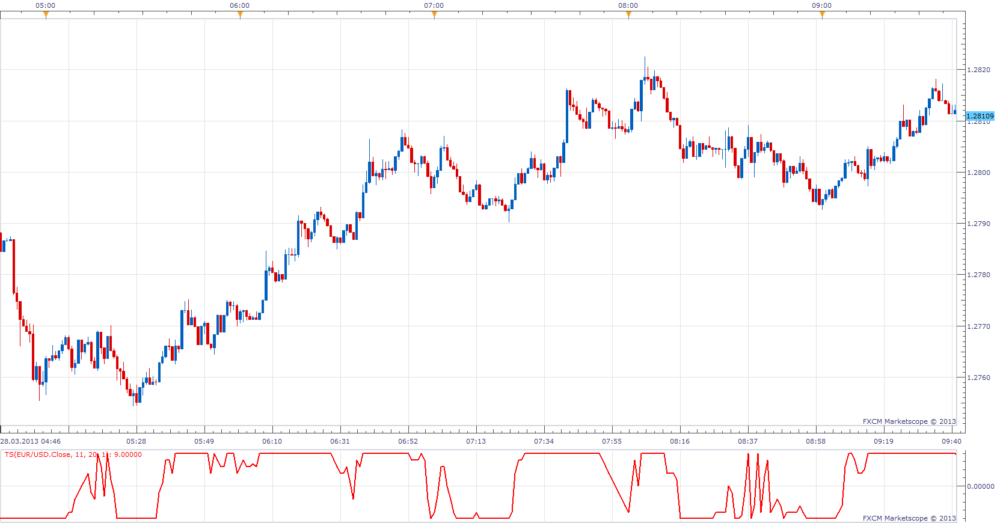

# TrendScore

> Source: https://fxcodebase.com/code/viewtopic.php?f=17&t=33942  
> Forum: 17 · Topic 33942 · 4 post(s)

---

## TrendScore

**Apprentice** · Thu Mar 28, 2013 10:11 am

As described in the article Rating Trend Strength by Tushar S. Chande, September 1993 of S&C magazine. Trendscore indicates both the trend direction and trend strength.

If (today's close >= close x days ago) then score = 1
If (today's close < close x days ago) then score = -1
For all periods From Star thill End Period.

 [TS.lua](files/57602/TS.lua)

---

## Re: TrendScore

**Alexander.Gettinger** · Fri Jun 06, 2014 3:35 pm

MQL4 version of Trend Score oscillator: [viewtopic.php?f=38&t=60798](https://fxcodebase.com/code/viewtopic.php?f=38&t=60798).

---

## Re: TrendScore

**tmdabc** · Fri Oct 23, 2015 1:59 pm

looks good，thanks

---

## Re: TrendScore

**Apprentice** · Fri Oct 12, 2018 5:17 am

The indicator was revised and updated.
