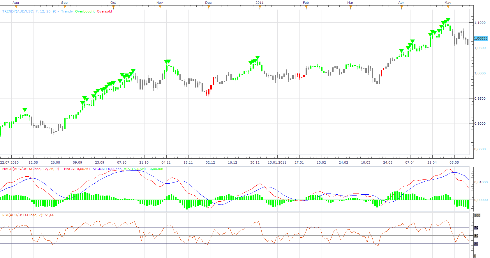

# Trendy

> Source: https://fxcodebase.com/code/viewtopic.php?f=17&t=4385  
> Forum: 17 · Topic 4385 · 2 post(s)

---

## Trendy

**Apprentice** · Fri May 20, 2011 2:14 pm

This, Helper, shows two things.
1.Position of the MACD signal line.

Up Trend
SIGNAL < MACD and SIGNAL> 0
Down Trend
SIGNAL> MACD and SIGNAL <0
ELSE
Neutral

2.RSI Overbought / Oversold Conditions
Overbought
RSI> 75
Oversold
RSI <25

 [Trendy.lua](files/10882/Trendy.lua)

MT4/MQ4 version.
[viewtopic.php?f=38&t=65761](https://fxcodebase.com/code/viewtopic.php?f=38&t=65761)

Entry
Up Trend or Down Trend

Exit
End of Overbought / Oversold Conditions.
Or
Trend Change

---

## Re: Trendy

**Apprentice** · Thu Mar 02, 2017 6:00 am

Indicator was revised and updated.
