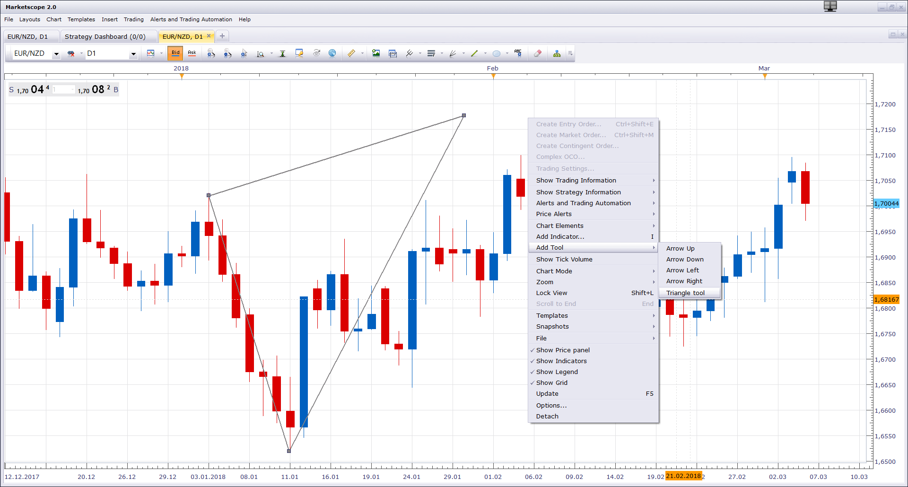
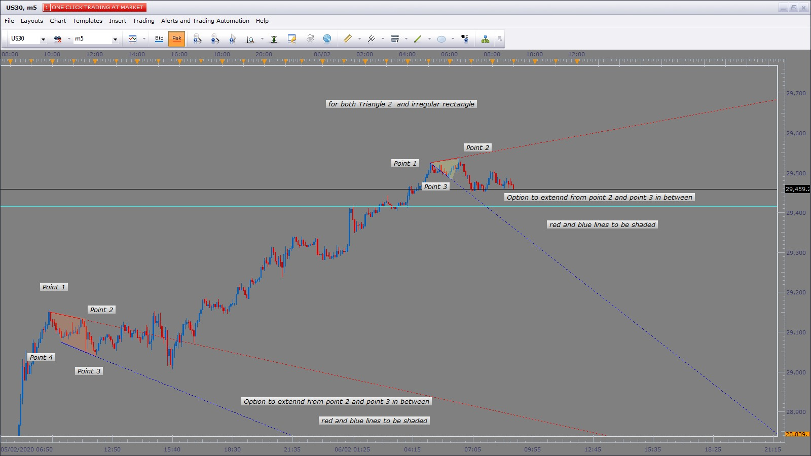

# Triangle a.k.a Metric Triangle Set Square on Chart

> Source: https://fxcodebase.com/code/viewtopic.php?f=17&t=65808  
> Forum: 17 · Topic 65808 · 32 post(s)

---

## Triangle a.k.a Metric Triangle Set Square on Chart

**Apprentice** · Tue Mar 06, 2018 3:53 pm

 

Based on the request.
[viewtopic.php?f=27&t=65767&p=117929#p117929](https://fxcodebase.com/code/viewtopic.php?f=27&t=65767&p=117929#p117929)
After installation will be available in the Add Tool section as the Triangle Tool.

 [triangle.lua](files/118065/triangle.lua)

 [Triangle 2.lua](files/118065/Triangle%202.lua)

---

## Re: Triangle a.k.a Metric Triangle Set Square on Chart

**High&Low** · Fri Mar 09, 2018 3:33 am

Hi,

Thank you for the effort. I appreciate it.

 The problem is that , when I import it from the platform or when I copy and paste it to the custom indicator folder ( I tried both ways) I could not insert it from the platform ! It could not find it on the indicator list .

 Could you please tell me what can be the problem ?

 Thanks

---

## Re: Triangle a.k.a Metric Triangle Set Square on Chart

**Apprentice** · Fri Mar 09, 2018 6:43 am

> After installation will be available in the Add Tool section as the Triangle Tool.

Will NOT appear in the indicator section.

---

## Re: Triangle a.k.a Metric Triangle Set Square on Chart

**susan61** · Mon Jun 10, 2019 8:35 am

Apprentice,
Is it possible to add double rectangle to outline on the chart the SL and TP for a trade. Would be added to tools were current rectangle is, this would work in same as when drawing but were we only have A to B then to A+ to draw current rectangle would add A- enabling us to get two rectangles and be able to have different colour rectangles and save as default
Hope you guys can help
Susan

 

---

## Re: Triangle a.k.a Metric Triangle Set Square on Chart

**Apprentice** · Tue Jun 11, 2019 5:45 am

How SL / TL levels are associated with the triangle?

---

## Re: Triangle a.k.a Metric Triangle Set Square on Chart

**susan61** · Tue Jun 11, 2019 9:17 am

> **Apprentice wrote:**
> How SL / TL levels are associated with the triangle?

Hi Apprentice the triangle is under tools as with the other shapes what i looking for is a tool that can draw two rectangles from one settings and be able to default the colours or do i need to start a new topic? under rectangles / tools
susan

---

## Re: Triangle a.k.a Metric Triangle Set Square on Chart

**Apprentice** · Wed Jun 12, 2019 6:34 am

Your request is added to the development list under Id Number 4715

---

## Re: Triangle a.k.a Metric Triangle Set Square on Chart

**Apprentice** · Thu Jun 13, 2019 6:49 am

Try this version.
[viewtopic.php?f=17&t=68571](https://fxcodebase.com/code/viewtopic.php?f=17&t=68571)

---

## Re: Triangle a.k.a Metric Triangle Set Square on Chart

**susan61** · Thu Jun 13, 2019 7:55 am

Thanks
Susan

---

## Re: Triangle a.k.a Metric Triangle Set Square on Chart

**minifire18** · Thu Jan 30, 2020 1:50 am

Hi Apprentice & Team,

Can you code to draw any shape /size triangles have colour options and x% of transparency of colour
Simply click on the 3 point you want to draw on chart colour and select how much transparency

Thanks in advance
Minifire

---

## Re: Triangle a.k.a Metric Triangle Set Square on Chart

**Apprentice** · Thu Jan 30, 2020 4:19 pm

Your request is added to the development list.
Development reference 613.

---

## Re: Triangle a.k.a Metric Triangle Set Square on Chart

**Apprentice** · Fri Jan 31, 2020 7:31 am

Version 2 added.

---

## Re: Triangle a.k.a Metric Triangle Set Square on Chart

**minifire18** · Mon Feb 03, 2020 8:47 am

Hey Apprentice,
Great Job can do a 4 point shape sloping rectangle diamond shape again have colour options and x% of transparency of colour.Simply click on the 4 point you want to draw on chart colour and select how much transparency
Thanks in advance Minifire

---

## Re: Triangle a.k.a Metric Triangle Set Square on Chart

**Apprentice** · Tue Feb 04, 2020 7:54 am

Your request is added to the development list.
Development reference 632.

---

## Re: Triangle a.k.a Metric Triangle Set Square on Chart

**Apprentice** · Wed Feb 05, 2020 9:53 am

Try this version.
[viewtopic.php?f=17&t=69383](https://fxcodebase.com/code/viewtopic.php?f=17&t=69383)

---

## Re: Triangle a.k.a Metric Triangle Set Square on Chart

**minifire18** · Thu Feb 06, 2020 6:10 am

Hey Apprentice,
Would you be able to add option to extend from point 2 and Point 3 to end or have a date option this would be on both triangle 2 and irregular rectangle
Thanks in advance
Minifire

 

---

## Re: Triangle a.k.a Metric Triangle Set Square on Chart

**Apprentice** · Thu Feb 06, 2020 8:37 am

Your request is added to the development list.
Development reference 685.

---

## Re: Triangle a.k.a Metric Triangle Set Square on Chart

**Apprentice** · Fri Feb 07, 2020 7:06 am

[Irregular Rectangle.lua](files/131168/Irregular%20Rectangle.lua)

 [Triangle 2.lua](files/131168/Triangle%202.lua)

---

## Re: Triangle a.k.a Metric Triangle Set Square on Chart

**minifire18** · Mon Feb 10, 2020 2:22 am

Hi Apprentice,
Can you create a indicator that can Identify and draw on the chart the 1st expanding & the 1st contracting triangles in the session outlined.Start of day ,Asian session, London session and US session,lines to be extended on expanding triangle from point 2 & 3 and on contracting triangle from point 1 to 2 & point 3 to 2.Would have a choice of time frames below 15min To have its own line and colour options for the 4  options below
1. Higher highs (use bid price)
2. Higher lows (use bid price)
3.Lower lows (use ask price)
4.Lower highs (use ask price)
thanks in advance
minifire

---

## Re: Triangle a.k.a Metric Triangle Set Square on Chart

**Apprentice** · Mon Feb 10, 2020 6:11 am

Your request is added to the development list.
Development reference 698.

---

## Re: Triangle a.k.a Metric Triangle Set Square on Chart

**minifire18** · Tue Feb 25, 2020 3:38 am

Hi Apprentice
any update with this topic?
minifire

---

## Re: Triangle a.k.a Metric Triangle Set Square on Chart

**Apprentice** · Tue Feb 25, 2020 7:25 am

do you have a preferred algorithm for Higher highs,Higher lows...

---

## Re: Triangle a.k.a Metric Triangle Set Square on Chart

**minifire18** · Tue Feb 25, 2020 8:52 am

Hi Apprentice
To use the zigzag channel with Output_Mult to define the higher lows &lower highs and higher highs & lower lows
(This is the version im currently using to work it manually and can be found here)
Fri Sep 22, 2017 1:02 pm
ZigZag Channel with Output_Mult.lua
(15.03 KiB) Downloaded 518 times

To have its own line and colour options for the 4 options
1. Higher highs (use bid price)
2. Higher lows (use bid price)
3.Lower lows (use ask price)
4.Lower highs (use ask price)
Thanks Minifire

---

## Re: Triangle a.k.a Metric Triangle Set Square on Chart

**Apprentice** · Wed Feb 26, 2020 5:20 am

If I understand.
We should use bid prices for highs,
and ask prices for lows?

---

## Re: Triangle a.k.a Metric Triangle Set Square on Chart

**minifire18** · Wed Feb 26, 2020 5:33 am

> **Apprentice wrote:**
> If I understand.
> We should use bid prices for highs,
> and ask prices for lows?

Hi Apprentice yes please that is correct
Thanks Minifire

---

## Re: Triangle a.k.a Metric Triangle Set Square on Chart

**minifire18** · Sat Mar 14, 2020 9:44 am

Hi Apprentice & Team
Any updates with this topic?
minifire

---

## Re: Triangle a.k.a Metric Triangle Set Square on Chart

**yolerap** · Tue Mar 24, 2020 8:12 am

HI,

Is it possible to create a rectangle tool for me please ?

The tool is a normal rectangle but with a Fibonnacci retracement inside it automatically traced.
Is it possible to add the same option which FXCM proposed.
Thank you,

---

## Re: Triangle a.k.a Metric Triangle Set Square on Chart

**Apprentice** · Tue Mar 24, 2020 9:00 am

Can you provide some Fibonacci retracement example?

Your request is added to the development list.
Development reference 932.

---

## Re: Triangle a.k.a Metric Triangle Set Square on Chart

**yolerap** · Tue Mar 24, 2020 6:16 pm

Yes,

The picture shows you the perfect tool i wish

Thank you,

---

## Re: Triangle a.k.a Metric Triangle Set Square on Chart

**Apprentice** · Wed Mar 25, 2020 6:18 am

Try this version.
[viewtopic.php?f=17&t=69574](https://fxcodebase.com/code/viewtopic.php?f=17&t=69574)

---

## Re: Triangle a.k.a Metric Triangle Set Square on Chart

**minifire18** · Fri Dec 31, 2021 9:56 am

Irregular triangle pattern
Hi Apprentice & Team
Season Greetings
Can you use the irregular triangle tool with trend line extension to end to code as in indicator when price is contained within a previous swing using zigzag to define the high low, and then prints lower high and a higher low within previous swing and have minimum points required between point 2 and 3 and would not auto delete until new pattern with above conditions are met have option to show last 3 patterns .As tool plots 1,2,3,4
1= high of previous swing, 2 = lower high, 3 = higher low, 4 = low of previous swing,
**The high and lower high to use ASK price data**
**The low and higher low to use Bid price data**
Thanks in Advance
Minifire

 

---

## Re: Triangle a.k.a Metric Triangle Set Square on Chart

**Apprentice** · Fri Dec 31, 2021 11:34 am

Your request is added to the development list.
Development reference 1039.
