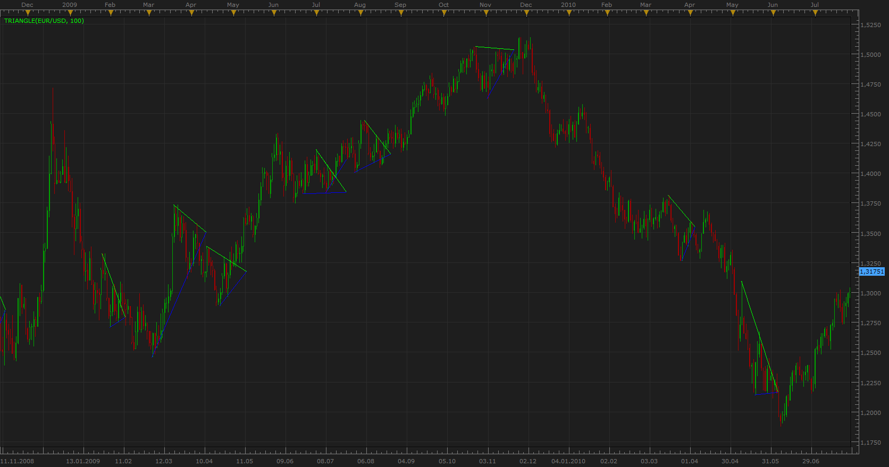
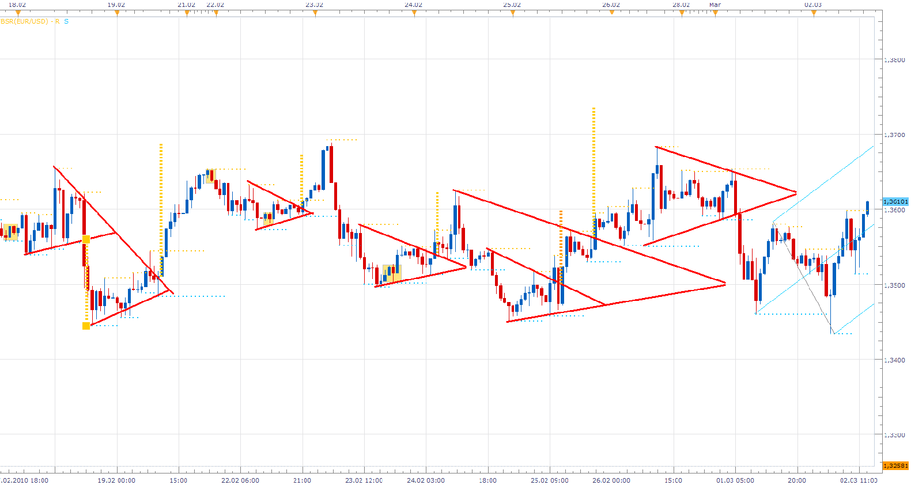
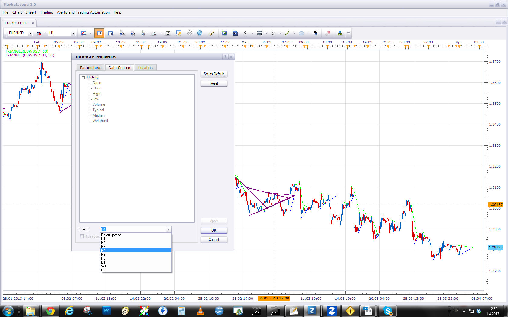

# Triangle and Wedges Patterns recognition

> Source: https://fxcodebase.com/code/viewtopic.php?f=17&t=1643  
> Forum: 17 · Topic 1643 · 49 post(s)

---

## Triangle and Wedges Patterns recognition

**Apprentice** · Mon Aug 02, 2010 12:10 pm

Triangles often form as uncertainty fills the market, and traders are unsure in which direction is market moving.
Triangles are continuation patterns, represent lines of supply and demand.
But modern technical analysis is not limited by this narrow description.
 There are three different types of triangles, the Ascending triangle, the Descending triangle, and the Symmetrical triangle.
Because of their similarities, we can add them, and growing or declining Wedge pattern.

If confirmed, the main application of the triangle pattern is to give price targets.
The direction of the trend is determined by the direction of the breakout.

 

An example of entry signals and exit target obtained using this method.
Time frame a few weeks, max. profit over 1000 pips.

There are some basic validation rules.
1.The pattern upper and lower sloping trendlines must have at least two points of confirmation.
2. Volume usually decreases as the pattern progresses and increases at the point of breakout, forming a wide spread candle.
3. Market (Closing price) "must" respect the pattern.
4.Closing price above the trendline in a bullish pattern and below the trendline in a bearish chart pattern.
5.Strong pattern break through the trend line in the first 2 / 3 of the pattern.

 [Triangle.lua](files/3269/Triangle.lua)

**This is an indicator that we've written a few months ago,
 one of the first indicators that I have help to write, One of the most valuable.
I did almost forget and lost It.**

MT4/MQ4 version.
[viewtopic.php?f=38&t=70457](https://fxcodebase.com/code/viewtopic.php?f=38&t=70457)

Indicator based strategy.
[viewtopic.php?f=17&t=67122](https://fxcodebase.com/code/viewtopic.php?f=17&t=67122)

---

## Re: Triangle and Wedges Patterns recognition

**schnuggelbugge** · Wed Jan 12, 2011 10:41 am

Hi! Thanks a lot! Maybe this is what I've been looking for for a long time...
Now that I'vetasted blood, I have some short questions:
Can you explain the parameters "Max. Base/ Side Ratio" and "Max. Side / Side Ratio" and the "Frame Size"?
Is it possible to play a configurable Soundfile, when a triangle is drawn?
Is it possible to draw the price target in a way you did it in your sample chart?
Is ist possible to play the sound only if a certain condition is met - for example RSI is in a Range between 35 and 65?

I would be very thankful for an answer. Perhaps you can give me some sample lines of code, if you haven't the time to work on some of my audacious requests - I'm a programmer and could try it on my own like a script kiddy...

Again, thanks a lot!

schnuggelbugge

---

## Re: Triangle and Wedges Patterns recognition

**Apprentice** · Wed Jan 12, 2011 2:27 pm

First, this is one of the first things I wrote, helped write.

You can try of course.

Code is available here just opened it using any text editor.

The parameters are used in the comparison of triangles.

 Base - Open, Or No Line Triangle Side
 Side - Triangle Side indicated by Triange line, lines.

Frame Size -Length of time in which we seek triangle pattern.

---

## Re: Triangle and Wedges Patterns recognition

**Apprentice** · Mon Jan 17, 2011 12:39 pm

[Triangle.lua](files/7522/Triangle.lua)

I presented an additional option, Lookback Search lengt,
which defines the Triangle searching area starting from last candle.
In order to improve performance.

---

## Re: Triangle and Wedges Patterns recognition

**compulsive** · Mon Jan 17, 2011 4:44 pm

You mentioned..."**If confirmed, the main application of the triangle pattern is to give price targets.
The direction the trend is determined by the direction of breakout**." but I don't see it on the chart. I see the triangles, wedges and etc but price targets?

---

## Re: Triangle and Wedges Patterns recognition

**Apprentice** · Mon Jan 17, 2011 5:41 pm

This is normal and expected.
In this version, the indicator does not give price targets.

Price target example I have added only as an example.

---

## Re: Triangle and Wedges Patterns recognition

**shinobi_brian** · Wed Jan 26, 2011 4:27 pm

Is there a strategy for this? I think it would be a good development idea. The trade could be placed on a retest of the triangle in the appropriate direction?

---

## Re: Triangle and Wedges Patterns recognition

**superleo** · Sun Dec 04, 2011 9:31 pm

hi apprendice,

can you create strategy based on this indicator.

---

## Re: Triangle and Wedges Patterns recognition

**Apprentice** · Tue Dec 06, 2011 3:17 am

Such a thing is possible.

---

## Re: Triangle and Wedges Patterns recognition

**rshoemake** · Sun Mar 17, 2013 10:33 am

Does this in fact identify wedges also? That would be very desirable behavior. In fact, if you could also add channels while you are at it it would deal with all three circumstances: paralle, converging,l diverging. Thanks alot!

---

## Re: Triangle and Wedges Patterns recognition

**Apprentice** · Mon Mar 18, 2013 4:05 am

Wedges are also supported.

---

## Re: Triangle and Wedges Patterns recognition

**rshoemake** · Mon Mar 18, 2013 5:59 am

What about channels?

---

## Re: Triangle and Wedges Patterns recognition

**Apprentice** · Tue Mar 19, 2013 9:33 am

Can you attach a chart with examples of these channels.
Which algorithm is used for channel calculation.

---

## Re: Triangle and Wedges Patterns recognition

**speakinmymind** · Fri Mar 29, 2013 1:49 am

can you add the ability to adjust size of lines?

---

## Re: Triangle and Wedges Patterns recognition

**speakinmymind** · Fri Mar 29, 2013 2:01 am

could you add a parameter to set a minimum lookback period? I am trying to create a min and max lookback that will set the range for the size of triangles to be displayed

It may be better to set an option to only display triangles of a certain size, the size being in pips or something better.

---

## Re: Triangle and Wedges Patterns recognition

**Apprentice** · Fri Mar 29, 2013 1:03 pm

Your request is added to the development list.

---

## Re: Triangle and Wedges Patterns recognition

**Apprentice** · Fri Mar 29, 2013 1:13 pm

Line Style Options Added.

---

## Re: Triangle and Wedges Patterns recognition

**speakinmymind** · Sat Mar 30, 2013 9:51 pm

This would be GREAT as a MTF!! if you could put the triangles from each larger timeframe on the chart in different colors it would be very useful!!

---

## Re: Triangle and Wedges Patterns recognition

**Apprentice** · Mon Apr 01, 2013 7:12 am

Please use, Data Source Period menu to select other Time Frames.

---

## Re: Triangle and Wedges Patterns recognition

**speakinmymind** · Tue Apr 02, 2013 9:11 am

Oh, wow I got it. Thanks!

Can you add the ability for the triangles to automatically change to "ask" properties when the chart is on ask? I don't see an option to set to ask prices at all.

---

## Re: Triangle and Wedges Patterns recognition

**speakinmymind** · Thu Jun 13, 2013 3:26 pm

Could you please develop an oscillator version of this?

---

## Re: Triangle and Wedges Patterns recognition

**Apprentice** · Mon Jun 17, 2013 5:39 am

Can you explain, I'm not sure that I understand U.

---

## Re: Triangle and Wedges Patterns recognition

**speakinmymind** · Wed Jun 19, 2013 7:13 am

I would like to use a different data source than price, such as macd or MVA .

---

## Re: Triangle and Wedges Patterns recognition

**Apprentice** · Sun Jun 23, 2013 2:28 pm

Your request is added to the development list.

---

## Re: Triangle and Wedges Patterns recognition

**Jamwal Suriya** · Thu Jun 27, 2013 1:11 am

Is there a strategy for this? I think it would be a good development idea.
The trade could be placed on a retest of the triangle in the appropriate direction?

---

## Re: Triangle and Wedges Patterns recognition

**Apprentice** · Fri Jun 28, 2013 2:35 am

Unfortunately not.
I have planned it, unfortunately I have not found the time for this task.

---

## Re: Triangle and Wedges Patterns recognition

**speakinmymind** · Tue Jul 23, 2013 4:23 pm

Is there any update in regards to using a MVA as the data source?

---

## Re: Triangle and Wedges Patterns recognition

**refresc0** · Mon Apr 28, 2014 12:58 am

this a great indicator very useful and well thought of. i will try to turn it into a strategy to open positions and let you know whether it works or not.

---

## Re: Triangle and Wedges Patterns recognition

**rose123** · Mon Sep 14, 2015 1:08 pm

hi apprendice,
can you create mtf mcp screener to identry triagle and wedge pattern

if there is triangle formation then draw "T"
if there is wedge formation then draw "W'

---

## Re: Triangle and Wedges Patterns recognition

**Apprentice** · Tue Sep 15, 2015 3:53 am

Your request is added to the development list.

---

## Re: Triangle and Wedges Patterns recognition

**mulligan** · Tue Nov 29, 2016 1:34 pm

This is a very handy indicator. Is it possible to have an alert when any of the chosen patterns appears on the chart? That way we can be alerted to watch where price action crosses the pattern and make buy, sell, or hold decisions.

Thanks

---

## Re: Triangle and Wedges Patterns recognition

**Apprentice** · Thu Dec 01, 2016 4:08 am

Your request is added to the development list, Under Id Number 3683
 If someone is interested to do this task, please contact me.

---

## Re: Triangle and Wedges Patterns recognition

**Alexander.Gettinger** · Tue Nov 21, 2017 5:26 pm

> **mulligan wrote:**
> This is a very handy indicator. Is it possible to have an alert when any of the chosen patterns appears on the chart? That way we can be alerted to watch where price action crosses the pattern and make buy, sell, or hold decisions.
>
> Thanks

Please, try this version of the indicator with alerts.

 [Triangle_With_Alert.lua](files/116156/Triangle_With_Alert.lua)

---

## Re: Triangle and Wedges Patterns recognition

**seunboi4u** · Sun Nov 26, 2017 9:22 pm

Triangle and Wedges Patterns recognition....please can you help with MT4 not only Lua language thanks

---

## Re: Triangle and Wedges Patterns recognition

**Apprentice** · Mon Nov 27, 2017 12:26 pm

Your request is added to the development list under Id Number 3961

---

## Re: Triangle and Wedges Patterns recognition

**Apprentice** · Sun Apr 22, 2018 5:47 am

The Indicator was revised and updated.

---

## Re: Triangle and Wedges Patterns recognition

**ANTONIO** · Wed Sep 11, 2019 1:33 pm

Hi,
the indicator Triangle with alert does not work correctly and does not send emails and shows up the message "false a new triangle has formed"

Thank you

---

## Re: Triangle and Wedges Patterns recognition

**Apprentice** · Thu Sep 12, 2019 8:04 am

Your request is added to the development list.
Development reference 75.

---

## Re: Triangle and Wedges Patterns recognition

**Apprentice** · Fri Sep 13, 2019 4:11 am

I don't see any issues with alerts

---

## Re: Triangle and Wedges Patterns recognition

**kwakugyau** · Thu Jul 23, 2020 10:36 am

Is there an mq4 version for this Triangle_With_Alert?
MQ4 version will be great. Thank you.

---

## Re: Triangle and Wedges Patterns recognition

**Apprentice** · Fri Jul 24, 2020 7:29 am

Your request is added to the development list.
Development reference 1762.

---

## Re: Triangle and Wedges Patterns recognition

**Apprentice** · Fri Sep 18, 2020 8:09 am

MT4/MQ4 version.
[viewtopic.php?f=38&t=70457](https://fxcodebase.com/code/viewtopic.php?f=38&t=70457)

---

## Re: Triangle and Wedges Patterns recognition

**fxlion** · Thu Nov 19, 2020 10:57 am

HI APPRENDICE,

CAN U CREATE STRATEGY BASED ON THIS INDICATOR

BUY: PRICE CROSSES UP OVER UPPER LINE
SELL: PRICE CROSSES BOTTOM LINE

THANK U

---

## Re: Triangle and Wedges Patterns recognition

**Apprentice** · Thu Nov 19, 2020 2:46 pm

Your request is added to the development list.
Development reference 2331.

---

## Re: Triangle and Wedges Patterns recognition

**Apprentice** · Fri Nov 20, 2020 4:12 am

Try this version.
[viewtopic.php?f=17&t=67122](https://fxcodebase.com/code/viewtopic.php?f=17&t=67122)

---

## Re: Triangle and Wedges Patterns recognition

**fxlion** · Fri Nov 20, 2020 6:08 am

> **Apprentice wrote:**
> Try this version.
> [viewtopic.php?f=17&t=67122](https://fxcodebase.com/code/viewtopic.php?f=17&t=67122)

hi apprendice,

this is indicator having trading option

i request strategy based on this indicatior.

thank u

---

## Re: Triangle and Wedges Patterns recognition

**fxlion** · Fri Nov 20, 2020 10:19 pm

> **fxlion wrote:**
> HI APPRENDICE,
>
> CAN U CREATE STRATEGY BASED ON THIS INDICATOR
>
> BUY: PRICE CROSSES UP OVER UPPER LINE
> SELL: PRICE CROSSES BOTTOM LINE
>
> THANK U

my request is to change this Triangle and Wedges Patterns recognition indicator optimised for strategy like trend demark indicator as beloW

[viewtopic.php?f=17&t=2483&hilit=Demark+Trend+Lines](https://fxcodebase.com/code/viewtopic.php?f=17&t=2483&hilit=Demark+Trend+Lines)

then create strategy based on that indicator as folloW

[viewtopic.php?f=31&t=65015&p=114367&hilit=trend+demark#p114367](https://fxcodebase.com/code/viewtopic.php?f=31&t=65015&p=114367&hilit=trend+demark#p114367)

thank u

---

## Re: Triangle and Wedges Patterns recognition

**Apprentice** · Sun Nov 22, 2020 4:50 am

Your request is added to the development list.
Development reference 2342.

---

## Re: Triangle and Wedges Patterns recognition

**Apprentice** · Mon Nov 23, 2020 2:19 pm

Unfortunately, there is no easy way to convert it to a strategy.
 But you can backtest in the simulator
