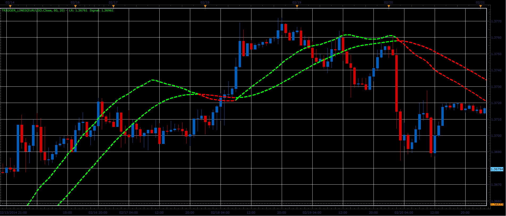

# Trigger lines

> Source: https://fxcodebase.com/code/viewtopic.php?f=17&t=60370  
> Forum: 17 · Topic 60370 · 2 post(s)

---

## Trigger lines

**Alexander.Gettinger** · Thu Feb 27, 2014 2:05 pm

The indicator is an implementation of Trigger Lines ([http://www.investopedia.com/terms/t/trigger-line.asp](http://www.investopedia.com/terms/t/trigger-line.asp)) similar to ones you can find in NT and MT.

 

Download:

 [Trigger_Lines.lua](files/92934/Trigger_Lines.lua)

The indicator was revised and updated

---

## Re: Trigger lines

**Apprentice** · Fri Jun 02, 2017 6:57 am

Indicator was revised and updated.
