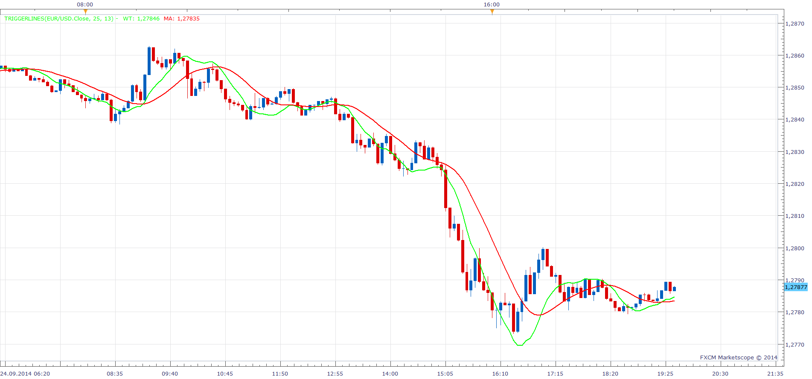

# Triggerlines

> Source: https://fxcodebase.com/code/viewtopic.php?f=17&t=61244  
> Forum: 17 · Topic 61244 · 3 post(s)

---

## Triggerlines

**Apprentice** · Wed Sep 24, 2014 12:35 pm

Based on request.
[viewtopic.php?f=27&t=60917&p=94929#p94929](https://fxcodebase.com/code/viewtopic.php?f=27&t=60917&p=94929#p94929)

 [Triggerlines.lua](files/96169/Triggerlines.lua)

---

## Re: Triggerlines

**Alexander.Gettinger** · Mon Mar 09, 2015 3:59 pm

MQL4 version of Triggerlines indicator: [viewtopic.php?f=38&t=61982](https://fxcodebase.com/code/viewtopic.php?f=38&t=61982).

---

## Re: Triggerlines

**Apprentice** · Mon Oct 08, 2018 6:00 am

The indicator was revised and updated.
