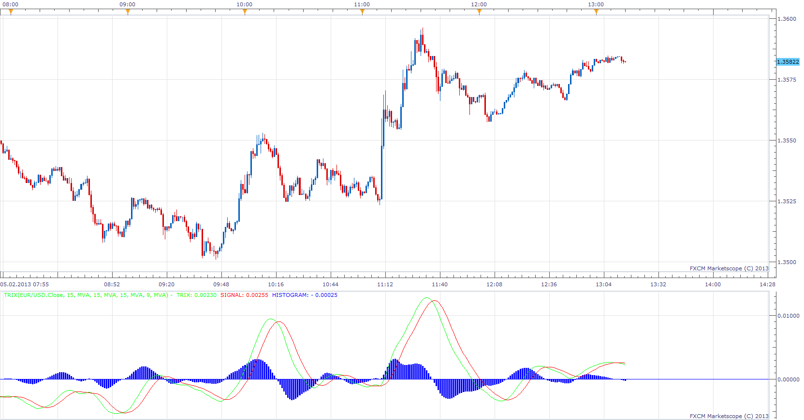

# Triple Smoothed Exponential Oscillator

> Source: https://fxcodebase.com/code/viewtopic.php?f=17&t=31775  
> Forum: 17 · Topic 31775 · 4 post(s)

---

## Triple Smoothed Exponential Oscillator

**Apprentice** · Tue Feb 05, 2013 2:37 pm

The TRIX was developed by Jack K. Hutson, publisher of Technical Analysis of Stocks & Commodities magazine, and was introduced in Volume 1, Number 5 of that magazine.
TRIX is a momentum oscillator that displays the percent rate of change of a triple exponentially smoothed moving average.

 [TRIX.lua](files/54173/TRIX.lua)

---

## Re: Triple Smoothed Exponential Oscillator

**evgeniyn** · Wed Feb 06, 2013 2:57 pm

HI, Invalid histogram and signal behavior,pls see attached,

---

## Re: Triple Smoothed Exponential Oscillator

**Apprentice** · Fri Feb 08, 2013 6:39 am

For some reason, the indicator will not work with EMA.
If you use other moving averages, you'll be fine.
Investigating, please redownload if you have old version.

---

## Re: Triple Smoothed Exponential Oscillator

**Apprentice** · Thu Apr 05, 2018 6:12 am

The Indicator was revised and updated.
