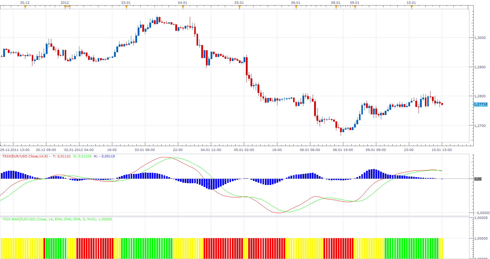

# Trix Bar

> Source: https://fxcodebase.com/code/viewtopic.php?f=17&t=11367  
> Forum: 17 · Topic 11367 · 2 post(s)

---

## Trix Bar

**Apprentice** · Tue Jan 10, 2012 1:17 pm

trix line > signal line and signal line> 0--------green
trix line> signal line and signal line< 0------- yellow
trix line< signal line and signal line < 0 ------red
trix line < signal line and signal line > 0-----yellow

 [Trix Bar.lua](files/22988/Trix%20Bar.lua)

Please install Trix Insicator.
[viewtopic.php?f=17&t=1022](https://fxcodebase.com/code/viewtopic.php?f=17&t=1022)

The indicator was revised and updated
MT4/MQ4 version
[viewtopic.php?f=38&t=66149](https://fxcodebase.com/code/viewtopic.php?f=38&t=66149)

---

## Re: Trix Bar

**Apprentice** · Wed Mar 22, 2017 11:49 am

Indicator was revised and updated.
