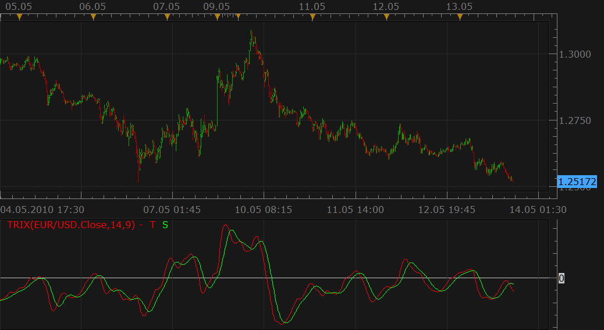

# Trix

> Source: https://fxcodebase.com/code/viewtopic.php?f=17&t=1022  
> Forum: 17 · Topic 1022 · 18 post(s)

---

## Trix

**Nikolay.Gekht** · Thu May 13, 2010 4:45 pm

The TRIX Indicator was developed in the early 1980s by Jack Hutson who was an editor for the Technical Analysis of Stocks and Commodities magazine. Its name is comprised of its calculation: **Tri**ple E**x**ponential.

The trix indicator is a tripple-smoothed price weighted against the previous tripple-smoothed price:
TrMA = (EMA(EMA(EMA(price, N), N), N)
TRIX(N)i = (TrMAi - TrMAi - 1) / TrMAi - 1).
SIGNAL(N, S) = SMA(TRIX(N), S)

HISTOGRAM = TRIX - SIGNAL

The formula is from Appel, Gerald: Winning Stock Market Systems. Signalert Corp., Great Neck, N.Y. 1974.

The indicator was revised and updated
The implementation lets you choose methods individually for each moving average. Please note that the methods marked using (*) requires the corresponding indicators to be downloaded and installed.

The common trading rule is:
Buy when TRIX is below zero and crosses its Signal Line from below.
Sell when TRIX is above zero and crosses its Signal Line from above.

 

Download the indicator:

 [trix.lua](files/1926/trix.lua)

Code: [Select all](https://fxcodebase.com/code/)
`-- TRIX index indicator
function Init()
    indicator:name("TRIX Index");
    indicator:description("The indicator eliminates cycles shorter than the selected indicator period. ");
    indicator:requiredSource(core.Tick);
    indicator:type(core.Oscillator);

    indicator.parameters:addInteger("P_N", "TRIX Periods", "", 14);
    indicator.parameters:addString("MA_1", "First Smoothing Method", "The methods marked by an asterisk (*) require the appropriate indicators to be loaded.", "EMA");
    indicator.parameters:addStringAlternative("MA_1", "MVA", "", "MVA");
    indicator.parameters:addStringAlternative("MA_1", "EMA", "", "EMA");
    indicator.parameters:addStringAlternative("MA_1", "LWMA", "", "LWMA");
    indicator.parameters:addStringAlternative("MA_1", "TMA", "", "TMA");
    indicator.parameters:addStringAlternative("MA_1", "SMMA*", "", "SMMA");
    indicator.parameters:addStringAlternative("MA_1", "Vidya (1995)*", "", "VIDYA");
    indicator.parameters:addStringAlternative("MA_1", "Vidya (1992)*", "", "VIDYA92");
    indicator.parameters:addStringAlternative("MA_1", "Wilders*", "", "WMA");
    indicator.parameters:addString("MA_2", "Second Smoothing Method", "The methods marked by an asterisk (*) require the appropriate indicators to be loaded.", "EMA");
    indicator.parameters:addStringAlternative("MA_2", "MVA", "", "MVA");
    indicator.parameters:addStringAlternative("MA_2", "EMA", "", "EMA");
    indicator.parameters:addStringAlternative("MA_2", "LWMA", "", "LWMA");
    indicator.parameters:addStringAlternative("MA_2", "TMA", "", "TMA");
    indicator.parameters:addStringAlternative("MA_2", "SMMA*", "", "SMMA");
    indicator.parameters:addStringAlternative("MA_2", "Vidya (1995)*", "", "VIDYA");
    indicator.parameters:addStringAlternative("MA_2", "Vidya (1992)*", "", "VIDYA92");
    indicator.parameters:addStringAlternative("MA_2", "Wilders*", "", "WMA");
    indicator.parameters:addString("MA_3", "Third Smoothing Method", "The methods marked by an asterisk (*) require the appropriate indicators to be loaded.", "EMA");
    indicator.parameters:addStringAlternative("MA_3", "MVA", "", "MVA");
    indicator.parameters:addStringAlternative("MA_3", "EMA", "", "EMA");
    indicator.parameters:addStringAlternative("MA_3", "LWMA", "", "LWMA");
    indicator.parameters:addStringAlternative("MA_3", "TMA", "", "TMA");
    indicator.parameters:addStringAlternative("MA_3", "SMMA*", "", "SMMA");
    indicator.parameters:addStringAlternative("MA_3", "Vidya (1995)*", "", "VIDYA");
    indicator.parameters:addStringAlternative("MA_3", "Vidya (1992)*", "", "VIDYA92");
    indicator.parameters:addStringAlternative("MA_3", "Wilders*", "", "WMA");
    indicator.parameters:addInteger("S_N", "Signal Periods", "", 9);
    indicator.parameters:addString("MA_S", "Signal Smoothing Method", "The methods marked by an asterisk (*) require the appropriate indicators to be loaded.", "MVA");
    indicator.parameters:addStringAlternative("MA_S", "MVA", "", "MVA");
    indicator.parameters:addStringAlternative("MA_S", "EMA", "", "EMA");
    indicator.parameters:addStringAlternative("MA_S", "LWMA", "", "LWMA");
    indicator.parameters:addStringAlternative("MA_S", "TMA", "", "TMA");
    indicator.parameters:addStringAlternative("MA_S", "SMMA*", "", "SMMA");
    indicator.parameters:addStringAlternative("MA_S", "Vidya (1995)*", "", "VIDYA");
    indicator.parameters:addStringAlternative("MA_S", "Vidya (1992)*", "", "VIDYA92");
    indicator.parameters:addStringAlternative("MA_S", "Wilders*", "", "WMA");

    indicator.parameters:addColor("TRIX_color", "Color of trix line", "", core.rgb(255, 0, 0));
    indicator.parameters:addColor("SIGNAL_color", "Color of signal line", "", core.rgb(0, 255, 0));
end

local source;
local MA1, MA2, MA3, MA4;
local TRIX, SIGNAL;

function Prepare()
    local name;
    name = profile:id() .. "(" .. instance.source:name() .. "," .. instance.parameters.P_N .. "," .. instance.parameters.S_N .. ")";
    instance:name(name);

    MA1 = core.indicators:create(instance.parameters.MA_1, instance.source, instance.parameters.P_N);
    MA2 = core.indicators:create(instance.parameters.MA_2, MA1.DATA, instance.parameters.P_N);
    MA3 = core.indicators:create(instance.parameters.MA_3, MA2.DATA, instance.parameters.P_N);

    TRIX = instance:addStream("T", core.Line, name .. ".T", "T", instance.parameters.TRIX_color, MA3.DATA:first() + 1);
    TRIX:addLevel(0);

    MA4 = core.indicators:create(instance.parameters.MA_S, TRIX, instance.parameters.S_N);

    SIGNAL = instance:addStream("S", core.Line, name .. ".S", "S", instance.parameters.SIGNAL_color, MA4.DATA:first());
end

function Update(period, mode)
    MA1:update(mode);
    MA2:update(mode);
    MA3:update(mode);

    if period >= TRIX:first() then
        TRIX[period] = (MA3.DATA[period] - MA3.DATA[period - 1]) / MA3.DATA[period - 1] * 100;
    end
    MA4:update(mode);
    if period >= SIGNAL:first() then
        SIGNAL[period] = MA4.DATA[period];
    end
end`

---

## Re: Trix

**rorieu** · Sun May 16, 2010 8:46 am

Nikolay

I am a Metatrader user looking to change over to Marketscope charts.

I was about to ask about Trix and then it appeared on May13th, thank you!

I have an MT4 version that changes color (with slope /direction or turning points) can this feature be added to your Trix?

Another indicator I use daily is an MA ( Exp, Simple or Linear weighted) which changes color according to SLOPE at a value I can pre-define. Is this possible to implement in Marketscope?

If required I will supply more details of the above indicators.

rorieu

---

## Re: Trix

**arindam89** · Mon Dec 12, 2011 5:44 am

hi
great work keep it up
this is a good indicator
can u give me the strategy of trix for trading station 2
thnaks a lot by
arindam

---

## Re: Trix

**arindam89** · Mon Dec 12, 2011 5:54 am

hi
can u give me a trix strategy that works on trading station 2 i.e, .lau
file
thanks by

---

## Re: Trix

**Apprentice** · Mon Dec 12, 2011 12:12 pm

Histogram Stream Added.

---

## Re: Trix

**jeisenm** · Mon Dec 12, 2011 12:50 pm

this is a very interesting indicator. can you explain how to use the histogram display that was just added?

---

## Re: Trix

**Apprentice** · Mon Dec 12, 2011 1:15 pm

The histogram is calculated similarly to its MACD Kontrapart.
Can be used in the same way.
It is designed as early detection tool for Trix/Sigal line crossover.
Use the divergence.

---

## Re: Trix

**arindam89** · Tue Dec 13, 2011 12:40 am

> **Apprentice wrote:**
> Histogram Stream Added.

HI
GOOD WORK YOU ADDED THE HISTOGRAM TO TRIX INDICATOR
CAN YOU PLEASE GIVE ME THE TRIX STRATEGY FOR TRADING STATION 2 ALSO I REALLY NEED IT IT WOULD BE REALLY KIND OF YOU COULD HELP ME
BY
ARINDAM

---

## Re: Trix

**Apprentice** · Tue Dec 13, 2011 4:18 am

Requested can be found here.
[viewtopic.php?f=31&t=9558](https://fxcodebase.com/code/viewtopic.php?f=31&t=9558)

---

## last request

**arindam89** · Wed Dec 14, 2011 7:20 am

> **Apprentice wrote:**
> Requested can be found here.
> [viewtopic.php?f=31&t=9558](https://fxcodebase.com/code/viewtopic.php?f=31&t=9558)

hi
i have one last request
can you code 2 trix strategies
1. when trix crosses signal line upwards and both are above the centre or zero line it opens a long position
2.when trix crosses signal line downwards and both are below the centre or zero line it opens a short position
sorry to disturb you again and again but i really need it
thanks by
arindam

---

## Re: Trix

**Apprentice** · Thu Dec 15, 2011 5:34 pm

Your request is added to the developmental cue.

---

## Re: Trix

**Apprentice** · Sun Apr 01, 2012 8:38 am

For arindam89

 

Long
Trix Line Signal Line CrossOver
and
Signal Line > 0

Short
Trix Line Signal Line CrossUnder
and
Signal Line < 0

Exit Long
Trix Line Signal Line CrossUnder
or
Signal Line < 0

Exit Short
Long
Trix Line Signal Line CrossOver
or
Signal Line > 0

 [Trix Strategy.lua](files/29153/Trix%20Strategy.lua)

Install Trix Indicator, in order to use this strategy.
[viewtopic.php?f=17&t=1022&hilit=trix](https://fxcodebase.com/code/viewtopic.php?f=17&t=1022&hilit=trix)

---

## Re: Trix

**Alexander.Gettinger** · Tue Jun 19, 2012 5:33 pm

MQL4 version of Trix indicator: [viewtopic.php?f=38&t=20395](https://fxcodebase.com/code/viewtopic.php?f=38&t=20395)

---

## Re: Trix

**cersoz** · Fri Apr 19, 2013 1:26 pm

Anyone can add to histogram color option? ..like as "http://fxcodebase.com/code/viewtopic.php?f=17&t=229&hilit=histogram"

---

## Re: Trix

**Apprentice** · Sun Apr 21, 2013 6:09 am

histogram color option added

---

## Re: Trix

**Swissy** · Mon Dec 23, 2013 7:10 pm

Is this trix indi the same as the Triple Smooth Exponential oscillator that is posted in separate thread? Same file name but looks to be bigger file. Both files states it was developed based on Jack K. Hutson. If they are different, I would like to know what the difference is.

[viewtopic.php?f=17&t=31775&p=54173&hilit=trix#p54173](https://fxcodebase.com/code/viewtopic.php?f=17&t=31775&p=54173&hilit=trix#p54173)

Thank you

---

## Re: Trix

**Apprentice** · Wed Dec 25, 2013 2:43 pm

I have checked the numbers.
They are identical.

---

## Re: Trix

**Apprentice** · Wed Mar 22, 2017 11:48 am

Indicator was revised and updated.
