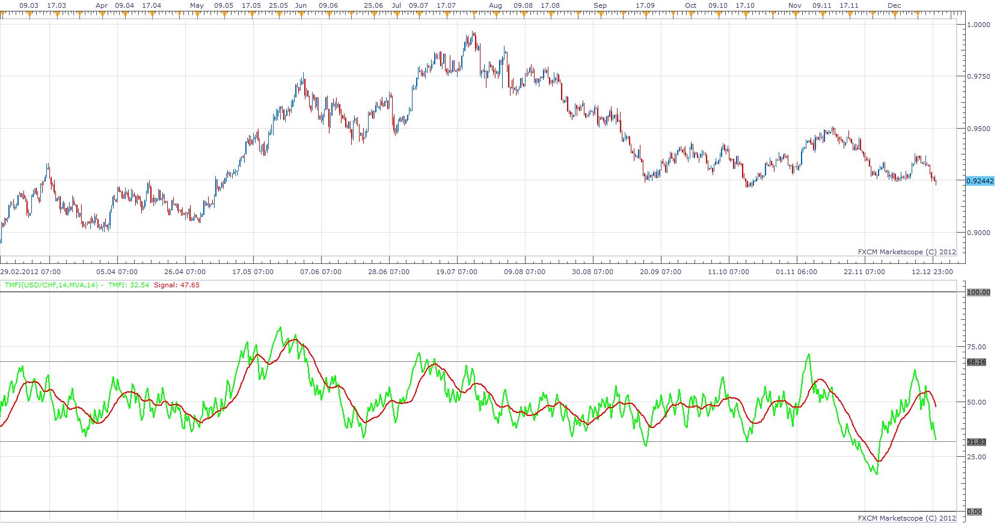
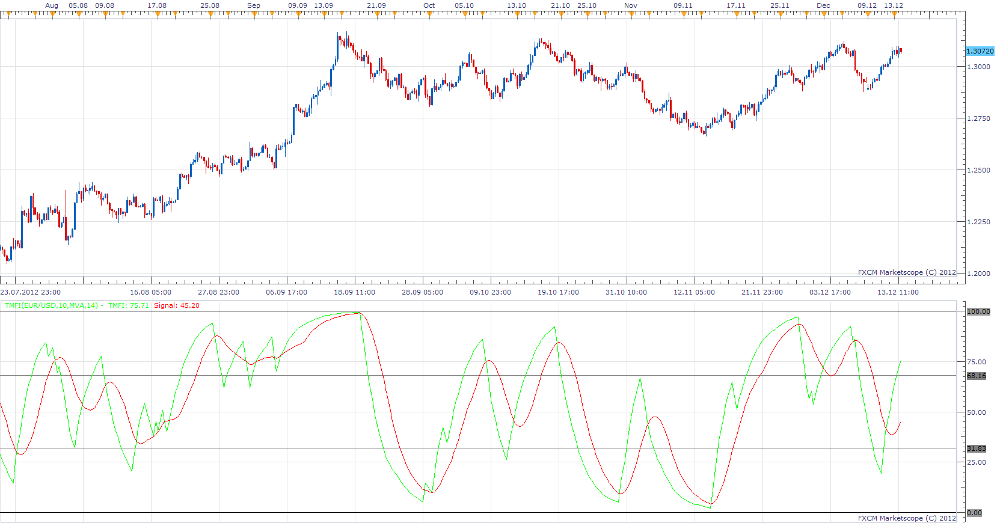

# True Money Flow Index

> Source: https://fxcodebase.com/code/viewtopic.php?f=17&t=27688  
> Forum: 17 · Topic 27688 · 9 post(s)

---

## True Money Flow Index

**Apprentice** · Thu Dec 13, 2012 12:52 pm

 [tmfi.lua](files/48452/tmfi.lua)

---

## Smoothed True MFI indicator

**Apprentice** · Thu Dec 13, 2012 1:17 pm

 [STMFI.lua](files/48454/STMFI.lua)

---

## Re: True Money Flow Index

**newton** · Thu Dec 13, 2012 6:27 pm

hi,

can u create a strategy based on this indicator.

buy level :60

sell level: 40

**buy:tmfi > buy level and tmfi cross over signal

sell: tmfi < sell level and tmfi cross under signal**

---

## Re: True Money Flow Index

**Apprentice** · Sat Dec 15, 2012 4:05 am

Your request is added to the development list.

---

## Re: True Money Flow Index

**Apprentice** · Thu Dec 27, 2012 4:39 am

Requested can be found here.
[viewtopic.php?f=31&t=27987&p=49114#p49114](https://fxcodebase.com/code/viewtopic.php?f=31&t=27987&p=49114#p49114)

---

## Re: True Money Flow Index

**newton** · Thu Dec 27, 2012 8:40 am

thankyou apprentice .

---

## Re: True Money Flow Index

**Coondawg71** · Wed Feb 13, 2013 5:46 pm

Can we please add a "50" line to BOTH of these indicators.

Thanks!

sjc

---

## Re: True Money Flow Index

**Apprentice** · Thu Feb 14, 2013 4:19 am

50 Line Added.

---

## Re: True Money Flow Index

**Apprentice** · Thu Apr 05, 2018 6:03 am

The Indicator was revised and updated.
