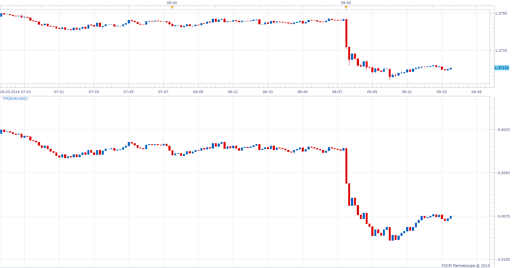
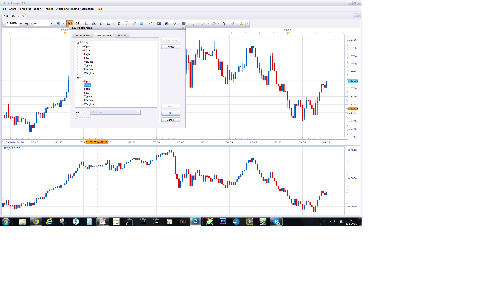

# True Price Index

> Source: https://fxcodebase.com/code/viewtopic.php?f=17&t=60466  
> Forum: 17 · Topic 60466 · 6 post(s)

---

## True Price Index

**Apprentice** · Fri Mar 28, 2014 3:37 am

Posted by request.
[viewtopic.php?f=27&t=60459](https://fxcodebase.com/code/viewtopic.php?f=27&t=60459)

 

 [TPI.lua](files/93255/TPI.lua)

 [TPI Line.lua](files/93255/TPI%20Line.lua)

---

## Re: True Price Index

**mennzz** · Fri Mar 28, 2014 8:50 am

This type of indicator expresses a clear view on price and it's direction without the heavy clutter usually on charts. On it's own, it highlights some micro divergences and combined with other oscillators such as MACD and True Strength Index (TSI), it works quite well.

For example: Here is the True Strength Index indicator with the TPI indicator as it's source data feed. Notice how there is fakeout divergence on the regular TSI while the TPI backed TSI indicator seems to weed out those fake divergence signals.

 

*Daily Chart of EURUSD with Divergences*

And then notice here how the TPI backed True Strength Index indicator likes to bounce off the close by trendlines when the regular TSI just blows right through or never even reaches them.

 

*Daily Chart of EURUSD with Trendlines*

It's a valid point that the regular TSI has it's own plus and advantages, but the (TPI) True Price backed True Strength Index indicator has some neat features of it's own that may rarely be found in other places.

Many thanks to the person who coded this indicator.

---

## Re: True Price Index

**Amr-Atallah** · Sun Mar 30, 2014 2:32 pm

If I may ask .. In the last picture, how did you manage to get the TSI merged with the TPI or in other words the TSI is getting it's data from the TPI ...

I'm currently using Market Scope ... Right clicked and went to Change Indicator >> Data Source and can't find how u linked them together as shown in the picture ...

Thanks in advance =)

---

## Re: True Price Index

**Apprentice** · Mon Mar 31, 2014 2:23 am

For each indicator, u can select source.
In this case, this is one of the components of True Price Index ("Zone")
I have changed "Zone" to TPI, please redownload.

---

## Re: True Price Index

**Amr-Atallah** · Mon Mar 31, 2014 4:32 am

Thank you Apprentice =)

---

## Re: True Price Index

**Apprentice** · Sun Jun 18, 2017 12:45 pm

The indicator was revised and updated.
