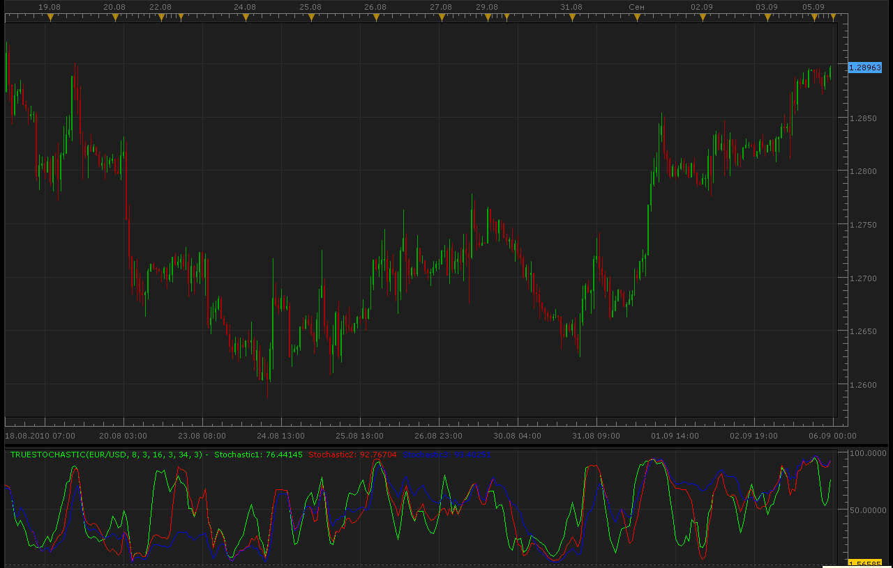

# True stochastic indicator

> Source: https://fxcodebase.com/code/viewtopic.php?f=17&t=2070  
> Forum: 17 · Topic 2070 · 6 post(s)

---

## True stochastic indicator

**Alexander.Gettinger** · Sun Sep 05, 2010 10:48 pm

[viewtopic.php?f=27&t=1953](https://fxcodebase.com/code/viewtopic.php?f=27&t=1953)
Indicator draw 3 stochastics on one chart.

 

 [TrueStochastic.lua](files/4239/TrueStochastic.lua)

The indicator was revised and updated

---

## Re: True stochastic indicator

**bourik** · Fri Feb 04, 2011 5:48 am

Hello

is it possible to modify the code to be able to change the size and the style of the differents stochastics which composed this indicator

Thanks

---

## Re: True stochastic indicator

**Apprentice** · Fri Feb 04, 2011 6:16 am

Style Option Added.

---

## Re: True stochastic indicator

**bourik** · Fri Feb 04, 2011 6:26 am

Thanks a lot

I don't speak very well english to tell what I think about your job but your like a god for me

Have a good week end

---

## Re: True stochastic indicator

**bourik** · Fri Feb 04, 2011 6:31 am

Thanks you very very much

---

## Re: True stochastic indicator

**Apprentice** · Fri Feb 17, 2017 10:10 am

Indicator was revised and updated.
