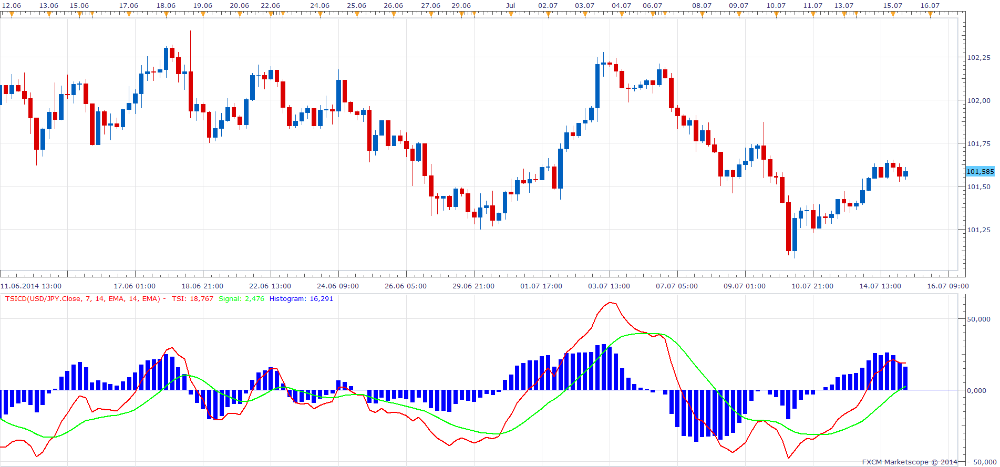

# True Strength Index Convergence Divergence

> Source: https://fxcodebase.com/code/viewtopic.php?f=17&t=60923  
> Forum: 17 · Topic 60923 · 26 post(s)

---

## True Strength Index Convergence Divergence

**Apprentice** · Tue Jul 15, 2014 5:40 am

Based on request.
[viewtopic.php?f=27&t=60914&p=94932#p94901](https://fxcodebase.com/code/viewtopic.php?f=27&t=60914&p=94932#p94901)

Your regular pre-installed True Strength Index with a few extras.
U can have any source stream as source indicator.
More moving average methods is available.

Additional lines.
Signal Line as the moving average of the TSI.
Histogram Line as the difference between the TSI & signal lines.

 [TSICD.lua](files/94946/TSICD.lua)

 

 [HTF TSICD.lua](files/94946/HTF%20TSICD.lua)

 

 [Lower Time Frame True Strength Index Convergence Divergence.lua](files/94946/Lower%20Time%20Frame%20True%20Strength%20Index%20Convergence%20Divergence.lua)

---

## Re: True Strength Index Convergence Divergence

**Apprentice** · Sun Jun 25, 2017 1:03 pm

The indicator was revised and updated.

---

## Re: True Strength Index Convergence Divergence

**Kelly123** · Sun Aug 28, 2022 3:37 am

Hi Apprentice
Can you make some adjustment to this topic

1. To have option to hide Histogram but keep Zero line and add an overbought and over sold level
2. To draw the divergences on TSI oscillator when price and TSI in disagreement
3. To have a dash line as they are forming and change to a solid line when crossed ma

**Reversal Divergence**
To only print a potential forming Divergence just after point 1 of DV the TSI to cross below MA for sells and price has made new high Dash line Divergence printed then confirmed to solid line on the cross below MA (Vice Versa for buys)

**Trend Continuation Divergence**
To only print a potential forming Divergence just after point 1 of DV the TSI to cross above MA for buys and price has failed to make a new low Dash line Divergence printed then confirmed to solid line on the cross above MA (Vice Versa for sells)
Thanks in a Advance
Kelly

 

---

## Re: True Strength Index Convergence Divergence

**Apprentice** · Wed Aug 31, 2022 4:15 am

We have added your request to the development list.
Development reference 528.

---

## Re: True Strength Index Convergence Divergence

**Kelly123** · Sun Sep 18, 2022 5:20 am

Hi Apprentice,
Any update with this request ?
Kelly

---

## Re: True Strength Index Convergence Divergence

**Apprentice** · Mon Nov 14, 2022 4:04 pm

Based on the request.
[https://fxcodebase.com/code/viewtopic.php?f=27&p=14769](https://fxcodebase.com/code/viewtopic.php?f=27&p=14769)

 [Dynamic TSI CD.lua](files/148328/Dynamic%20TSI%20CD.lua)

---

## Re: True Strength Index Convergence Divergence

**arfs9090** · Tue May 09, 2023 8:05 am

Hey Apprentice & Team
Is there aw way you can use a LTF on TSI on HTF price action for this topic and add zero line and hide the histogram
[https://fxcodebase.com/code/viewtopic.php?f=27&p=14769](https://fxcodebase.com/code/viewtopic.php?f=27&p=14769)
hope you can help thanks in advance
Arf

---

## Re: True Strength Index Convergence Divergence

**Apprentice** · Tue May 09, 2023 12:10 pm

To have an LTH oscillator on HTF?
Can you repost the link?

---

## Re: True Strength Index Convergence Divergence

**arfs9090** · Wed May 10, 2023 1:10 am

Hey Apprentice

Yes to to have LTF oscillator on HTF and option to hide histogram but show zero line [https://fxcodebase.com/code/viewtopic.php?f=27&p=14769](https://fxcodebase.com/code/viewtopic.php?f=27&p=14769) to the topic at top of this page
thanks Arf

---

## Re: True Strength Index Convergence Divergence

**arfs9090** · Wed May 10, 2023 2:26 am

Hey Apprentice
ignore last message the link was wrong here is the correct one and if you have option to hide histogram and keep zero line
and yes to your question to have LTF Oscillator on HTF
 [viewtopic.php?f=17&t=60923](https://fxcodebase.com/code/viewtopic.php?f=17&t=60923)
thanks Arf

---

## Re: True Strength Index Convergence Divergence

**Apprentice** · Sat May 13, 2023 12:07 pm

The link is broken.

Do you have an example of something similar to what you want?

Here are some examples.
[https://fxcodebase.com/code/viewtopic.p ... me#p133441](https://fxcodebase.com/code/viewtopic.php?f=17&t=69782&p=133441&hilit=lower+time+frame#p133441)
[https://fxcodebase.com/code/viewtopic.p ... =10#p97425](https://fxcodebase.com/code/viewtopic.php?f=28&t=61403&start=10#p97425)

We can do it for a single line.
The problem is for Multiple lines it will be crowded.
Maybe if I add a selector for one maybe two lines.

---

## Re: True Strength Index Convergence Divergence

**arfs9090** · Mon May 15, 2023 12:35 am

Hey Apprentice

Here are the links of the original request to be converted to lua and your version if this can be done on your version in lua (screen shot of your version to be recoded to have LTF oscillator on HTF price action
[viewtopic.php?f=27&t=60914&p=94932#p94901](https://fxcodebase.com/code/viewtopic.php?f=27&t=60914&p=94932#p94901)

and if you have option to hide histogram and keep zero line
and yes to your question to have LTF Oscillator on HTF have looked at the link to generic but dont see TSI indicator on there

thanks Arf

 

---

## Re: True Strength Index Convergence Divergence

**Apprentice** · Fri May 19, 2023 9:00 am

Something like HTF TSICD?
[https://fxcodebase.com/code/viewtopic.php?f=17&t=60923](https://fxcodebase.com/code/viewtopic.php?f=17&t=60923)

---

## Re: True Strength Index Convergence Divergence

**arfs9090** · Fri May 19, 2023 12:22 pm

> **Apprentice wrote:**
> Something like HTF TSICD?
> [https://fxcodebase.com/code/viewtopic.php?f=17&t=60923](https://fxcodebase.com/code/viewtopic.php?f=17&t=60923)

Hey Apprentice
Not sure if you understand the request if you have a LTF TSICD (using the LTF data) on a HTF price action chart for example price chart 5min and want to use the 1min TSICD (so every 1min the TSICD will update instead of using the 5min to update)
 the one you have done is to have HTF TSICD on LTF price action chart (which you can do using data Source) I saw on the update you have option to hide histogram but it also hides the zero line if you just add zero and still have option to hide histogram
hope this clarify the request
thanks Arfs

---

## Re: True Strength Index Convergence Divergence

**Apprentice** · Wed May 24, 2023 12:47 pm

Zelo line add to HTF version.

---

## Re: True Strength Index Convergence Divergence

**arfs9090** · Wed May 24, 2023 11:02 pm

Hey Apprentice
**Not sure if you understand the request if you have a LTF TSICD**
(using the LTF data) on a HTF price action chart
for example
5min price chart and want to use the 1min TSICD on the 5min price chart
(so every 1min the TSICD will update instead of using the 5min to update)

hope this clarify the request
thanks Arfs

---

## Re: True Strength Index Convergence Divergence

**Apprentice** · Sat Jun 03, 2023 5:44 am

Try LTF version.
[https://fxcodebase.com/code/viewtopic.php?f=17&t=60923](https://fxcodebase.com/code/viewtopic.php?f=17&t=60923)

---

## Re: True Strength Index Convergence Divergence

**arfs9090** · Tue Jun 06, 2023 2:21 am

Hey Apprentice
is there a way you can change the bars on the LTF TSICD back to lines and the zero line has gone if you can add pls
thanks Arf

---

## Re: True Strength Index Convergence Divergence

**Apprentice** · Thu Jun 15, 2023 5:12 am

[Lower Time Frame True Strength Index Convergence Divergence.lua](files/151226/Lower%20Time%20Frame%20True%20Strength%20Index%20Convergence%20Divergence.lua)

Try this version.

---

## Re: True Strength Index Convergence Divergence

**arfs9090** · Sat Jun 17, 2023 4:11 am

Hi Apprentice
Great work with this topic but there seems to a problem with the short ma as it never crosses the long ma (Or TSI never crosses the Signal line) on default settings or any others have tried different settings and still no cross over as thats want to use as the conformation trigger. if you can look into this also when on default and not using LTF TSI use 5min on 5min there is only one line The down in the LTF TSI, on the the original TSI it labeled as TSI line and signal line is this just a labelling thing
thanks in advance 
arfs

---

## Re: True Strength Index Convergence Divergence

**Apprentice** · Wed Jun 21, 2023 9:37 am

We can not draw all values for the lower time frame,
therefore, for the selected line,
we only draw the highest and lowest value for the period,

If you select the chart time frame, we will have only one line.
(selected line)

---

## Re: True Strength Index Convergence Divergence

**Apprentice** · Thu Aug 17, 2023 2:08 pm

Task 528

 

 [TSICD.lua](files/152127/TSICD.lua)

There are a lot of divergence indicators that already exist.
 You can try:
[viewtopic.php?f=17&t=65033&p=114501#p114501](https://fxcodebase.com/code/viewtopic.php?f=17&t=65033&p=114501#p114501)
[viewtopic.php?f=17&t=64631](https://fxcodebase.com/code/viewtopic.php?f=17&t=64631)
[viewtopic.php?f=31&t=2841](https://fxcodebase.com/code/viewtopic.php?f=31&t=2841)
[viewtopic.php?f=17&t=70545](https://fxcodebase.com/code/viewtopic.php?f=17&t=70545)
[viewtopic.php?f=17&t=70545](https://fxcodebase.com/code/viewtopic.php?f=17&t=70545)
etc

---

## Re: True Strength Index Convergence Divergence

**Kelly123** · Thu Oct 05, 2023 12:03 am

Hi Apprentice,
Can you draw a horizontal ray from the current live signal and TSI line looking back have option to turn either or both off and use same colour option as the signal & TSI line also able to hide histogram but keep zero line (have colour option for zero line)
thanks in advance Kelly

 

---

## Re: True Strength Index Convergence Divergence

**Apprentice** · Fri Oct 06, 2023 3:11 am

We have added your request to the development list.
Development reference 900.

---

## Re: True Strength Index Convergence Divergence

**Kelly123** · Wed Oct 25, 2023 6:22 am

Hi Apprentice & Team
any updates with this request?
kelly

---

## Re: True Strength Index Convergence Divergence

**Apprentice** · Mon Oct 30, 2023 6:24 am

 [TSICD.lua](files/153125/TSICD.lua)
