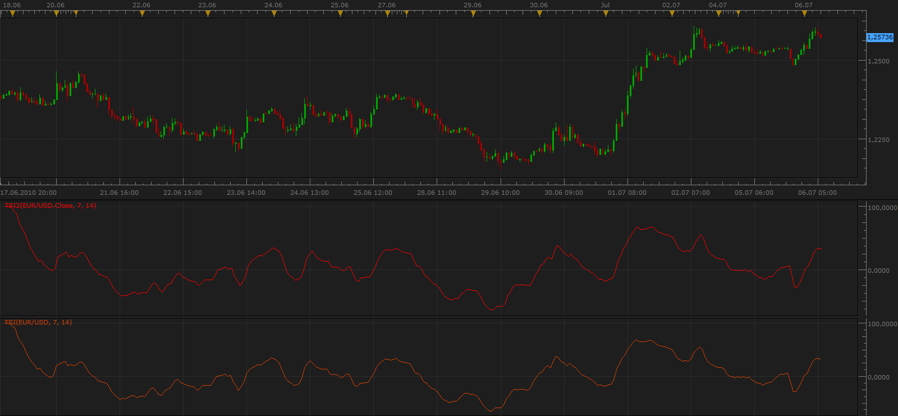

# True Strength Index (TSI) - Modification

> Source: https://fxcodebase.com/code/viewtopic.php?f=17&t=1466  
> Forum: 17 · Topic 1466 · 8 post(s)

---

## True Strength Index (TSI) - Modification

**Apprentice** · Tue Jul 06, 2010 5:24 am

I made a small modification of standard TSI indicator.
You can use it on other data sources (indicators, indices, ...)

To work properly you need to download both files.

 [TSI2.lua](files/2869/TSI2.lua)

 [TSI2.lua.rc](files/2869/TSI2.lua.rc)

The next version of MarketScope should include this version as a standard.

The indicator was revised and updated

---

## Re: True Strength Index (TSI) - Modification

**jimmybh** · Tue Aug 13, 2013 3:09 am

Hi there

This is a really powerful indicator and can identify some great set ups - is there a version with an email alert for zero line cross overs?

Many thanks, James

---

## Re: True Strength Index (TSI) - Modification

**Apprentice** · Wed Aug 14, 2013 1:40 am

Your request is added to the development list.

---

## Re: True Strength Index (TSI) - Modification

**Coondawg71** · Tue Jun 24, 2014 2:28 pm

With the recent TSI Candle added to the Lua library I thought I would share a MACD based on the True Strength indicator. I simply altered the RSI MACD and used TSI indicator as the point of source. Interesting comparison and useful!

Please the attached.

sjc

You can download Averages.lua here.
[viewtopic.php?f=17&t=2430](https://fxcodebase.com/code/viewtopic.php?f=17&t=2430)

---

## Re: True Strength Index (TSI) - Modification

**Apprentice** · Sun Jun 25, 2017 1:21 pm

The indicator was revised and updated.

---

## Re: True Strength Index (TSI) - Modification

**ksalex** · Fri May 08, 2020 5:57 am

> **Coondawg71 wrote:**
> With the recent TSI Candle added to the Lua library I thought I would share a MACD based on the True Strength indicator. I simply altered the RSI MACD and used TSI indicator as the point of source. Interesting comparison and useful!
>
> Please the attached.
>
> sjc

Hi,
when I try to insert this indicator, a message appears that informs me to install AVERAGES indicator. Which indicator does it mean??

---

## Re: True Strength Index (TSI) - Modification

**Apprentice** · Fri May 08, 2020 11:18 am

You can download Averages.lua here.
[viewtopic.php?f=17&t=2430](https://fxcodebase.com/code/viewtopic.php?f=17&t=2430)

---

## Re: True Strength Index (TSI) - Modification

**ksalex** · Sat May 09, 2020 2:36 pm

thanks a lot Apprentice!
