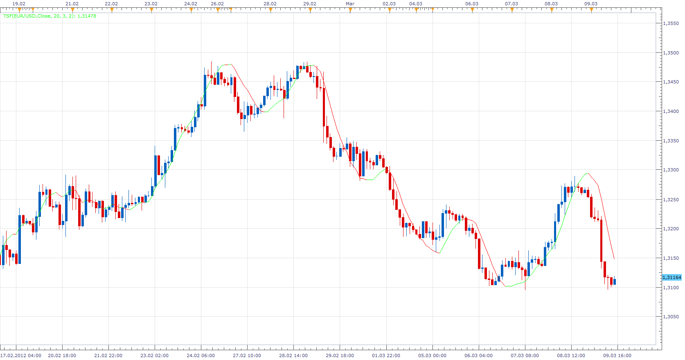
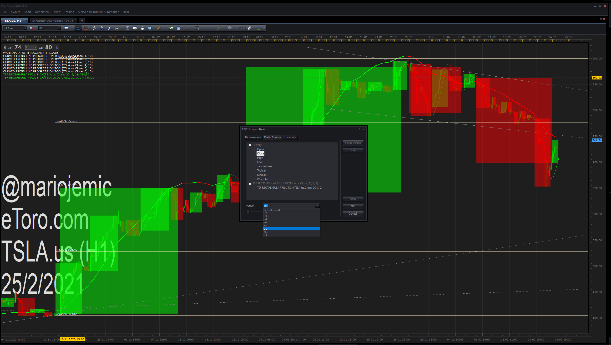

# TSF Indicator

> Source: https://fxcodebase.com/code/viewtopic.php?f=17&t=14691  
> Forum: 17 · Topic 14691 · 25 post(s)

---

## TSF Indicator

**Apprentice** · Sun Mar 11, 2012 6:05 am

This simple indicator is MT4 translation.
Use the formula.

 TSF[period] = LWMA * LWMA_Weight - MA * MA_Weight

 [TSF.lua](files/27856/TSF.lua)

 

 [TSF Rectangular Fill Tick.lua](files/27856/TSF%20Rectangular%20Fill%20Tick.lua)

 [TSF Rectangular Fill Bar.lua](files/27856/TSF%20Rectangular%20Fill%20Bar.lua)

 

 [Two Line TSF Rectangular Fill Bar.lua](files/27856/Two%20Line%20TSF%20Rectangular%20Fill%20Bar.lua)

 [Two Line TSF Rectangular Fill Tick.lua](files/27856/Two%20Line%20TSF%20Rectangular%20Fill%20Tick.lua)

MT4/MQ4 version.
[viewtopic.php?f=38&t=68365](https://fxcodebase.com/code/viewtopic.php?f=38&t=68365)
Indicator based Signal/Strategy
[https://fxcodebase.com/code/viewtopic.php?f=17&t=72830](https://fxcodebase.com/code/viewtopic.php?f=17&t=72830)

---

## Re: TSF Indicator

**briansummy** · Sun Mar 11, 2012 8:30 pm

That is pretty sweet!

---

## Re: TSF Indicator

**Blackcat2** · Tue Mar 13, 2012 6:55 am

Hi Apprentice,

Is it the same the developed by richardtao ([viewtopic.php?f=17&t=4096](https://fxcodebase.com/code/viewtopic.php?f=17&t=4096))?

The filename is the same so I can't just copy it in, will it work if I just rename the filename?

Thanks..
BC

---

## Re: TSF Indicator

**Apprentice** · Tue Mar 13, 2012 7:01 am

Name change does not affect functionality.

---

## Re: TSF Indicator

**Apprentice** · Sun Apr 02, 2017 7:26 am

Indicator was revised and updated.

---

## Re: TSF Indicator

**SANTOSH** · Wed Apr 03, 2019 8:49 am

> **Apprentice wrote:**
>
>
> The attachment **TSF.png** is no longer available
>
>
>
> This simple indicator is MT4 translation.
> Use the formula.
>
> TSF[period] = LWMA * LWMA_Weight - MA * MA_Weight
>
>
>
> The attachment **TSF.png** is no longer available
>
>
> The indicator was revised and updated

Hi Apprentice ,
Can from start of bullish green ma to end of bullish green ma be filled with a rectangular green box , also the same for bearish red ma start -end .
For more clear , i have attached the picture edited in paint .
Also , there could be an option available to change the rectangular height .
Rectangular width cannot be changed as its start end are defined to the ma .

So just need an option to change the rectangular height .

Regards ,
santosh sahu

---

## Re: TSF Indicator

**Apprentice** · Thu Apr 04, 2019 4:28 pm

Try TSF Rectangular Fill Bar.lua

---

## Re: TSF Indicator

**SANTOSH** · Fri Apr 05, 2019 4:54 am

> **Apprentice wrote:**
> Try TSF Rectangular Fill Bar.lua

That was really great and fast work APPRENTICE , cheers!

I have made a TSF 2.0 indicator which includes both fast and slow ma with same bullish and bearish colours as the original TSF indicator . It just includes two mas (lag and lead ).Attached pictures .

**Now when both the slow and fast ma agree the same trend for example bullish , then that area should be filled by a rectangular green box , vice versa for the bearish .**

Attached the indicator and also the shaded area as explain above which is needed .

Regards ,
Santosh .

---

## Re: TSF Indicator

**Apprentice** · Fri Apr 05, 2019 3:51 pm

Try Two Line TSF Rectangular Fill.

---

## Re: TSF Indicator

**SANTOSH** · Fri Apr 05, 2019 10:00 pm

> **Apprentice wrote:**
> Try Two Line TSF Rectangular Fill.

That was super fast !!!
Thanks buddy !!

Regards ,
Santosh

---

## Re: TSF Indicator

**kitefrog** · Mon Apr 08, 2019 7:54 am

nice work

---

## Re: TSF Indicator

**MemphisRokudo** · Tue Apr 16, 2019 4:25 am

Can you make a mt4 version of the box indicator with alerts when it appears?

---

## Re: TSF Indicator

**Apprentice** · Thu Apr 18, 2019 5:12 am

Your request is added to the development list under Id Number 4597

---

## Re: TSF Indicator

**Apprentice** · Fri Apr 19, 2019 6:38 am

MT4/MQ4 version.
[viewtopic.php?f=38&t=68365](https://fxcodebase.com/code/viewtopic.php?f=38&t=68365)

---

## Re: TSF Indicator

**SANTOSH** · Mon Dec 07, 2020 5:55 pm

Is this doable for this TSF TWO LINE FILL INDICATOR ?
Print the Width , Height and Ration of W/h On the chart ?

Regards ,
Santosh.

---

## Re: TSF Indicator

**Apprentice** · Tue Dec 08, 2020 4:29 am

Your request is added to the development list.
Development reference 2415.

---

## Re: TSF Indicator

**Apprentice** · Thu Dec 10, 2020 6:55 am

[Two Line TSF Rectangular Fill Bar.lua](files/139437/Two%20Line%20TSF%20Rectangular%20Fill%20Bar.lua)

Try this version.

---

## Re: TSF Indicator

**SANTOSH** · Sun Feb 21, 2021 7:46 am

Hi Apprentice ,

Can you make this indicator Multi time frame for three time frames ?

TF 1
TF 2
TF 3

Regards ,
Santosh Sahu .

---

## Re: TSF Indicator

**Apprentice** · Mon Feb 22, 2021 3:20 am

What information will be shown?
Value or relative position in relation to the TSF Indicator line.

---

## Re: TSF Indicator

**SANTOSH** · Mon Feb 22, 2021 12:29 pm

> **Apprentice wrote:**
> What information will be shown?
> Value or relative position in relation to the TSF Indicator line.

1. User selectable bool to select TF1 , TF2, TF3
2. User selectable time frame selector - m1 , m5 , h1 etc
3. If TF 1 is true and selected m1 it should TSF FILL 1 min boxes even if 5 min chart or any other tf chart .
4. IF TF 2 is true and selected m5 it should show TSF Fill 5 min boxes even if 1 min chart or anyother chart selected .
5. Same goes for TF3 .

---

## Re: TSF Indicator

**Apprentice** · Tue Feb 23, 2021 2:53 am

Your request is added to the development list.
Development reference 221.

---

## Re: TSF Indicator

**Apprentice** · Wed Feb 24, 2021 7:41 am

Why not overlay 3 indicators?
This is a much more universal solution.
 It'll work faster, with fewer bugs and you can add any number of timeframes you want.

---

## Re: TSF Indicator

**SANTOSH** · Wed Feb 24, 2021 11:38 am

> **Apprentice wrote:**
> Why not overlay 3 indicators?
> This is a much more universal solution.
> It'll work faster, with fewer bugs and you can add any number of timeframes you want.

Need different tf indicator in different timeframe chart .
Possible?

---

## Re: TSF Indicator

**Apprentice** · Thu Feb 25, 2021 2:56 am

---

## Re: TSF Indicator

**SANTOSH** · Thu Feb 25, 2021 7:51 pm

> **Apprentice wrote:**
>
>
> Untitled.png

Good one !!
Thanks !
