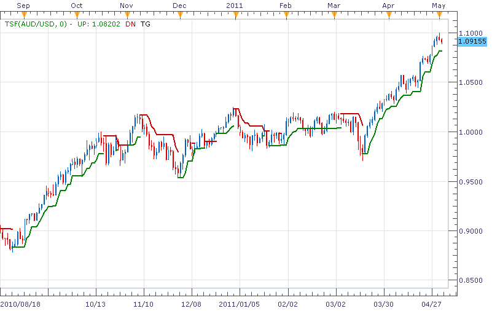

# TSF indicator

> Source: https://fxcodebase.com/code/viewtopic.php?f=17&t=4096  
> Forum: 17 · Topic 4096 · 20 post(s)

---

## TSF indicator

**richardtao** · Mon May 02, 2011 11:50 pm

The TSF indicator version 1 is applying to Trading Station II.
The indicator is the Richard Tao Trend Signal Framework.
( The Holy Grail of trading rules:
In moving market trades trend, in fluctuating market trades range, and don’t misuse. )

This is utilized to verify indicators for Trend indentify and trading signal.
This version combines TTI, TKD, and TCA by applying TTS status change then displaying trading signal by trailing ATR. Therefore it needs to prepare above indicators.

The first parameter is "SELC: Select " which defines trend decided indicator. To select "AUTO" is syndicated three indicators in one.
The second parameter is "PA: Parameters of automation" which defines nine parameters only on selecting AUTO. The parameter separate column by ”,” columns 1,2,3 set WN, HN and TN of TTI; 4,5,6 set WN, HN and TN of TKD; 7,8,9 set WN, HN and TN of TCA.
The third parameter is "PA: Parameters of selected " which defines four parameters only on selecting TTI/TKD/TCA.
The parameter separate column by ”,” column 1 defines periods for whipsaw status.
The aggressive strategy will set WN as smaller number. To avoid fluctuation just set WN as bigger number.
The parameter column 2 defines periods to adjust trend beginning and fading.
The parameter column 3 defines periods to catch major trend.
The parameter column 4 defines periods of ma smooth.

The fourth parameter is " AppStatus: Applying Status" which defines whether applying TTS status change or not. If this parameter set to be true, the two succeeded parameters are valid on:
The parameter "AF: Timeframe " which defines the timeframe of TTS.
The parameter "AN: Periods of Applying " which defines periods of TTS.

The appearance of UP stream shows that trading signal of buying and trailing stop.
The appearance of DN stream shows that trading signal of selling and trailing stop.

The general parameters I was focused on including EUR/USD, GBP/USD, USD/CHF, AUD/USD in D1, H4, H1 timeframe. If anybody is interested in one of these, just send me private message.

For correct work of this indicator, you should download and install the following indicators:
TTI
[viewtopic.php?f=17&t=3559#p10031](https://fxcodebase.com/code/viewtopic.php?f=17&t=3559#p10031)
TTS
[viewtopic.php?f=17&t=3610#p10271](https://fxcodebase.com/code/viewtopic.php?f=17&t=3610#p10271)
TKD
[viewtopic.php?f=17&t=3477#p10030](https://fxcodebase.com/code/viewtopic.php?f=17&t=3477#p10030)
TCA
[viewtopic.php?f=17&t=3393#p10029](https://fxcodebase.com/code/viewtopic.php?f=17&t=3393#p10029)

The indicator was revised and updated

---

## Re: TSF indicator

**bluepip** · Tue May 03, 2011 4:44 pm

I can't install it

;-(

---

## Re: TSF indicator

**sunshine** · Tue May 03, 2011 11:50 pm

For correct work of this indicator, you should download and install the following indicators:
TTI
[viewtopic.php?f=17&t=3559#p10031](https://fxcodebase.com/code/viewtopic.php?f=17&t=3559#p10031)
TTS
[viewtopic.php?f=17&t=3610#p10271](https://fxcodebase.com/code/viewtopic.php?f=17&t=3610#p10271)
TKD
[viewtopic.php?f=17&t=3477#p10030](https://fxcodebase.com/code/viewtopic.php?f=17&t=3477#p10030)
TCA
[viewtopic.php?f=17&t=3393#p10029](https://fxcodebase.com/code/viewtopic.php?f=17&t=3393#p10029)

---

## Re: TSF indicator

**RJH501** · Mon Jul 25, 2011 7:01 pm

Hello Richard, you have an interesting indicator that I am trying.

Would it be possible to give us the ability to change the line width? It would be a big help.

Thank you,

RJH

---

## Re: TSF indicator

**richardtao** · Tue Jul 26, 2011 6:07 am

hi RJH
Thanks for your advise.
hope this updated would help.

---

## Re: TSF indicator

**RJH501** · Tue Jul 26, 2011 5:14 pm

Hi Richard, thanks for the quick reply! Could you please check the download link?

I get an error that the link is missing.

Thanks much,

Richard

---

## Re: TSF indicator

**RJH501** · Tue Jul 26, 2011 5:49 pm

Thanks again Richard! I employed another method to save the .lua file and it works fine.

However above 15 minutes it loads in a separate area under the main chart where it isn't helpfull.

Regards,

Richard

---

## Re: TSF indicator

**richardtao** · Thu Aug 04, 2011 12:09 am

hi RJH
i am not sure...
maybe some indicators exclude others.
please remove all indicator than try add one again.
below is my testing snapshot for eur/usd 15m.

 

---

## Re: TSF indicator

**RJH501** · Thu Aug 04, 2011 7:12 pm

Hi Richard,

No problems 15 min and lower. Doesn't work above 15 minutes, i.e. 30 min or 60 min or higher.

You need a bigger time frame edition.

Regards,

Richard

---

## Re: TSF indicator

**richardtao** · Fri Aug 05, 2011 3:38 am

hi Richard,
do you mind checking the parameter "Applying Timeframe"?
it suppose to be set the bigger timeframe than the target instrument.
or you can capture the errlog or message for me.
thank a lot!

---

## Re: TSF indicator

**RJH501** · Fri Aug 05, 2011 10:03 am

Hi Richard,

SEE ATTACHED

Ther is no error, it just shows in 2nd window NOT on chart.

Good Luck,

Richard

---

## Re: TSF indicator

**t1982t** · Sun Aug 07, 2011 9:24 pm

Hello, thank you for this indicator. I wondering if is it possible a strategy with it.
Kind regards

---

## Re: TSF indicator

**richardtao** · Wed Aug 10, 2011 6:13 am

hi RJH
it's weird, i am not sure why the indicator switch to the new window as a oscillator.
you can select change indicator to open the properties dialogue.
select "location" tag than mouse click the first line "chart-EUR/USD ..."
at last click "apply" button.
the indicator will go back to price chart area.
if this way is not work, please let me know. thanks.

 

the timeframe m30 could try parameter 9,30,50,9,40,50,9,40,60
Applying Timeframe H2, period 10

---

## Re: TSF indicator

**richardtao** · Wed Aug 10, 2011 6:17 am

hi t1982t
sorry i did not build strategy so far.
it's good advise.i will do it in the future.

---

## Re: TSF indicator

**mike62** · Thu Aug 11, 2011 11:50 am

Hi Richard
Does the TSF indicator repaint?

Thank you for your time.

Miguel

---

## Re: TSF indicator

**RJH501** · Sun Aug 14, 2011 12:05 pm

Thanks Richard!

---

## Re: TSF indicator

**yccharlie** · Fri Aug 26, 2011 4:36 am

Helo!

I have the same question as mike62;

Does the TSF indicator repaint/recalculate?

Thanks for your answer,
Charlie

---

## Re: TSF indicator

**richardtao** · Thu Sep 01, 2011 8:38 pm

hi mike62 & yccharlie
sorry, i am not understanding the question.
if "Applying Status" set to true, the indicator need to load difference timeframe data source.
after loading, it need to redraw base on the new source.
is this answer what you ask?

---

## Re: TSF indicator

**briansummy** · Fri Mar 23, 2012 11:09 pm

That's a great question. Basically, when looking at the chart, will it change colors in the few bars past like, nonlagdot, Semafor, ZigZag, and so forth? Many indicators I am coming across which looking spot on turn out to change opposite a few candles to the future. I hope the TSF doesn't because it looks very accurate when using a larger time frame. For example when looking at a minute chart the blue nonlagdots are showing continue buy pressure, but 4 or 5 candles in the future the price drops hard and the previous blue dots "repaint" to a red! So when loading a chart up initially it appears that the nonlagdots picked the top and bottom candle perfectly however in real time it changes on the chart by repainting.

A strategy with the TSF indicator Green Buy/Red Sell signal in agreement with Tick SAR strategy and/or the Averages SAR Candle strategy would be an excellent strategy if there is no repainting if it's possible and just might be the winning combination.

I hope to see more info about the TSF in the future.

---

## Re: TSF indicator

**Apprentice** · Mon Mar 27, 2017 3:41 pm

Indicator was revised and updated.
