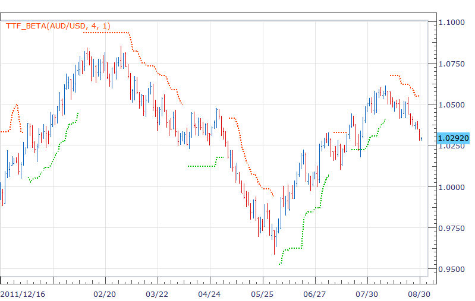

# TTF indicator

> Source: https://fxcodebase.com/code/viewtopic.php?f=17&t=22844  
> Forum: 17 · Topic 22844 · 2 post(s)

---

## TTF indicator

**richardtao** · Thu Aug 30, 2012 10:22 pm

The TTF indicator is nominated Richard Tao Trend Follower.
This beta version is applying to Trading Station II.

 

This indicator is not a predictor but a follower.
Every trader needs one follower indicator at least, because a common saying: trend is your friend.
However, the trend follower is defected by swing.
The TTF try to eliminate the market fluctuation.

The first parameter is " N: Number of periods" which defines periods.
The second parameter is " T: Type of strategy" which provide 1 to 3 strategies.

The recommend parameters setting as below:
D1: (3 or 4, 1); (5 or 6, 2); (3 or 5, 3)
H4: (4 or 6, 1); (3 to 6, 2); (5 or 6, 3)
H1: (6 or 8, 1); (3 to 5, 2); (3, 3)

 [TTF_beta.bin](files/39411/TTF_beta.bin)

The relevant strategy posted on TTF_S.

---

## Re: TTF indicator

**Apprentice** · Thu Apr 06, 2017 3:51 pm

Bump up.
