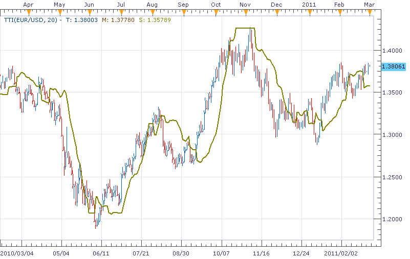

# TTI indicator

> Source: https://fxcodebase.com/code/viewtopic.php?f=17&t=3559  
> Forum: 17 · Topic 3559 · 3 post(s)

---

## TTI indicator

**richardtao** · Mon Feb 28, 2011 9:28 pm

The TTI indicator version 1 is applying to Trading Station II.
The indicator is nominated as Richard Tao Trailing Signal indicator.
This indicator is the fast predictor. It represents the leading signal of trend.
The TTI is one of the most useful predictors developed by Richard Tao.

The first parameter is "N: Number of periods " which defines price periods.
The second parameter is "M: Periods for Smooth" which defines ma periods.
The third parameter is "D: Distance deviation percentage " which defines gauging level in percentage of one deviation.
The fourth parameter is "C: Coefficient percentage " which defines the multiplier of change coefficient in percentage.
Personal advice is that N better not too small and the applying timeframe D1 may use:20,2,100,100; H4:30,2,100,100; H1:30,1,100,100.

The TTI applying rules:
When T crosses up S, signal to buy. S is regarding as supporting on bottom.
When T crosses down S, signal to sell. S is regarding as resistance on top.

The excellence trader needs to have the ability to forecast trend. To enlarge profit, a trader had better to take position before market move rather than just following.
The general indicator is hard to catch the starting and fade away of the trend in performance. That’s the reason why I built a serial of simple and effective predictors for private use. To use those predictors, a trader needs to a)find the average time span, b)trace it, c)believe it. Hope this would help.

The indicator was revised and updated

---

## Re: TTI indicator

**richardtao** · Mon Apr 25, 2011 11:50 pm

v1.1 Enhance to distinguish between fast and slow signal.

 [TTI.lua](files/10031/TTI.lua)

---

## Re: TTI indicator

**Apprentice** · Sun Mar 12, 2017 5:34 pm

Indicator was revised and updated.
