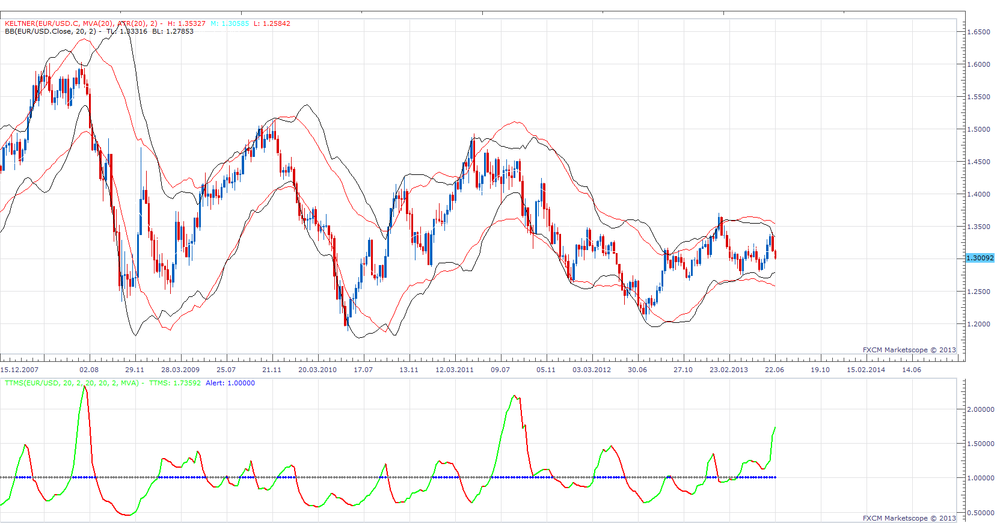

# TTM Squeeze

> Source: https://fxcodebase.com/code/viewtopic.php?f=17&t=42679  
> Forum: 17 · Topic 42679 · 11 post(s)

---

## TTM Squeeze

**Apprentice** · Sun Jun 30, 2013 7:55 am

The basic idea of John Carter TTM Squeeze indicator.
Trade Only if Bollinger band is within Keltner bands, a.k.a. Trade Zone.
Presented by Central Line Dots.
Trade in the direction of Price / MA of Price Cross.

 [TTMS.lua](files/69293/TTMS.lua)

The indicator was revised and updated

---

## Re: TTM Squeeze

**BabyDragonFX** · Mon Jul 01, 2013 11:19 pm

The oscillator that you have is different than mine... I like the one you have... I have a center bar which looks very much like the MACD. I would prefer the line that you have that changes color with the trend...

---

## Re: TTM Squeeze

**Apprentice** · Tue Jul 02, 2013 4:10 am

[TTMS.lua](files/69790/TTMS.lua)

---

## Re: TTM Squeeze

**BabyDragonFX** · Mon Jul 08, 2013 12:04 pm

Thank you very Much!!!

---

## Re: TTM Squeeze

**Alexander.Gettinger** · Tue Aug 13, 2013 2:04 pm

MQL4 version of TTM Squeeze oscillator: [viewtopic.php?f=38&t=59084](https://fxcodebase.com/code/viewtopic.php?f=38&t=59084)

---

## Re: TTM Squeeze

**Stance** · Wed Oct 14, 2015 10:12 pm

Hi,

Can a strategy be made for this to follow the direction of stochastic?

---

## Re: TTM Squeeze

**Apprentice** · Thu Oct 15, 2015 3:10 am

Can you define entry / exit conditions.

---

## Re: TTM Squeeze

**Stance** · Thu Oct 15, 2015 10:40 pm

BUY:
Bollinger band is within Keltner bands
Stochastic K is above D

SELL
Bollinger band is within Keltner bands
Stochastic D is above K

Trailing stop loss to exit.

---

## Re: TTM Squeeze

**Apprentice** · Mon Oct 19, 2015 5:03 am

Requested can be found here.
[viewtopic.php?f=31&t=62795](https://fxcodebase.com/code/viewtopic.php?f=31&t=62795)

---

## Re: TTM Squeeze

**Phil_RX** · Fri Oct 23, 2015 4:20 am

Nice one

---

## Re: TTM Squeeze

**Apprentice** · Wed Jul 26, 2017 9:47 am

The indicator was revised and updated.
