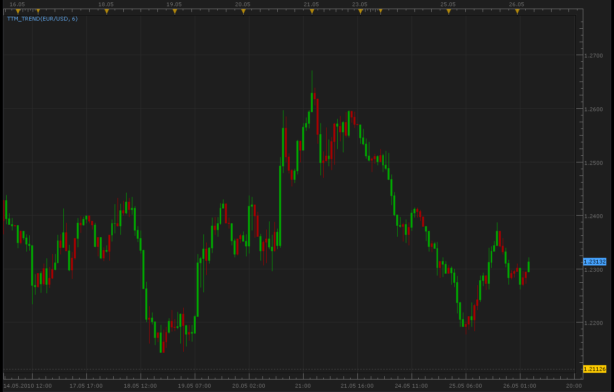

# TTM Trend indicator

> Source: https://fxcodebase.com/code/viewtopic.php?f=17&t=1125  
> Forum: 17 · Topic 1125 · 3 post(s)

---

## TTM Trend indicator

**Alexander.Gettinger** · Wed May 26, 2010 3:20 am

[viewtopic.php?f=27&t=1063&p=2020#p2020](https://fxcodebase.com/code/viewtopic.php?f=27&t=1063&p=2020#p2020)

 

The indicator was revised and updated

---

## Re: TTM Trend indicator

**KBW721** · Wed May 26, 2010 5:58 pm

The TTM Trend is not quite right yet . The concept that it is coded on is this . Look back 6 candles and take the high and the low of them then divide by 2 and if the close of the next candle is above that number it paints it blue and if its below it paints the candle red ...

 Thanks for trying Alexander

---

## Re: TTM Trend indicator

**Apprentice** · Wed Jan 11, 2017 5:52 am

Indicator was revised and updated.
