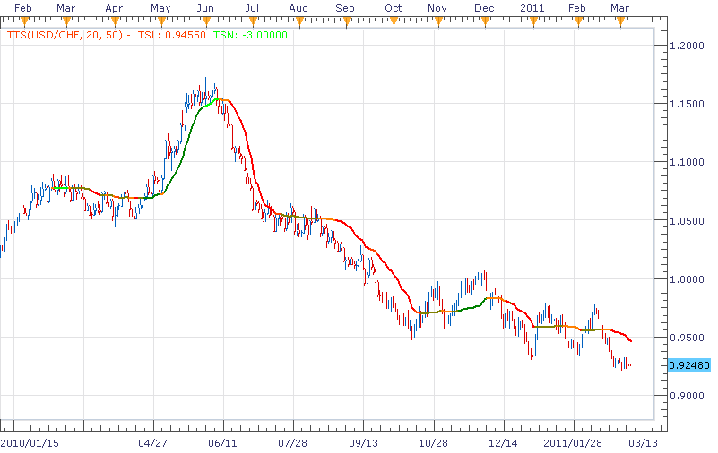
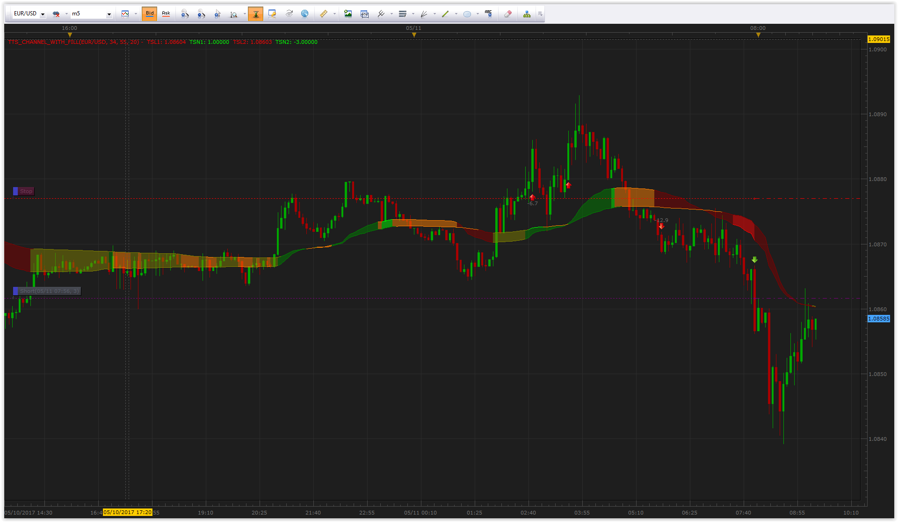

# TTS indicator

> Source: https://fxcodebase.com/code/viewtopic.php?f=17&t=3610  
> Forum: 17 · Topic 3610 · 6 post(s)

---

## TTS indicator

**richardtao** · Sun Mar 06, 2011 11:38 pm

The TTS indicator version 1 is applying to Trading Station II.
The indicator is nominated as Richard Tao Trend Status indicator.
This indicator is highlight status by filtering variety ma.

The first parameter is "T: Timeframe " which defines the timeframe of source.
The second parameter is "N: Number of periods " which defines periods of ma.
The third parameter is "L: Level of threshold " which defines the threshold to distinguish status between flat and trend.

The indicator was revised and updated

---

## Re: TTS indicator

**richardtao** · Fri Mar 11, 2011 4:11 am

revise TTS for trend starting.

 [TTS.lua](files/8736/TTS.lua)

---

## Re: TTS indicator

**richardtao** · Mon May 02, 2011 11:46 pm

Enhance to distinguish trend accelerate/decelerate
and set default threshold as 20.

 [TTS.lua](files/10271/TTS.lua)

---

## Re: TTS indicator

**Apprentice** · Sun Mar 12, 2017 5:37 pm

Indicator was revised and updated.

---

## Re: TTS indicator

**Gentle** · Thu May 11, 2017 10:17 am

By adding another TTS curve and a fill between the two, the result is a TTS channel:

 [TTS_Channel_with_fill.lua](files/112386/TTS_Channel_with_fill.lua)

---

## Re: TTS indicator

**richardtao** · Sun May 21, 2017 1:26 am

you are doing a great work!
thank you very much.
