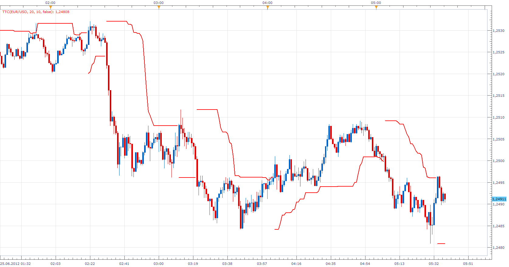

# Turtle Trading Channel

> Source: https://fxcodebase.com/code/viewtopic.php?f=17&t=20563  
> Forum: 17 · Topic 20563 · 8 post(s)

---

## Turtle Trading Channel

**Apprentice** · Mon Jun 25, 2012 4:38 am

 [TTC.lua](files/36026/TTC.lua)

 [TTC with Alert.lua](files/36026/TTC%20with%20Alert.lua)

 [Raw TTC.lua](files/36026/Raw%20TTC.lua)

---

## Re: Turtle Trading Channel

**cersoz** · Mon Jun 25, 2012 6:24 am

Awesome!..

---

## Re: Turtle Trading Channel

**RJH501** · Mon Jul 23, 2012 5:45 pm

Gentlemen,

Would you please add the capability to change the color of the outer and inner bars with the trend.

That is a channel bar would be blue (selected by user) for uptrend and red for downtrend.

This would be a big help for my strategy that I use.

Thank you,

RJH

---

## Re: Turtle Trading Channel

**Apprentice** · Wed Feb 21, 2018 6:54 am

The Indicator was revised and updated.

---

## Re: Turtle Trading Channel

**adloule** · Fri Apr 19, 2019 7:23 am

hello Apprentice

could you please add an arrow and alert whenever the channel change direction

Thank you

---

## Re: Turtle Trading Channel

**Apprentice** · Mon Aug 19, 2019 5:00 am

TTC with Alert.lua added.

---

## Re: Turtle Trading Channel

**Avignon** · Tue Aug 20, 2019 5:10 am

Great, but the 10-day closing signal is missing.

---

## Re: Turtle Trading Channel

**Apprentice** · Tue Aug 20, 2019 6:07 am

Signals/Arrows are same, only levels differ.
