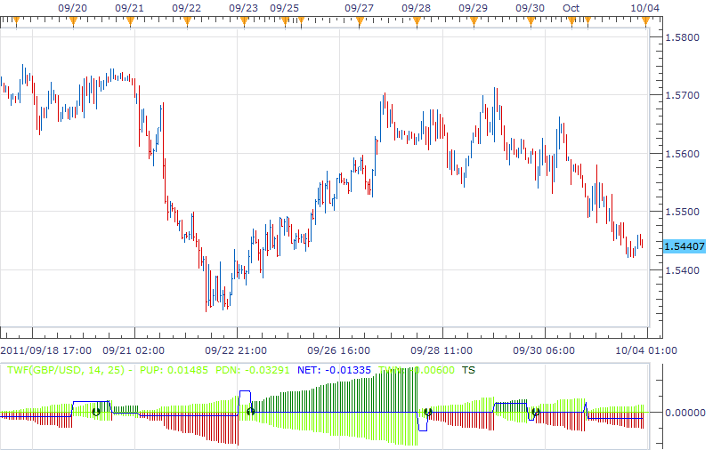

# TWF indicator

> Source: https://fxcodebase.com/code/viewtopic.php?f=17&t=7022  
> Forum: 17 · Topic 7022 · 8 post(s)

---

## TWF indicator

**richardtao** · Mon Oct 03, 2011 10:33 pm

The TWF indicator version 1 is applying to Trading Station II.
The indicator is nominated as Richard Tao Wave Force which segregates waves to gauge move intensity.
This is serials number 4 of the predictors developed by Richard Tao.

The first parameter is "N: Number of periods " which defines periods to segregate wave.
(The experience period may set 9,14,21)
The second parameter is "L: Level of slope " which defines the threshold of channel slope in percentage.
(The experience level may set 25% which is angle on 11 degree)

The TWF applying rule:
After Number of periods, if the accumulated force over the previous weighting force already, the move intensity regarded as strong. Otherwise, if the accumulated force crossover the previous weighting force level the new trend is about to start.

 [TWF.lua](files/15769/TWF.lua)

The indicator was revised and updated

---

## Re: TWF indicator

**kumaresan** · Tue Oct 04, 2011 12:48 pm

Hi,
This Indicator seems tobe too good.
Can u pls explain bit in-detail for the better understanding.

Thank you.

---

## Re: TWF indicator

**Blackcat2** · Tue Oct 04, 2011 6:43 pm

I tried to apply this on EUR/USD 1H chart with default parameters and it shows very late entry, almost towards the end of the trend.

For the example on screen, could you please tell me what pair and what's the parameters?

Thanks..
BC

---

## Re: TWF indicator

**richardtao** · Wed Oct 05, 2011 9:16 pm

hello kumaresan
this is a perdictor try to predict the coming trend base on the beginnig of turning.
the color of grass is begining of trend, the green color shows up moving force is greater than previous moving, the red color shows down moving force is greater than previous moving.
the applying rule is describe on first post.
please notice that the predictor won't be correct every time.
thanks!

---

## Re: TWF indicator

**richardtao** · Wed Oct 05, 2011 9:22 pm

hello BC
the snapshot is GBP/USD H1, the parameters is 14,25.
for detail checking you could double click on the picture.
this indicator might not been testing over whole instrument, it's not perfect yet.
hope this could help.
rgds,

---

## Re: TWF indicator

**Blackcat2** · Sat Oct 08, 2011 6:12 pm

I still don't really understand, since the indicator doesn't provide the up or down arrow, could you please give more information on how to read the signal?

So when it change color, for example from green/green to dark green/green that's when it might reverse?

Cheers..
BC

---

## Re: TWF indicator

**richardtao** · Tue Oct 11, 2011 11:34 pm

hello BC,

when color change to dark green it imply the trend will continue going up.
when color change to red it imply the trend will continue going down.
but if TS arrow shows different direct, it imply the trend could ready to reverse.
for your reference.

---

## Re: TWF indicator

**Apprentice** · Sun Mar 19, 2017 10:23 am

Indicator was revised and updated.
