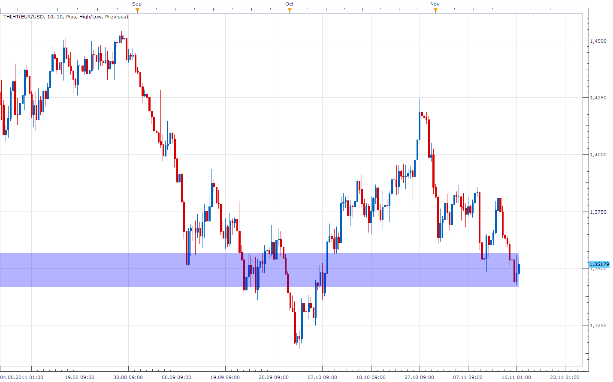

# Two Horizontal Lines Helper Tool

> Source: https://fxcodebase.com/code/viewtopic.php?f=17&t=8145  
> Forum: 17 · Topic 8145 · 6 post(s)

---

## Two Horizontal Lines Helper Tool

**Apprentice** · Wed Nov 16, 2011 2:12 pm

With this tool you can draw,
define the zone, bounded by two lines.
Zone can be defined in Pips or percentages.
The reference is to the closing price or the current High / Low.
Supports Live and end of period mode.

 [THLHT.lua](files/17996/THLHT.lua)

---

## Re: Two Horizontal Lines Helper Tool

**tradingboy** · Thu Jul 18, 2013 4:48 am

The 2 lines are ended at 17:00.
Is it the time zone problem as my time zone is GMT +8 ?
Can it be fixed to suit my time zone and end at 05:00 (day close) ?
Thanks.

---

## Re: Two Horizontal Lines Helper Tool

**Apprentice** · Thu Jul 18, 2013 1:35 pm

I wrote that line begins with the first period,
and ending with the last, current.
It is possible to change this algorithm.
Which is an added benefit for you?

---

## Re: Two Horizontal Lines Helper Tool

**tradingboy** · Fri Jul 19, 2013 3:22 am

yes, i need it extending to day close time (05:00) GMT+8.
Please kindly change it. Thanks.

---

## Re: Two Horizontal Lines Helper Tool

**tradingboy** · Wed Jul 31, 2013 8:55 am

Any progress ? Please !

---

## Re: Two Horizontal Lines Helper Tool

**Apprentice** · Tue Jul 03, 2018 7:14 am

The indicator was revised and updated.
