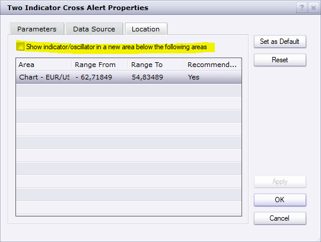

# Two Indicator Cross Alert

> Source: https://fxcodebase.com/code/viewtopic.php?f=17&t=63118  
> Forum: 17 · Topic 63118 · 5 post(s)

---

## Two Indicator Cross Alert

**Apprentice** · Fri Feb 05, 2016 8:46 am

Based on request.
[viewtopic.php?f=27&t=63115](https://fxcodebase.com/code/viewtopic.php?f=27&t=63115)

 [Two Indicator Cross Alert.lua](files/104642/Two%20Indicator%20Cross%20Alert.lua)

---

## Re: Two Indicator Cross Alert

**Apprentice** · Mon Oct 22, 2018 5:39 am

The indicator was revised and updated.

---

## Re: Two Indicator Cross Alert

**Daveatt** · Wed Jan 16, 2019 10:08 am

Hi Mario

Thanks for this indicator
I tried to make it work for catching two True Strenght Index (TSI) crossing. It doesn't display the arrows on the chart for me
However, confirming it's working when I select two moving averages (MA) for instance

Could you please have a look ?

Thanks
Daveatt

---

## Re: Two Indicator Cross Alert

**Apprentice** · Thu Jan 17, 2019 4:19 am

Try to add it as an oscillator.

 

 

---

## Re: Two Indicator Cross Alert

**Daveatt** · Thu Jan 17, 2019 5:00 am

Indeed that was my issue

Thanks for your help
