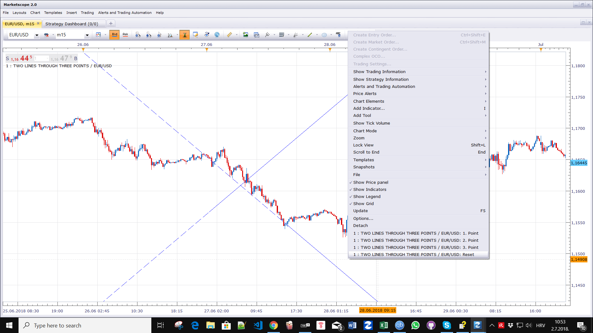

# Two Lines Through Three Points

> Source: https://fxcodebase.com/code/viewtopic.php?f=17&t=66236  
> Forum: 17 · Topic 66236 · 1 post(s)

---

## Two Lines Through Three Points

**Apprentice** · Mon Jul 02, 2018 5:53 am

Based on request.
[viewtopic.php?f=27&t=66120](https://fxcodebase.com/code/viewtopic.php?f=27&t=66120)
Three points are defined my user input.
Lines will have the same slope, with the opposite sign/direction.

 [Two Lines Through Three Points.lua](files/119774/Two%20Lines%20Through%20Three%20Points.lua)
