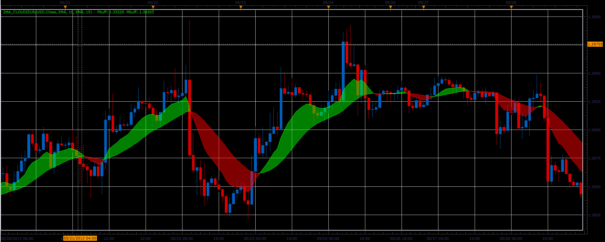
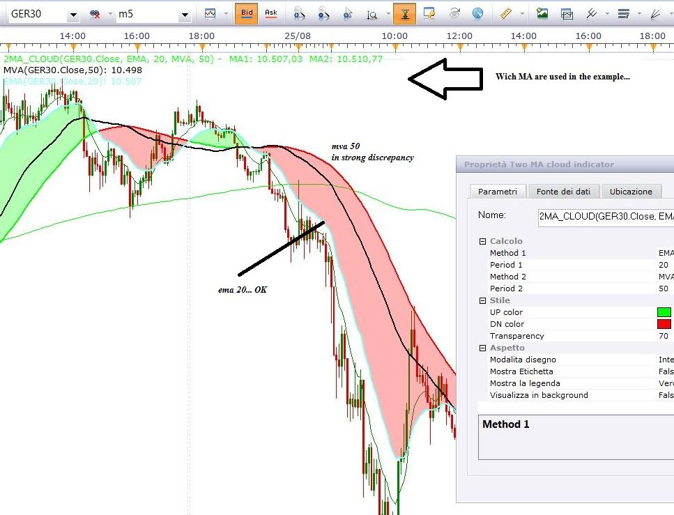

# Two MA cloud

> Source: https://fxcodebase.com/code/viewtopic.php?f=17&t=41306  
> Forum: 17 · Topic 41306 · 22 post(s)

---

## Two MA cloud

**Alexander.Gettinger** · Tue Jun 18, 2013 2:31 pm

The indicator draws the strip between the two MA.

Formulas:
MA1 = MA(Price),
MA2 = MA(MA1).

 

Download:

 [2MA_Cloud.lua](files/67534/2MA_Cloud.lua)

 [2MA_Cloud with Alert.lua](files/67534/2MA_Cloud%20with%20Alert.lua)

For this indicator must be installed Averages indicator ([viewtopic.php?f=17&t=2430](https://fxcodebase.com/code/viewtopic.php?f=17&t=2430)).

---

## Re: Two MA cloud

**JOKER83** · Wed Mar 04, 2015 4:30 pm

PLEAS MAKE STRATEGY BUT
THREE CLOUD AVERAGE
WITH PARAMETERS
ONE CLOUD
TIMEFRAME
TRADE CLOSE YES/NO

TWO CLOUD
TIMFRAME
TRADE CLOSE YES/NO

THREE CLOUD
THREE CLOUD ON/OFF
TIMEFRAME
TRADE CLOSE YES/NO

---

## Re: Two MA cloud

**mykkee** · Thu Apr 23, 2015 2:10 pm

Is there, or can there be, an alert when the moving averages of the cloud cross?? Thank you for your time and consideration.

---

## Re: Two MA cloud

**Apprentice** · Mon Apr 27, 2015 2:18 am

You can find a strategy based on this indicator here.
[viewtopic.php?f=31&t=62150](https://fxcodebase.com/code/viewtopic.php?f=31&t=62150)

Set "Allow strategy to trade" no NO for alerts only.

---

## Re: Two MA cloud

**jamrocktrader** · Tue Jul 07, 2015 6:40 am

Hi Apprentice,

This is a very useful indicator. Using the strategy as an alert does not work because I use a custom time frame. It would really help if you could add an alert similar to the Equilibrium Cross with Alarm indicator.

Thank You,

Jamrocktrader

---

## Re: Two MA cloud

**Apprentice** · Mon Jul 13, 2015 3:49 am

How you generate custom time frame?

---

## Re: Two MA cloud

**jamrocktrader** · Tue Jul 14, 2015 3:03 pm

I use the "Custom Time Frame Candle View" indicator.

---

## Re: Two MA cloud

**Apprentice** · Thu Jul 16, 2015 5:21 am

New version of TS should allow such timeframes,,
for now Backtester will not allow non standard time frames like "m2"
With Views things are even more complicated.
Try this version.

 [2MA cloud Strategy.lua](files/101431/2MA%20cloud%20Strategy.lua)

For example you can type in "m2" time frame.
Trading should work.

---

## Re: Two MA cloud

**jamrocktrader** · Thu Jul 16, 2015 6:56 am

Thank you very much

---

## Re: Two MA cloud

**jamrocktrader** · Thu Jul 16, 2015 7:06 am

The results that the strategy gives for both standard and custom timeframes are different when compared to the indicator. The strategy will enter trades before the MA crosses and for m1&m2 TF it sometimes enter a short trade 3 or 4 candles after the indicator cross with a long signal.

---

## Re: Two MA cloud

**jamrocktrader** · Mon Aug 17, 2015 2:04 pm

Hey apprentice,
Could you please make an alert that gives an alarm on the open of the candle after the moving average cross.
This is the main indicator I use in my trading and it would help a lot if I don’t have to constantly watch the chart for a cross.

Thank you very much

---

## Re: Two MA cloud

**Apprentice** · Wed Aug 19, 2015 3:07 am

Have you try 2MA cloud Strategy.lua
Set "Allow strategy to trade" to NO.

---

## Re: Two MA cloud

**jamrocktrader** · Wed Aug 19, 2015 7:21 am

I have spent a good amount of time with no success trying to get the 2MA cloud Strategy to give an alarm when the 2MA cloud indicator crosses. The alarm consistently occurs several candles before or after the cross, and I sometimes get an alert when there is a good distance between the MA.

---

## Re: Two MA cloud

**Apprentice** · Wed Aug 26, 2015 9:16 am

In that strategy we have to Execution Types
End of turn
Will wait candle end for trade opportunity.

Live
Will enter the trade immediately after condition is met.

---

## Re: Two MA cloud

**jamrocktrader** · Mon Aug 31, 2015 9:43 pm

From the attachment you can see that the 2 MA Cloud Strategy does not correspond with the 2 MA Cloud Indicator. They both have the same parameters but when the chart falls below the MA the strategy gives a sell signal before the cross and exits the trade several candles after the indicator gives a buy signal. So the main problem is that the Strategy deviates greatly from the indicator.

On the other hand the Two MA Cross Alert executes at the end of turn every time the MA crosses. If you could adjust the Two MA Cloud Strategy to work similar the Two MA Cross Alert that would be amazing.
Thank You

---

## Re: Two MA cloud

**Apprentice** · Tue Sep 01, 2015 4:24 am

Can provide the strategy link.
This is expected behavior if the End of Turn execution is used.
Use Live execution if available.

---

## Re: Two MA cloud

**Loredana Sorci** · Sun Sep 11, 2016 10:45 am

In the attachment you will find an example of use of 2MA_Cloud.
It would seem that the second MA is always moved by several points, with the result that the Zone/Cloud appears much larger than it should. (Of course I have several different examples to show...)

 

As can be seen by comparing the Legend (top left): varying the couple of MAs the first match the identical MA selected "individually" from the menu "Add Indicator" ... - while the second is always abundantly offset.
Could you be kind enough to check this discrepancy?

---

## Re: Two MA cloud

**Apprentice** · Mon Sep 12, 2016 6:32 am

While Two MA cloud Formulas is
**MA1** = MA(Price),
MA2 = MA(**MA1**).

You are using

MA1 = MA(Price),
MA2 = MA(Price).

---

## Re: Two MA cloud

**Apprentice** · Tue Sep 04, 2018 10:03 am

The indicator was revised and updated.

---

## Re: Two MA cloud

**SavvyStrategist** · Sat Oct 13, 2018 3:04 pm

Would it be possible to have an alert added on the indicator script and not as a strategy? I'm using the 2MA Cloud on an indicator instead of price.

---

## Re: Two MA cloud

**Apprentice** · Sun Oct 14, 2018 6:03 am

2MA_Cloud with Alert.lua added.

---

## Re: Two MA cloud

**SavvyStrategist** · Mon Oct 15, 2018 6:24 pm

Thanks, that was quick. Much appreciated.
