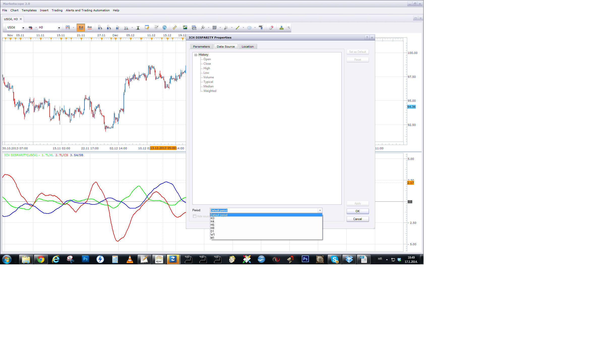

# Two MA Cross Alert

> Source: https://fxcodebase.com/code/viewtopic.php?f=17&t=59789  
> Forum: 17 · Topic 59789 · 53 post(s)

---

## Two MA Cross Alert

**Apprentice** · Sat Nov 02, 2013 12:15 pm

This indicator provides Audio / Email Alerts if and Two MA-s cross over/under.

 [Two MA Cross Alert.lua](files/90522/Two%20MA%20Cross%20Alert.lua)

 [Tick Two Averages Cross Alert.lua](files/90522/Tick%20Two%20Averages%20Cross%20Alert.lua)

 [Two Averages Cross Alert.lua](files/90522/Two%20Averages%20Cross%20Alert.lua)

Provides additional methods available through Averages indicator.

To work install 20 in 1 Moving Average Indicator a.k.a. Averages
[viewtopic.php?f=17&t=2430](https://fxcodebase.com/code/viewtopic.php?f=17&t=2430)

---

## Re: Two MA Cross Alert

**Alexander.Gettinger** · Mon Dec 02, 2013 11:03 am

MQL4 version of Two MA Cross Alert indicator: [viewtopic.php?f=38&t=60050](https://fxcodebase.com/code/viewtopic.php?f=38&t=60050).

---

## Re: Two MA Cross Alert

**udaysharma** · Wed Dec 04, 2013 2:27 am

Hi there
This is a Fantastic indicator,I have used this but there are some error as follows :-
1). Alert window says "uptrend" while in actually there is a "downtrend crossover ".
2). If I choose "NO LINE" in "FAST MA LINE STYLE" it removes the "slow MA" and vice versa.

Thanks
Uday Sharma

---

## Re: Two MA Cross Alert

**Apprentice** · Fri Dec 06, 2013 3:15 am

As i Wrote, Written during the weekend....
Thank you for the report. Have fix this problem.

---

## Re: Two MA Cross Alert

**SuperTrader** · Mon Dec 09, 2013 7:32 am

This is a **great** indicator once again, I just love it. It's so helpful, specially to traders who are trading on multiple screens, on many open charts simultaneously, scalping several instruments on small timeframes. Thank you for developing stuff like this one Apprentice. I'm taking this opportunity to **thank you so much for all your work** so far (contributing with hundreds of indicators, strategies, signals, etc). You have helped me (and so many others I'm sure) **immensely** over the last several years to become a better trader.

---

## Re: Two MA Cross Alert

**Apprentice** · Wed Dec 11, 2013 9:35 am

I would like to help even more, unfortunately I have limited time to my disposal.

---

## Re: Two MA Cross Alert

**Paul W** · Thu Dec 26, 2013 12:25 pm

can you add the moving averages from the Moving Average Indicator: 20 in 1 - [viewtopic.php?f=17&t=2430&hilit=Moving+Average+Indicator%3A+20+in+1+Moving+Average+Indicator](https://fxcodebase.com/code/viewtopic.php?f=17&t=2430&hilit=Moving+Average+Indicator%3A+20+in+1+Moving+Average+Indicator)

This would be a great help

Thanks,

---

## Re: Two MA Cross Alert

**Apprentice** · Fri Dec 27, 2013 3:52 am

Two Averages Cross Alert Added.

---

## Re: Two MA Cross Alert

**Paul W** · Fri Dec 27, 2013 12:24 pm

Thank you for your work

but I was hoping you could add the various other moving average types from the 20 in 1 indicator into the Two MA Cross Alert

specifically, I was hoping you could add HMA - Hull Moving Average by Alan Hull:

HMA - Hull Moving Average by Alan Hull
HMA[i]=LWMA(i,len,(2*LWMA(i,N/2,Price)-LWMA(i,N,Price))), where
len=Sqrt(N),
LWMA(i,N,Price) - Linear Weighted Moving Average

Again, thank you for your efforts

---

## Re: Two MA Cross Alert

**Apprentice** · Fri Dec 27, 2013 3:49 pm

> In order to Audio/Email alerts could work, install and activate Alert Signal.

U have to have one Active (Shown on Chart) Alert Signal per Currency Pair.

---

## Re: Two MA Cross Alert

**Paul W** · Fri Dec 27, 2013 3:53 pm

my mistake - loaded wrong update

tested, and the indicator works well - including sound alert

thanks

---

## Re: Two MA Cross Alert

**cave76** · Mon Jan 13, 2014 12:27 pm

hi I keep getting error when cross happens
An error occurred during the calculation of the indicator 'TWO AVERAGES CROSS ALERT'. The error details: Two Averages Cross Alert.lua:458: attempt to concatenate global 'Price' (a nil value).

---

## Re: Two MA Cross Alert

**Apprentice** · Mon Jan 13, 2014 12:37 pm

Fixed. Please Re-Download.

---

## Re: Two MA Cross Alert

**cave76** · Mon Jan 13, 2014 1:35 pm

thanks works fine now

---

## Re: Two MA Cross Alert

**Paul W** · Thu Jan 16, 2014 8:43 pm

is it possible to enhance the fast and slow MA periods to support/include separate time periods, e.g. fast MA (5min) and slow MA (15 min) ?

I suspect it may not with how the indicator is currently structured

Thanks

---

## Re: Two MA Cross Alert

**Apprentice** · Fri Jan 17, 2014 12:48 pm

Although, the other (higher) time frame is not a playground for this indicator,
try to use MA Cross Signals or Strategys
u can try to select a different price source for this indicator.

 

---

## Re: Two MA Cross Alert

**Coondawg71** · Sun Feb 16, 2014 11:28 am

Can we please add Square Weighted Moving Average to this indicator.

[viewtopic.php?f=17&t=3697&p=36262&hilit=square+weighted#p36262](https://fxcodebase.com/code/viewtopic.php?f=17&t=3697&p=36262&hilit=square+weighted#p36262)

Thanks!

sjc

---

## Re: Two MA Cross Alert

**Apprentice** · Mon Feb 17, 2014 2:40 am

Your request is added to the development list.

---

## Re: Two MA Cross Alert

**Apprentice** · Mon Mar 03, 2014 12:12 pm

SQW_MA Added.

---

## Re: Two MA Cross Alert

**SenseClash** · Sat Sep 27, 2014 3:10 pm

Would it be possible to modify this so that I can choose to be alerted only on certain types of crosses? If I determine through other means that a currency is in an uptrend, I'd like to be notified only when there is an upward crossover. Likewise, when a currency is in a downtrend, I'd like notification only when there is a downward crossunder. Could these options be added?

---

## Re: Two MA Cross Alert

**Apprentice** · Tue Sep 30, 2014 2:23 am

Please Try Updated Version of Two Averages Cross Alert.lua

---

## Re: Two MA Cross Alert

**SenseClash** · Tue Sep 30, 2014 8:50 pm

I uploaded the "Two MA Cross Alert" on page one of this thread.
I applied it to a some charts with fast EMAs on the 1-minute timeframe.
I added the _Alert.lua to the chart to make sure I could get an email.
No signals were sent to my phone. My phone does work for alerts--I've gotten them in the past.
Attached are a chart and my settings.

---

## Re: Two MA Cross Alert

**Apprentice** · Sat Oct 04, 2014 2:27 am

Set "Show MA Alers" to Yes.

U should have email alerts.
If not, will investigate this after market re-opens.

---

## Re: Two MA Cross Alert

**gfozmo** · Fri Dec 05, 2014 11:12 am

I also have the same problem. The emails and sound notifications no longer work. It was all working fine and then one day just stopped. On other indicators I use with alerts, the email and sound notification works fine. I tried removing from computer and re-installing. I downloaded both "Two Averages Cross Alert" and "Two MA Cross Alert" and also re-installed Alerts.Lua. Also tried a clean install on a different computer, still didn't work. The popup works as does the crossover indicator on the chart.

---

## Re: Two MA Cross Alert

**gfozmo** · Fri Dec 05, 2014 12:56 pm

Ignore that last post. I got it figured out. When I rolled back to a previous saved layout it all worked.
Sorry and thanks

---

## Re: Two MA Cross Alert

**Coondawg71** · Wed Apr 08, 2015 5:42 am

error code regarding using the Kama averages

"lua221; lua62; method Kama is unknown"

thanks!

sjc

---

## Re: Two MA Cross Alert

**Apprentice** · Mon Dec 14, 2015 4:36 am

Compatibility issue Fixed. _Alert helper is not longer needed.

If you want to use updated version of this indicator,
please make sure to use TS Version 01.14.101415. or higher.

---

## Re: Two MA Cross Alert

**Paul W** · Sun Jan 17, 2016 2:48 pm

currently Two MA Cross Alert does not support use on a Tick chart

could you please enable ?

thanks

---

## Re: Two MA Cross Alert

**Apprentice** · Wed Jan 20, 2016 5:55 am

Tick Two Averages Cross Alert.lua Added.

---

## Re: Two MA Cross Alert

**panos59** · Wed Mar 09, 2016 8:44 pm

Is there any option to select the sound file ?

---

## Re: Two MA Cross Alert

**panos59** · Wed Mar 09, 2016 8:48 pm

Ooooppppps !!!! sorry..wrong question..

---

## Re: Two MA Cross Alert

**Apprentice** · Sun Jul 30, 2017 10:56 am

The indicator was revised and updated.

---

## Re: Two MA Cross Alert

**omsairam** · Tue Aug 14, 2018 4:43 pm

Can you please add DEVIATION SCALED MOVING AVERAGE to this indicator

Thank you in advance,
NV

---

## Re: Two MA Cross Alert

**steveped** · Wed Aug 15, 2018 4:25 am

Hi Apprentice,
Any chance to have a different price source for the indicator? I would like to have as source another indicator (ie RSI or Stochastic, etc...). Thanks

---

## Re: Two MA Cross Alert

**Apprentice** · Wed Aug 15, 2018 6:14 am

Have you tried tick version, the Tick Two Averages Cross Alert?

---

## Re: Two MA Cross Alert

**Apprentice** · Wed Aug 15, 2018 6:19 am

The indicator was revised and updated.

---

## Re: Two MA Cross Alert

**steveped** · Fri Oct 18, 2019 10:36 am

Hi Apprentice,
any chance to have the Instrument Price into the body of the email? Thanks

---

## Re: Two MA Cross Alert

**Apprentice** · Fri Oct 18, 2019 11:51 am

Your request is added to the development list.
Development reference 212.

---

## Re: Two MA Cross Alert

**Apprentice** · Mon Oct 21, 2019 5:21 am

[Two_MA_Cross_Alert.lua](files/129351/Two_MA_Cross_Alert.lua)

Try this version.

---

## Re: Two MA Cross Alert

**steveped** · Mon Oct 21, 2019 9:16 am

Perfect! Thanks!

Any chance to have it for Tick Two Averages Cross Alert.lua too?

---

## Re: Two MA Cross Alert

**Apprentice** · Tue Oct 22, 2019 4:20 am

Your request is added to the development list.
Development reference 229.

---

## Re: Two MA Cross Alert

**Apprentice** · Tue Oct 22, 2019 9:02 am

[Tick_Two_Averages_Cross_Alert.lua](files/129376/Tick_Two_Averages_Cross_Alert.lua)

Try this version.

---

## Re: Two MA Cross Alert

**steveped** · Tue Oct 22, 2019 9:14 am

That's ok. I noticed that if I apply this indicator on another indicator the price shown is the indicator's level. Is is possible to see the underline instrument price instead? Or maybe decide what's the info to be shown between indicator's level and instrument price. Thanks.

---

## Re: Two MA Cross Alert

**Apprentice** · Thu Oct 24, 2019 5:39 am

I don't understand what he is talking about. You are choosing the source yourself in the dialog. I don't see any points to select one source and don't use it. And FXTS2 doesn't provide information on what indicator based on what.

Can you provide more information, example?

---

## Re: Two MA Cross Alert

**steveped** · Thu Oct 24, 2019 7:34 am

Sure. I apply this indicator to another (ie Regularized Momentum). When I receive the alert via email, the number shown is the level of the indicator. I would like to receive the price of the underline instrument instead (ie GER30).

---

## Re: Two MA Cross Alert

**Apprentice** · Mon Oct 28, 2019 5:27 am

Impossible to implement.
Indicators can't get the source of their source.
We can only hardcode it. It will not work on indicator views properly.

 [Tick_Two_Averages_Cross_Alert_steveped.lua](files/129452/Tick_Two_Averages_Cross_Alert_steveped.lua)

---

## Re: Two MA Cross Alert

**fx1954** · Sun Jul 18, 2021 7:06 am

> **Apprentice wrote:**
>
>
> Two MA Cross Alert.png
>
>
> This indicator provides Audio / Email Alerts if and Two MA-s cross over/under.
>
>
>
> Two MA Cross Alert.lua
>
>
>
>
> Tick Two Averages Cross Alert.lua
>
>
>
>
>
> Two Averages Cross Alert.lua
>
>
> Provides additional methods available through Averages indicator.
>
> To work install 20 in 1 Moving Average Indicator a.k.a. Averages
> [viewtopic.php?f=17&t=2430](https://fxcodebase.com/code/viewtopic.php?f=17&t=2430)

Is there a version of this indicator with horisontal shift?

---

## Re: Two MA Cross Alert

**Apprentice** · Mon Jul 19, 2021 6:02 am

Your request is added to the development list.
Development reference 658.

---

## Re: Two MA Cross Alert

**fx1954** · Wed Jul 21, 2021 4:10 am

> **Apprentice wrote:**
>
>
> Two MA Cross Alert.png
>
>
> This indicator provides Audio / Email Alerts if and Two MA-s cross over/under.
>
>
>
> Two MA Cross Alert.lua
>
>
>
>
> Tick Two Averages Cross Alert.lua
>
>
>
>
>
> Two Averages Cross Alert.lua
>
>
> Provides additional methods available through Averages indicator.
>
> To work install 20 in 1 Moving Average Indicator a.k.a. Averages
> [viewtopic.php?f=17&t=2430](https://fxcodebase.com/code/viewtopic.php?f=17&t=2430)

Excuse me, which one of these indicators has the option with shift, I couldn't find it by myself?

---

## Re: Two MA Cross Alert

**Apprentice** · Fri Jul 23, 2021 6:49 am

Try this version.

 [Two Averages Cross with Alert and Shift.lua](files/142933/Two%20Averages%20Cross%20with%20Alert%20and%20Shift.lua)

---

## Re: Two MA Cross Alert

**fx1954** · Wed Aug 04, 2021 10:59 am

I tried the indicator with shift, it works well if you apply shift to both MAs, if you apply only shift to the first one, the lines do not show up.

---

## Re: Two MA Cross Alert

**Apprentice** · Thu Aug 05, 2021 6:19 am

Try Two Averages Cross with Alert and Shift.lua now.

---

## Re: Two MA Cross Alert

**fx1954** · Thu Aug 05, 2021 9:20 am

> **Apprentice wrote:**
> Try Two Averages Cross with Alert and Shift.lua now.

Thank you.
