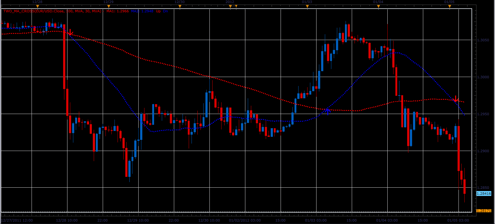
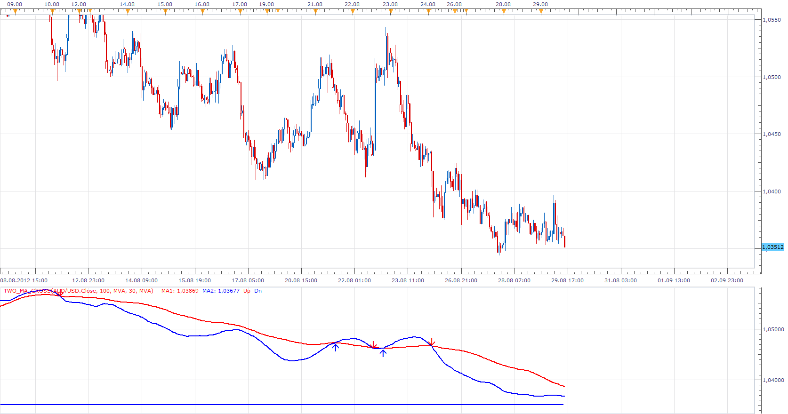

# Two MA cross indicator

> Source: https://fxcodebase.com/code/viewtopic.php?f=17&t=11038  
> Forum: 17 · Topic 11038 · 31 post(s)

---

## Two MA cross indicator

**Alexander.Gettinger** · Thu Jan 05, 2012 4:19 pm

The indicator is written at the request of [viewtopic.php?f=27&t=10811&p=22392#p22392](https://fxcodebase.com/code/viewtopic.php?f=27&t=10811&p=22392#p22392)

The indicator draws two MA and arrows on their intersections.

 

Download:

 [Two_MA_Cross.lua](files/22542/Two_MA_Cross.lua)

For this indicator must be installed Averages indicator ([viewtopic.php?f=17&t=2430](https://fxcodebase.com/code/viewtopic.php?f=17&t=2430)).

The indicator was revised and updated

---

## Re: Two MA cross indicator

**sergesp** · Wed Mar 21, 2012 11:54 am

Hi

Thanks for this indicator: I have a couple of questions:
(1) If I want to be able to select individually the source data for each MVA e.g. if for the slow MVA I want to use the bar open or bar close data independently of the fast MVA how to do that and conversely if I want to be able to use say bar (H+L+C)/3 as the source data.

(2) how do I use the crosses generated in this indicator to be used in my signal / strategy program to generate alerts and trades? (Without having to re write the same program logic in those programs) - or am I going about it in the wrong way?

Thanks for you help

---

## Re: Two MA cross indicator

**Apprentice** · Fri Mar 23, 2012 2:59 am

Your request is added to the development list.

---

## Re: Two MA cross indicator

**Alexander.Gettinger** · Mon Apr 02, 2012 9:38 am

> **sergesp wrote:**
> (1) If I want to be able to select individually the source data for each MVA e.g. if for the slow MVA I want to use the bar open or bar close data independently of the fast MVA how to do that and conversely if I want to be able to use say bar (H+L+C)/3 as the source data.

Indicator with different sources for slow and fast MA.
(H+L+C)/3 is a typical price.

Download:

 [Two_MA_Cross2.lua](files/29206/Two_MA_Cross2.lua)

---

## Re: Two MA cross indicator

**Alexander.Gettinger** · Mon Apr 02, 2012 9:46 am

Strategy based on this indicator: [viewtopic.php?f=31&t=15504](https://fxcodebase.com/code/viewtopic.php?f=31&t=15504)

---

## Re: Two MA cross indicator

**nazaar** · Mon Apr 02, 2012 10:50 am

Brilliant!!!

I have been looking for this for a long time, thank you!!!

---

## Re: Two MA cross indicator

**toxl89** · Tue Apr 17, 2012 4:02 pm

Hi Alex,
Can I get the MLQ4 code for this indicator please.

---

## Re: Two MA cross indicator

**Apprentice** · Wed Apr 18, 2012 2:03 am

Unfortunately this forum does not provide, support for MT4.
Contact Alex, he would be able to help you.
On our premium service development team.

---

## Re: Two MA cross indicator

**sergesp** · Wed Apr 25, 2012 7:57 am

> **Alexander.Gettinger wrote:**
>
>
> > **sergesp wrote:**
> > (1) If I want to be able to select individually the source data for each MVA ...........
> > be able to use say bar (H+L+C)/3 as the source data.
>
>
>
> Indicator with different sources for slow and fast MA.
> (H+L+C)/3 is a typical price.
>
> Download:
>
>
> Two_MA_Cross2.lua

Thank you very much

---

## Re: Two MA cross indicator

**Alexander.Gettinger** · Tue May 08, 2012 5:20 pm

MQL4 version of indicator: [viewtopic.php?f=38&t=17979](https://fxcodebase.com/code/viewtopic.php?f=38&t=17979)

---

## Re: Two MA cross indicator

**nazaar** · Mon Aug 27, 2012 1:19 pm

Hi Alexander,

thanks for this useful indicator. I like using this indicator BUT display it below in a **new area below the chart**so that I do not clutter charts with to many lines. However, when displayed below you only see the order of the two lines, it does not show the MA lines in relation to the live price level.

Is it possible to add the option to display a horizontal line **showing the current market price** in the new area below the chart along with the two MA's?

Thanks in advance!

---

## Re: Two MA cross indicator

**Apprentice** · Wed Aug 29, 2012 1:02 am

Your request is added to the development list.

---

## Re: Two MA cross indicator

**nazaar** · Wed Aug 29, 2012 10:38 am

> **Apprentice wrote:**
> Your request is added to the development list.

Dear Apprentice,

Please advise if the request is possible?

---

## Re: Two MA cross indicator

**Apprentice** · Wed Aug 29, 2012 2:37 pm

Try This Version

 [Two_MA_Cross.lua](files/39362/Two_MA_Cross.lua)

For this indicator must be installed Averages indicator
[viewtopic.php?f=17&t=2430](https://fxcodebase.com/code/viewtopic.php?f=17&t=2430)

---

## Re: Two MA cross indicator

**biggiesmalls** · Wed Aug 29, 2012 10:51 pm

Any way we could get this indicator or the Averages indicator to have the option for the T3 Clean moving average? Here's the link on this website [http://fxcodebase.com/code/viewtopic.php?f=17&t=22108](https://fxcodebase.com/code/viewtopic.php?f=17&t=22108)

---

## Re: Two MA cross indicator

**nazaar** · Thu Aug 30, 2012 12:49 am

> **Apprentice wrote:**
>
>
> Two_MA_Cross.png
>
>
> Try This Version
>
>
> Two_MA_Cross.lua

Apprentice, perfect! Thank you.

The price line width is not adjusting, thoughts?

Any chance you can get the live price to also be shown on the right axis is it highlights in the chart above?

Thanks.

---

## Re: Two MA cross indicator

**Apprentice** · Thu Aug 30, 2012 1:33 am

I have fix Style option.
Unfortunately Axis option is not possible.
I can add value as Text / Label.

---

## Re: Two MA cross indicator

**nazaar** · Tue Sep 18, 2012 11:22 am

Hello,

could you please add the regression line moving average to the list of methods?

thanks in advance.

---

## Re: Two MA cross indicator

**Apprentice** · Wed Sep 19, 2012 2:50 am

Your request is added to the development list.

---

## Re: Two MA cross indicator

**Alexander.Gettinger** · Wed Sep 19, 2012 1:07 pm

> **nazaar wrote:**
> Hello,
>
> could you please add the regression line moving average to the list of methods?
>
> thanks in advance.

Please, post formulas or link of the regression line moving average.

---

## Re: Two MA cross indicator

**nazaar** · Wed Sep 19, 2012 1:14 pm

Hello,

attached is the file with the regression line indicator. Does this help?

---

## Re: Two MA cross indicator

**FamWue** · Tue Oct 02, 2012 9:15 am

How is it possbible to just draw the arrows without drawing the MAs?

---

## Re: Two MA cross indicator

**Apprentice** · Tue Oct 02, 2012 12:30 pm

This arrows are placed on Price / MA Crosses?

---

## Re: Two MA cross indicator

**nazaar** · Thu Jul 25, 2013 11:21 am

> **Alexander.Gettinger wrote:**
> The indicator draws two MA and arrows on their intersections.
>
> Download:
>
> Two_MA_Cross.lua
>
> For this indicator must be installed Averages indicator ([viewtopic.php?f=17&t=2430](https://fxcodebase.com/code/viewtopic.php?f=17&t=2430)).

Hello,

May I request a variation to this indicator? I like how the current version shows two MA lines, but is it possible to have the first MA line drawn for the selected chart period and the second MA line for another time period? For example, on the 1 hour chart, the first MA line shows the 21 period 1-hour MA and the second MA line is also 21 period but for the 4-hour chart.

Please see attached chart for more clarification.

Thanks in advance.

---

## Re: Two MA cross indicator

**Apprentice** · Sat Jul 27, 2013 3:22 am

Your request is added to the development list.

---

## Two MA cross indicator with Higher Time Frame 2 MA Cross

**nazaar** · Wed Oct 09, 2013 10:36 pm

Hello,

May I request a spin off from the Two MA Cross tool? The spin off version would build on the existing version only adding the same calculation for a higher time frame.

For example, the current version shows the 100 and 200 period EMA on a chosen chart. Could you add the ability to show, at the same time the same two periods EMA but for a higher time frame?

Please see attached chart, the solid line shows the 100 and 200 period EMA for the 15-minute chart while the dotted lines show the 100 and 200 period EMA for a higher time frame 1-hour chart.

thanks.

---

## Re: Two MA cross indicator

**Apprentice** · Fri Oct 11, 2013 2:10 am

Your request is added to the development list.

---

## Re: Two MA cross indicator

**bwalks** · Fri Oct 11, 2013 12:28 pm

is there any way to add a color coded cloud to the 2 MA cross? Im looking for a fast and slow EMA cloud so i can have a better visual when the faster EMA is above/Below the slower EMA? Not sure if this indicator already exists but i didnt have any luck finding it on this site. Thanks

---

## Re: Two MA cross indicator

**Apprentice** · Sat Oct 12, 2013 4:50 am

MVA/EMA Cloud is one of them.
[viewtopic.php?f=17&t=1589&hilit=ma+cloud](https://fxcodebase.com/code/viewtopic.php?f=17&t=1589&hilit=ma+cloud)

---

## Re: Two MA cross indicator

**Apprentice** · Mon Jun 12, 2017 6:07 am

The indicator was revised and updated.

---

## Re: Two MA cross indicator

**Alexander.Gettinger** · Wed Mar 20, 2019 7:26 pm

> **nazaar wrote:**
>
>
> > **Alexander.Gettinger wrote:**
> > The indicator draws two MA and arrows on their intersections.
> >
> > Download:
> >
> > The attachment **Two_MA_Cross.lua** is no longer available
> >
> > For this indicator must be installed Averages indicator ([viewtopic.php?f=17&t=2430](https://fxcodebase.com/code/viewtopic.php?f=17&t=2430)).
>
>
>
> Hello,
>
> May I request a variation to this indicator? I like how the current version shows two MA lines, but is it possible to have the first MA line drawn for the selected chart period and the second MA line for another time period? For example, on the 1 hour chart, the first MA line shows the 21 period 1-hour MA and the second MA line is also 21 period but for the 4-hour chart.
>
> Please see attached chart for more clarification.
>
> Thanks in advance.

Please try this indicator:

 [2_MA_Cross_Higher_TF.lua](files/124829/2_MA_Cross_Higher_TF.lua)
