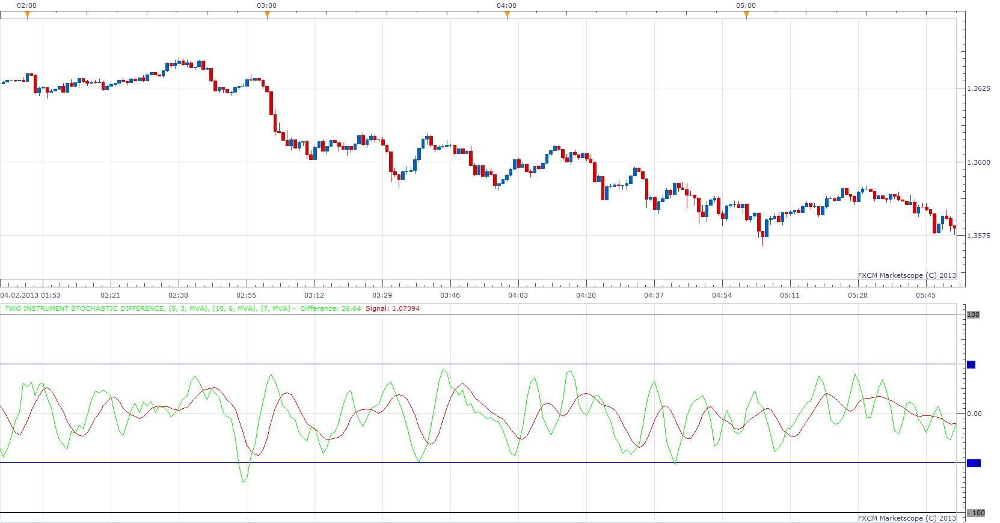

# Two Stochastic Difference

> Source: https://fxcodebase.com/code/viewtopic.php?f=17&t=31736  
> Forum: 17 · Topic 31736 · 2 post(s)

---

## Two Stochastic Difference

**Apprentice** · Mon Feb 04, 2013 7:33 am

Indicator will calculate the difference between the two Stochastic Indicators.
Difference = 1. Stochastic - 2.Stochastic
If INVERSE is Used.
Difference = 2. Stochastic - 1.Stochastic

 [Two Stochastic Difference.lua](files/54116/Two%20Stochastic%20Difference.lua)

---

## Re: Two Stochastic Difference

**Apprentice** · Thu Apr 05, 2018 6:15 am

The indicator was revised and updated.
