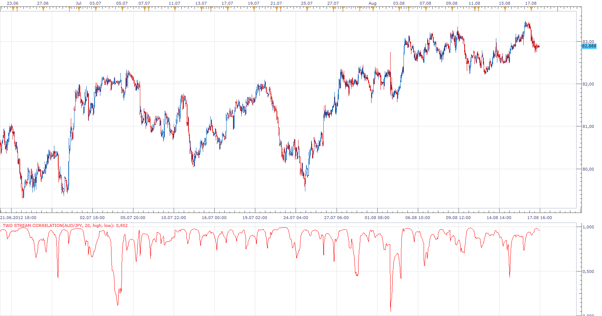
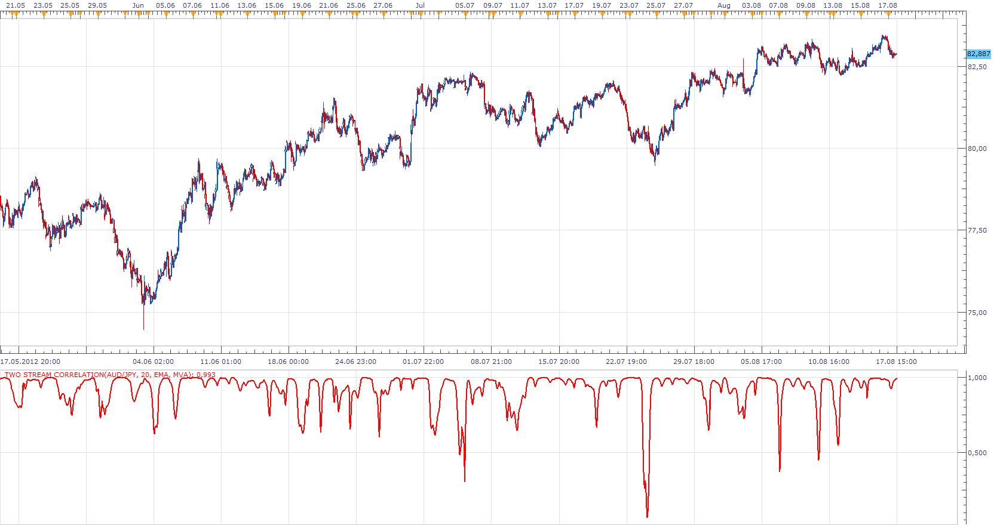

# Two Stream Correlation

> Source: https://fxcodebase.com/code/viewtopic.php?f=17&t=22506  
> Forum: 17 · Topic 22506 · 4 post(s)

---

## Two Stream Correlation

**Apprentice** · Fri Aug 17, 2012 2:15 pm

*High / Low Price Correlation*

 

*EMA / MVA Indicator Correlation*

This indicator gives you the option of calculating the correlation between two data series.
Data series can be Indicator, or Price (high, low, close, open ...)
By default indicator will select first source stream.
However, you can choose others if they exist.

For Example.
EMA have only one data stream.
MACD have three data sreams.

 [Two Stream Correlation.lua](files/38826/Two%20Stream%20Correlation.lua)

The indicator was revised and updated

---

## Re: Two Stream Correlation

**kingsee** · Sat Aug 18, 2012 9:31 pm

please tell me where can i find the "new topic " button , i want to post a new topic .

---

## Re: Two Stream Correlation

**Ekaterina** · Mon Aug 20, 2012 1:07 am

Hi kingsee,

If you have developed a new indicator, please contact the [admin](https://fxcodebase.com/code/memberlist.php?mode=viewprofile&u=57) by e-mail or private message. He can give you a permission to open new topic in this one thread.

Best regards,
Ekaterina

---

## Re: Two Stream Correlation

**Apprentice** · Mon Apr 24, 2017 5:17 am

Indicator was revised and updated.
