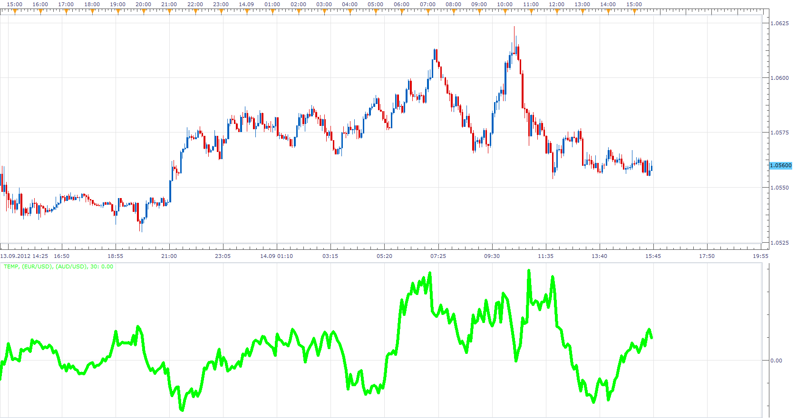

# Two Streams Ratio / MA Delta

> Source: https://fxcodebase.com/code/viewtopic.php?f=17&t=23419  
> Forum: 17 · Topic 23419 · 6 post(s)

---

## Two Streams Ratio / MA Delta

**Apprentice** · Fri Sep 14, 2012 2:42 pm

This indicator has been written according to formula provided by sebgautier49.
TSRMD = ( (Stream 1 / Stream2) - MA(Stream 1 / Stream2) )*1000

 [Two Streams Ratio MA Delta.lua](files/40319/Two%20Streams%20Ratio%20MA%20Delta.lua)

As for indicator name, I'm open to suggestions,
I was not creative in this part.

The indicator was revised and updated

---

## Re: Two Streams Ratio / MA Delta

**Apprentice** · Sun Sep 16, 2012 3:44 am

> I am working on pair trading between FR40 et GER30
>
> When the indicator is above +12 you have to buy two FR40 and sell one DAX30
> when the indicator is above 15 you have to stop loose
>
> When the indicator is under -12 you have to sell two FR40 and buy one DAX30
> when the indicator is under -15 you have to stop loose

For more info about this strategy ask sebgautier49.
[memberlist.php?mode=viewprofile&u=187798](https://fxcodebase.com/code/memberlist.php?mode=viewprofile&u=187798)

---

## Re: Two Streams Ratio / MA Delta

**sebgautier49** · Thu Oct 18, 2012 8:59 am

Dear People,

I would like to developp a strategy based on this indicator.
IF the indicator is egal 10.8 : Buy two FR40 and sell 1 GER30
IF the indicator is egal 21 : Buy two FR40 and sell 1 GER30
IF the indicator is egal 29.5 : Buy two FR40 and sell 1 GER30
When the indicator is egal 0 close all positions

IF the indicator is egal -10.8 : Sell two FR40 and buy 1 GER30
IF the indicator is egal -21 : Sell two FR40 and buy 1 GER30
IF the indicator is egal -29.5 : Sell two FR40 and buy 1 GER30
When the indicator is egal 0 close all positions

IBest regards,

Sébastien

---

## Re: Two Streams Ratio / MA Delta

**Apprentice** · Fri Oct 19, 2012 4:14 pm

Your request is added to the development list.

---

## Re: Two Streams Ratio / MA Delta

**Apprentice** · Tue Sep 30, 2014 1:03 pm

Update

---

## Re: Two Streams Ratio / MA Delta

**Apprentice** · Mon Jun 26, 2017 4:20 am

The indicator was revised and updated.
