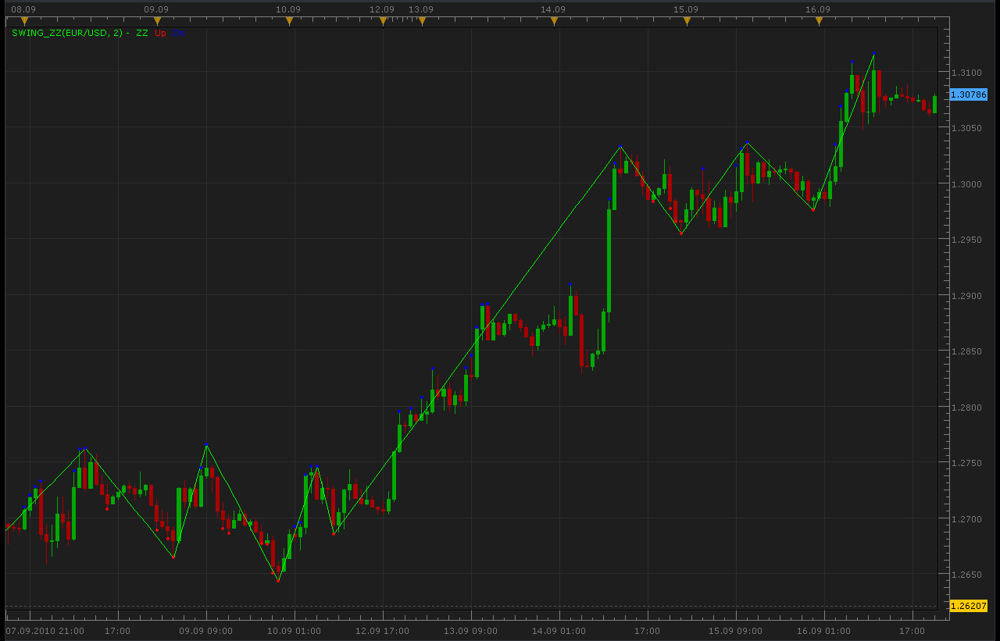
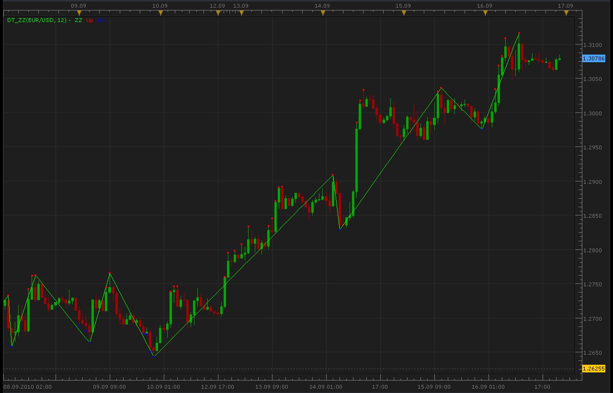

# Two ZigZags

> Source: https://fxcodebase.com/code/viewtopic.php?f=17&t=2197  
> Forum: 17 · Topic 2197 · 4 post(s)

---

## Two ZigZags

**Alexander.Gettinger** · Fri Sep 17, 2010 1:52 am

2 indicators from article [http://articles.mql4.com/444](http://articles.mql4.com/444)

1. Gann swing ZigZag.

 



The indicator was revised and updated

---

## Re: Two ZigZags

**Alexander.Gettinger** · Fri Sep 17, 2010 2:12 am

2. DT-ZigZag.

 



```lua
function Init()
    indicator:name("DT ZigZag");
    indicator:description("DT ZigZag");
    indicator:requiredSource(core.Bar);
    indicator:type(core.Indicator);

    indicator.parameters:addGroup("Calculation");
    indicator.parameters:addInteger("ExtDepth", "ExtDepth", "", 12);

    indicator.parameters:addGroup("Style");
    indicator.parameters:addColor("clrZZ", "Color ZigZag", "Color ZigZag", core.rgb(0, 255, 0));
    indicator.parameters:addColor("UP_color", "Color of UP", "Color of UP", core.rgb(255, 0, 0));
    indicator.parameters:addColor("DN_color", "Color of DN", "Color of DN", core.rgb(0, 0, 255));
end

local first;
local source = nil;
local ExtDepth;
local zz=0;
local zzL=0;
local zzH=0;
local buffZZ=nil;
local buffUp=nil;
local buffDn=nil;
local i;
local shift;
local pos;
local lasthighpos;
local lastlowpos;
local curhighpos;
local curlowpos;
local curlow;
local curhigh;
local lasthigh;
local lastlow;
local min;
local max;

function Prepare()
    source = instance.source;
    ExtDepth=instance.parameters.ExtDepth;
    first = source:first()+2;
    zz = instance:addInternalStream(0, 0);
    zzL = instance:addInternalStream(0, 0);
    zzH = instance:addInternalStream(0, 0);
    local name = profile:id() .. "(" .. source:name() .. ", " .. instance.parameters.ExtDepth .. ")";
    instance:name(name);
    buffZZ = instance:addStream("BuffZZ", core.Line, name .. ".ZZ", "ZZ", instance.parameters.clrZZ, first);
    buffUp = instance:createTextOutput ("Up", "Up", "Wingdings", 10, core.H_Center, core.V_Center, instance.parameters.UP_color, first);
    buffDn = instance:createTextOutput ("Dn", "Dn", "Wingdings", 10, core.H_Center, core.V_Center, instance.parameters.DN_color, first);
end

function Update(period, mode)
   if (period>first+ExtDepth) then
    lasthighpos=first+ExtDepth;
    lastlowpos=first+ExtDepth;
    lasthigh=source.high[lasthighpos];
    lastlow=source.low[lastlowpos];
    for i=first+ExtDepth,period,1 do
     curlowpos=i;
     curlow=source.low[i];
     curhighpos=i;
     curhigh=source.high[i];
     for ii=i-ExtDepth,i,1 do
      if source.low[ii]<curlow then
       curlow=source.low[ii];
       curlowpos=ii;
      end
      if source.high[ii]>curhigh then
       curhigh=source.high[ii];
       curhighpos=ii;
      end
     end
     
     if curlow>=lastlow then
      lastlow=curlow;
     else
      if lasthighpos<curlowpos then
       zzL[curlowpos]=curlow;
       buffDn:set(curlowpos, curlow, "\159", "");
       min=1000000;
       pos=lasthighpos;
       for ii=lasthighpos,curlowpos,1 do
        if zzL[ii]~=0 and zzL[ii]<min then
         min=zzL[ii];
         pos=ii;
        end
        if zzL[ii]~=0 then
         zz[ii]=0;
        end
       end
       zz[pos]=min;
      end
      lastlowpos=curlowpos;
      lastlow=curlow;
     end
     
     if curhigh<=lasthigh then
      lasthigh=curhigh;
     else
      if lastlowpos<curhighpos then
       zzH[curhighpos]=curhigh;
       buffUp:set(curhighpos, curhigh, "\159", "");
       max=-1000000;
       pos=lastlowpos;
       for ii=lastlowpos,curhighpos,1 do
        if zzH[ii]~=0 and zzH[ii]>max then
         max=zzH[ii];
         pos=ii;
        end
        if zzH[ii]~=0 then
         zz[ii]=0;
        end
       end
       zz[pos]=max;
      end
      lasthighpos=curhighpos;
      lasthigh=curhigh;
     end
    end
   
    local Prev=nil;
    for i=ExtDepth,period,1 do
     if zz[i]==zzH[i] and zz[i]>0 then
      buffZZ[i]=zz[i];
      if Prev~=nil then
       core.drawLine(buffZZ,core.range(Prev,i),buffZZ[Prev],Prev,buffZZ[i],i);
      end
      Prev=i;
     end
     if zz[i]==zzL[i] and zz[i]>0 then
      buffZZ[i]=zz[i];
      if Prev~=nil and Prev~=i then
       core.drawLine(buffZZ,core.range(Prev,i),buffZZ[Prev],Prev,buffZZ[i],i);
      end
      Prev=i;
     end
    end
   end
   
end
```

---

## Re: Two ZigZags

**bluemoon** · Fri Apr 29, 2011 6:23 am

What is the difference between both indicators?

---

## Re: Two ZigZags

**Apprentice** · Sun Mar 12, 2017 5:31 pm

Indicator was revised and updated.
