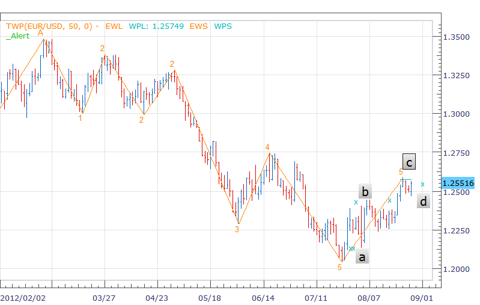
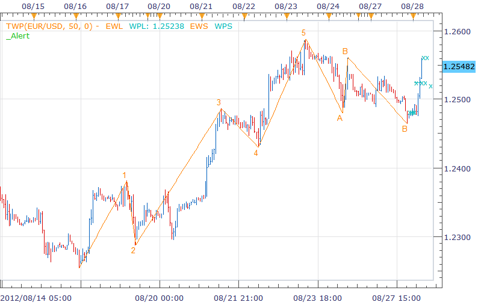

# TWP indicator

> Source: https://fxcodebase.com/code/viewtopic.php?f=17&t=7023  
> Forum: 17 · Topic 7023 · 26 post(s)

---

## TWP indicator

**richardtao** · Mon Oct 03, 2011 10:44 pm

The TWP indicator version 1 is applying to Trading Station II.
This is enhanced version of Elliott wave which was requested by some traders.
The indicator is nominated as Richard Tao Wave Predictor which base on Elliott Wave Analysis. The projection extracted from personal experience.
This is serials number 5 of the predictors developed by Richard Tao.

The first parameter is "M: Trend Minimum" which defines Minimum Periods of Main Trend.
The second parameter is "N: Wave Minimum" which defines Minimum Periods of Wave, 0 is automatic.
The third parameter is " ShowWaveNo: Show WaveNo" which defines whether display wave number or not.
The fourth parameter is " ShowProject: Show Projection" which defines whether display projection of mark or not.
This version displays all projection for all user which means did not exclude low possibility.

 [TWP.lua](files/15770/TWP.lua)

---

## Re: TWP indicator

**Batista** · Tue Oct 04, 2011 7:15 am

Halo
can you tell me what the xxxx have a meaning?

Thank you.

---

## Re: TWP indicator

**Blackcat2** · Tue Oct 04, 2011 6:46 pm

I tried this on EUR/USD, 1H chart with default parameter and I'm not sure how to use this indicator. I roughly know what Elliot Wave is, but what's the purpose of point "A"?

Could you please post a screenshot with that shows entry and exit? What are the rules?

Thanks..
BC

---

## Re: TWP indicator

**Blackcat2** · Wed Oct 05, 2011 6:04 pm

I've been observing this indicator last night, I would like to know how to interpret point "1","2","A","B"
I also noticed that it repaint and moved the projected Take Profit (TP) point depending on the candle movements..

Looks promising but would need more information on the rules and how to read/analyze this indicator..

Cheers..
BC

---

## Re: TWP indicator

**richardtao** · Wed Oct 05, 2011 9:43 pm

hello Batista,
the x present after the lastest turning point.
they imply the price projection at that period.
when the price is fulfil at that level, the next projection will come out.
it might help you to make decision of taking whether position or profit.
for your reference.

---

## Re: TWP indicator

**richardtao** · Wed Oct 05, 2011 10:31 pm

hello BC,
it's very difficult to explain Elliott wave trading stretagy in simple wording.
my suggestion is to check the book at amazon.com there are many classic materials.
after that, you could search those pattern for a while,
it's easy to be familiar with basic theory, but hard to be proficient in.
this indicator is try to assist a little.
for your reference.
rgd,

---

## Re: TWP indicator

**richardtao** · Fri Oct 07, 2011 3:06 am

hello BC,
regarding to your second reply,
this indicator assumed that the last two wave are the moving wave and the corrective wave no matter which wave at the last.
if moving wave number as 12345 than the corrective wave number as ABC, vice versa.
the bull/bear pattern was base on the combination of wave number.
the price could be drawback or ready to extend the new trend when the wave turn.
the x mark is projection base on the wave pattern.
each candle come in, the indicator recalc the new projection.
to avoid confuse, it shows projection only from the new peak.
the more x mark aggregated the higher confidence the target/resistence will appear.
that might help to set the order in advance.
rgds,

---

## Re: TWP indicator

**richardtao** · Tue Dec 13, 2011 5:29 am

modify some error and the rule to identify wave A.

 [TWP.lua](files/20511/TWP.lua)

---

## Re: TWP indicator

**Kingpin** · Wed Mar 07, 2012 8:21 am

Hallo Richard Tao,

great Indicator. Thumps up!!

But what means EWL, WPL, EWS and WPS?

Thx

---

## Re: TWP indicator

**richardtao** · Tue Aug 28, 2012 5:13 am

hi
it's available to explain some.

 

form the above screenshot on EUR D1.
1.there are two (xx) near label square a. this display the project point of previous wave. there are 3 or 5 percentage error in pratice.
2.there is one x near label square b. this is the first project point after complete 5 waves. we guess price could pull back for a while.
3.there are WPL near label square c. this is the last project point achieve so it was display the line which could show the value on status area.
4.there is one x near label square d. this is the next project point calculated in advance. which might hint price moveing target.

 

another example screenshot on EUR h1.
1.there are three (xxx) about 1.2525. this is the first rebound target.
2.there are two (xx) about 1.2560. this is the second rebound target.

for yor reference.

---

## Re: TWP indicator

**ThemBonez** · Thu Aug 21, 2014 7:26 pm

Hello,
Can you please define the output streams EWL, WPL and WPT.
Thank You

---

## Re: TWP indicator

**richardtao** · Wed Oct 22, 2014 5:48 am

hello ThemBonez,
Sorry for reply lately. i had not login this site for a while.
You had mention EWL, WPL and WPT.
are you mean EWL, WPL, and WPS?
EWL is the name of drawing Line of Elliott Wave.
WPL is the name of elliott Wave Projector Level which is the target level.
WPS is the name of elliott Wave Projector Symbol which mark 'x' to record recently projector.
the more x appeared, the higher probability the target will be.

for your reference.

---

## Re: TWP indicator

**easytrading** · Wed Jan 28, 2015 4:24 am

> **richardtao wrote:**
>
>
> > The TWP indicator version 1 is applying to Trading Station II.

hello richardtao,

are there any plans to develope version 2 of TWP indicator ? cause we r still waiting for that.thank u for the very good work.

best regards.

---

## Re: TWP indicator

**richardtao** · Wed Feb 04, 2015 5:40 am

hello,
here is the version 2.
it's pity i did not figure out new approach.
this beta version just fix bugs.
if you guys had any ideal please advise.
thanks!

 [TWP2b.bin](files/98465/TWP2b.bin)

---

## Re: TWP indicator

**easytrading** · Thu Feb 05, 2015 2:19 pm

hello richardtao,

I am getting this error message on H8 timeframe only
"An error occurred during the calculation of the indicator 'TWP2B'. The error details: TWP2b.bin:804: Index is out of range.. "

could you review and fix it please ?

thank you for the better version than the previous one.
best regards.

---

## Re: TWP indicator

**richardtao** · Thu Feb 05, 2015 11:06 pm

hello easytrading,
if market move violently like USD/CHF the wave front was hard to identify.
can you provide which instrument H8 for further debug?
regards,

---

## Re: TWP indicator

**easytrading** · Fri Feb 06, 2015 2:40 am

hello richardtao,

the problem has been gone ,i believe it was because my EUR/USD chart was so compressed with many indicators .now it works smoothly like other timeframes.thank you so much for your quick responce and wish you more pips hunting with TWP indicator.

best regards.

---

## Re: TWP indicator

**evgeniyn** · Fri Feb 13, 2015 10:53 am

Hi richardtao,
A new version of indicator works very well. But sometimes I get an error. Pls see below,

> "An error occurred during the calculation of the indicator 'TWP2B'. The error details: TWP2b.bin:181: TWP2b.bin:203: The third parameter must be a string."

And in addition I would like to add some enhancements:

1) Possibility to change wave line width and style

2) Possibility to change label, projection size

3) And decrease possible minimum for "Trend Minimum".
Thanks in advance,

---

## Re: TWP indicator

**richardtao** · Mon Feb 16, 2015 10:36 pm

hello,
add some style configuration.
my appreciation that you can provide the information of instrument, timeframe, and time span when error occured.

regards,

 [TWP2b.bin](files/98671/TWP2b.bin)

---

## Re: TWP indicator

**evgeniyn** · Wed Feb 18, 2015 3:51 am

Hello richardtao,
Regarding the issue, I can't say exactly. I've switched between GER30, ITA40 and UK100 with timeframe 1m. I'm not sure about time span(working/not working hours). Actually the issue was observed only once. I'll update you with more details, if the issue will be back.
Thank you for updated version.
In addition, could you please add possibility to change wave number label size, and draw projection only for some defined back period(in other words, remove not actual projection points).

---

## Re: TWP indicator

**easytrading** · Thu Feb 19, 2015 3:06 pm

Hello richardtao,

i am having this problem on all timeframes of EUR/USD chart which is:
each time i sequeeze or compresed the chart to have the overall view ,the projected target level represented by xxx changes its position to onther level sometimes to the opesite direction of price action.is it possible to review and fix this please ?
with my best regards.

'

;

---

## Re: TWP indicator

**richardtao** · Tue Feb 24, 2015 4:43 am

hello easytrading,
try this version.
the restricted price backward may cause the shorter view on wave seperator.
for your reference.
regards,

 [TWP2b.bin](files/98824/TWP2b.bin)

---

## Re: TWP indicator

**easytrading** · Mon Mar 09, 2015 1:08 am

Hello richardtao,

did you notice that on EUR/USD daily chart the indicator is not providing any projected target levels.and it is drawing the waves but the counting is only with number 1 for all waves. i am using the last revised version TWP2b. kindly, could check and fix this please.with much appreciation.

---

## Re: TWP indicator

**richardtao** · Wed Mar 18, 2015 5:42 am

hello easytrading,

revised by advice.
thanks!!

 [TWP2b.bin](files/99326/TWP2b.bin)

---

## Re: TWP indicator

**richardtao** · Thu Jul 06, 2017 12:40 am

share the simple version to display the congregate projection level.

 [TWP.bin](files/113427/TWP.bin)

jun 2018 add style version:

 [TWP.bin](files/113427/TWP%20%282%29.bin)

---

## Re: TWP indicator

**easytrading** · Mon Jun 11, 2018 4:00 am

is it possible to add line style configuration for both wave line & wave targets for TWP.bin with my appreciation.
