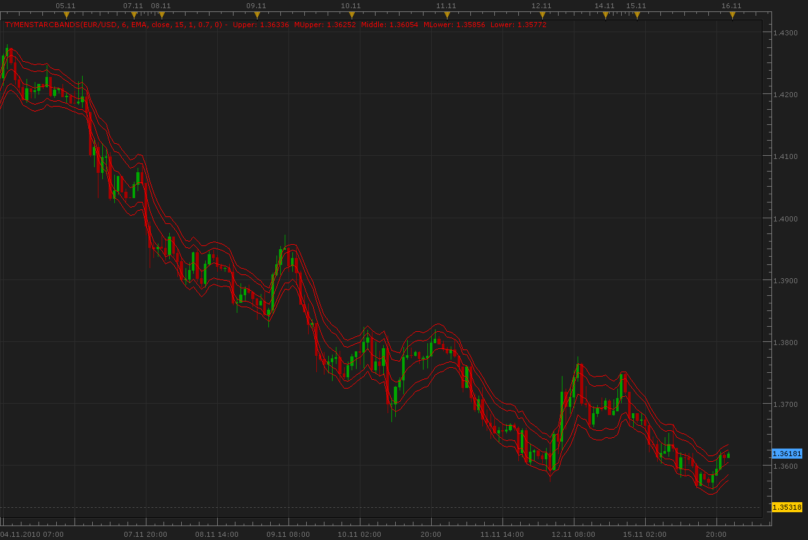

# Tymen STARC Bands

> Source: https://fxcodebase.com/code/viewtopic.php?f=17&t=2713  
> Forum: 17 · Topic 2713 · 2 post(s)

---

## Tymen STARC Bands

**Alexander.Gettinger** · Mon Nov 15, 2010 11:37 pm

[viewtopic.php?f=27&t=2647](https://fxcodebase.com/code/viewtopic.php?f=27&t=2647)

Formulas:
Middle=MA,
Upper=MA+KATR*ATR,
Lower=MA-KATR*ATR,
MUpper=MA+MKATR*ATR,
MLower=MA-MKATR*ATR, where
KATR, MKATR is a indicator parameters.

 

Indicator Averages ([viewtopic.php?f=17&t=2430](https://fxcodebase.com/code/viewtopic.php?f=17&t=2430)) must be installed.

MT4/MQ4 version
[viewtopic.php?f=38&t=64417](https://fxcodebase.com/code/viewtopic.php?f=38&t=64417)

The indicator was revised and updated

---

## Re: Tymen STARC Bands

**Apprentice** · Thu Feb 02, 2017 4:09 pm

Indicator was revised and updated.
