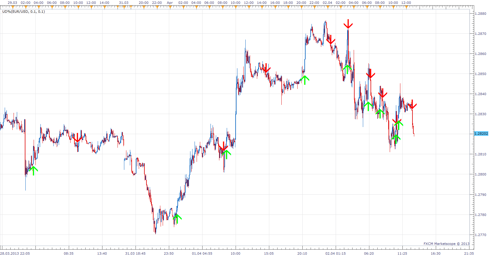

# UD% Price Change Indicator

> Source: https://fxcodebase.com/code/viewtopic.php?f=17&t=34020  
> Forum: 17 · Topic 34020 · 8 post(s)

---

## UD% Price Change Indicator

**Apprentice** · Tue Apr 02, 2013 1:33 pm

As described by Dennis Meyers.
This indicator expresses buy and sell signals based on user-defined percentage
changes in a market.
Percentage should be adjusted to the time frame used.

 [UD%.lua](files/57836/UD.lua)

---

## Re: UD% Price Change Indicator

**Zalabia** · Tue Apr 09, 2013 9:50 pm

Hi Apprentice,

I need an indicator which is similar to this one. The indicator name is "Relative Aggression Bars".
The indicator will highlight 6 types of bars with different colours, the rest of the bars will be grey coloured.
Level (I) long Aggression Bar: will be coloured light green and based on a percentage up of the price change or the average true range or volume, or mix of two or the three of them.
Level (II) long Aggression Bar: will be coloured dark green and based on higher percentage up of the price change or the average true range or volume, or mix of two or the three of them.
Level (III) long Aggression Bar: will be coloured very dark green and based on higher percentage up than level (II) of the price change or the average true range or volume, or mix of two or the three of them.
Level (I) short Aggression Bar: will be coloured light red and based on a percentage down of the price change or the average true range or volume, or mix of two or the three of them.
Level (II) short Aggression Bar: will be coloured dark red and based on a higher percentage down of the price change or the average true range or volume, or mix of two or the three of them.
Level (III) short Aggression Bar: will be coloured very dark red and based on a higher percentage down than level (II) of the price change or the average true range or volume, or mix of two or the three of them.
When level (III) aggression bar appears a short horizontal line will be drawn at the high and the low of the bar, they will work as support and resistance.

Regards,

---

## Re: UD% Price Change Indicator

**Apprentice** · Wed Apr 10, 2013 5:36 am

Requested can be found here.
[viewtopic.php?f=17&t=34335](https://fxcodebase.com/code/viewtopic.php?f=17&t=34335)

---

## Re: UD% Price Change Indicator

**Zalabia** · Wed Apr 10, 2013 12:23 pm

Thanks Aprentice, thats exactly what Im after.
You are great.

---

## Re: UD% Price Change Indicator

**Lolopoulos19** · Sun Apr 14, 2013 7:20 pm

Please,
I have a question about this indicator:
When does this indicator show the signals? After the candle close?
 So, is it possible to take the signal in time and open my position correctly (due to BUY or SELL arrow)
or the signal is constantly changing during the price movement?

---

## Re: UD% Price Change Indicator

**Apprentice** · Mon Apr 15, 2013 4:56 am

Signal will constantly change its indications until period end.

---

## Re: UD% Price Change Indicator

**Lolopoulos19** · Mon Apr 15, 2013 5:18 am

Thank you!!

---

## Re: UD% Price Change Indicator

**Apprentice** · Mon Feb 19, 2018 8:25 am

The Indicator was revised and updated.
