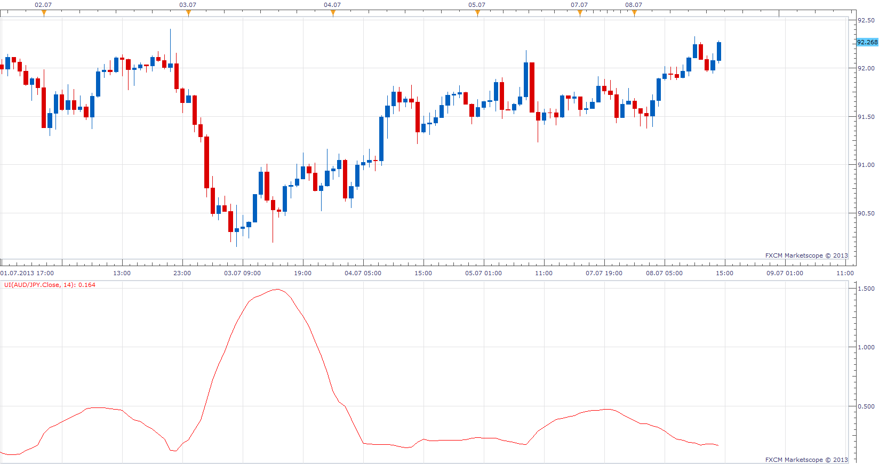

# Ulcer Index

> Source: https://fxcodebase.com/code/viewtopic.php?f=17&t=47357  
> Forum: 17 · Topic 47357 · 9 post(s)

---

## Ulcer Index

**Apprentice** · Mon Jul 08, 2013 2:22 pm

Developed by Peter Martin and Byron McCann in 1987, the Ulcer Index is a volatility indicator that measures downside risk.
It's designed as a measure of volatility, but only volatility in the downward direction, i.e. the amount of drawdown or retracement occurring over a period.
 Many consider the Ulcer Index superior to the standard deviation and other measures of risk.

 [UI.lua](files/74254/UI.lua)

The indicator was revised and updated

---

## Re: Ulcer Index

**Coondawg71** · Mon Jul 08, 2013 4:07 pm

Thanks Apprentice, this will be a very useful indicator!!!

I will post a request for a MTF MCP Ulcer Index Table List in the appropriate forum.

Thanks for all your time and effort!

sjc

---

## Re: Ulcer Index

**Apprentice** · Tue Jul 09, 2013 5:21 am

 [MTF MCP Ulcer Index List.lua](files/74760/MTF%20MCP%20Ulcer%20Index%20List.lua)

---

## Re: Ulcer Index

**JDFXUK** · Tue Jul 09, 2013 2:31 pm

Hi, is it possible to create a ' Price Inverse ' indicator , that I can apply to all pairs?

Example take the USD/JPY I would like it to be displayed as JPY/USD etc.

Thanks in advance. This will also allow me to apply the Ulcer Index to them that way.

---

## Re: Ulcer Index

**Apprentice** · Wed Jul 10, 2013 6:17 am

I believe that we already have one or two Inverse indicators.
[viewtopic.php?f=17&t=34005&p=57805&hilit=Inverse](https://fxcodebase.com/code/viewtopic.php?f=17&t=34005&p=57805&hilit=Inverse) # p57805

Applicable for standard Ulcer Index.

Unfortunately for MCP MTF this will not work.
This must be hard coded from within indicator.

---

## Re: Ulcer Index

**Apprentice** · Wed Jul 10, 2013 7:14 am

Invers option added.
U have to download and reinstall both of indicators.

---

## Re: Ulcer Index

**JDFXUK** · Sat Jul 20, 2013 7:49 am

Thank you for your help. Much appreciated.

---

## Re: Ulcer Index

**Alexander.Gettinger** · Tue Aug 13, 2013 1:57 pm

MQL4 version of Ulcer Index: [viewtopic.php?f=38&t=59083](https://fxcodebase.com/code/viewtopic.php?f=38&t=59083)

---

## Re: Ulcer Index

**Apprentice** · Fri Jun 09, 2017 8:33 am

The indicator was revised and updated.
