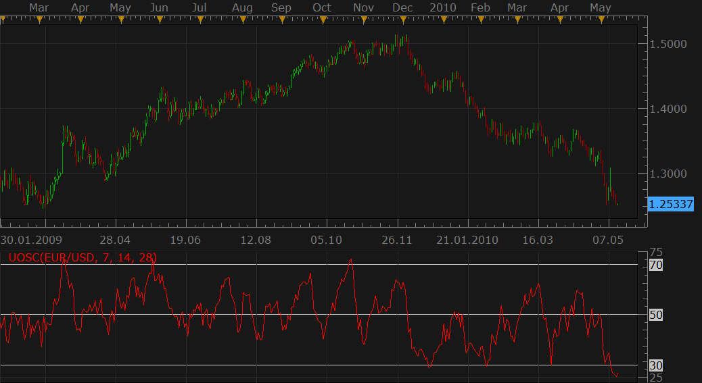

# Ultimate Oscillator

> Source: https://fxcodebase.com/code/viewtopic.php?f=17&t=1024  
> Forum: 17 · Topic 1024 · 7 post(s)

---

## Ultimate Oscillator

**Nikolay.Gekht** · Thu May 13, 2010 5:22 pm

Ultimate Oscillator is another oscillator developed by Larry Williams

Read more about the Ultimate Oscillator on [wiki](https://en.wikipedia.org/wiki/Ultimate_Oscillator)

 

Download:

 [UOSC.lua](files/1928/UOSC.lua)

The indicator was revised and updated

---

## Re: Ultimate Oscillator

**Paul W** · Wed Apr 29, 2015 7:40 am

could you pls add a line width option

thx

---

## Re: Ultimate Oscillator

**Apprentice** · Fri May 01, 2015 2:35 am

Style Option Added.

---

## Re: Ultimate Oscillator

**Apprentice** · Mon Jul 03, 2017 8:08 am

The indicator was revised and updated.

---

## Re: Ultimate Oscillator

**yolerap** · Sat May 30, 2020 9:17 am

Could you please provide the strategy with this indicator ?

When the UOSC goes down the level 30 -> Open long trade
When the UOSC goes up the level 70 -> Open short trade

But open the trade from that moment :
If it's a long trade, wait a green candle and open on the next candle ( through the option " end of turn " )
If it's a short trade, wait a red candle and open on the next candle ( through the option " end of turn " ).

My picture shows you the short trade.
Please, add the option " Timeframe trading " and " Modify the two levels of the UOSC "

Thank you,

---

## Re: Ultimate Oscillator

**Apprentice** · Sun May 31, 2020 4:04 am

Your request is added to the development list.
Development reference 1399.

---

## Re: Ultimate Oscillator

**Apprentice** · Sun May 31, 2020 5:06 am

Try this version.
[viewtopic.php?f=31&t=69943](https://fxcodebase.com/code/viewtopic.php?f=31&t=69943)
