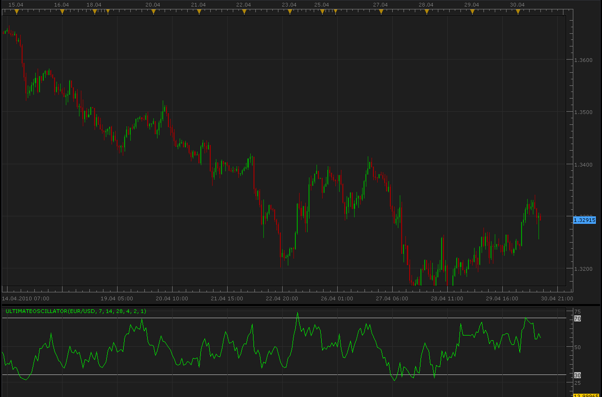

# Ultimate Oscillator

> Source: https://fxcodebase.com/code/viewtopic.php?f=17&t=897  
> Forum: 17 · Topic 897 · 2 post(s)

---

## Ultimate Oscillator

**Alexander.Gettinger** · Fri Apr 30, 2010 11:30 am

The values of the indicator vary in a range from zero to 100 and the center is the 50 value. Values below 30 correspond with the overbought zone, and values between 70 and 100 - with the oversold zone.

Calculation:

 1.Define current "True Low" (TL) — the least of two values: the current minimum and the precious closing price.

 TL (i) = MIN (LOW (i) || CLOSE (i - 1))

 2.Find current "Buying Pressure" (BP). It is equal to the difference between current closing price and current True Low.

 BP (i) = CLOSE (i) - TL (i)

 3.Define the "True Range" (TR). It is the greatest of the following differences: current maximum and minimum; current maximum and previous closing price; current minimum and previous closing price.

 TR (i) = MAX (HIGH (i) - LOW (i) || HIGH (i) - CLOSE (i - 1) || CLOSE (i - 1) - LOW (i))

 4.Find the sum of BP values for all three periods of calculation:

 BPSUM (N) = SUM (BP (i), i)

 5.Find the sum of TR values for all three periods of calculation:

 TRSUM (N) = SUM (TR (i), i)

 6.Calculate the "Raw Ultimate Oscillator" (RawUO)

 RawUO = 4 * (BPSUM (1) / TRSUM (1)) + 2 * (BPSUM (2) / TRSUM (2)) + (BPSUM (3) / TRSUM (3))

 7.Calculate the "Ultimate Oscillator" (UO) value according to the formula:

 UO = ( RawUO / (4 + 2 + 1)) * 100

Where:
MIN — means the minimum value;
MAX — the maximum value;
|| — a logical OR;
LOW (i) — the minimum price of the current bar;
HIGH (i) — the maximum price of the current bar;
CLOSE (i) — the closing price of the current bar;
CLOSE (i — 1) — the closing price of the previous bar;
TL (i) — the True Low;
BP (i) — the Buying Pressure;
TR (i) — the True Range;
BPSUM (N) — the mathematical sum of BP values for an n period (N equal to 1 corresponds with i=7 bars; N equal to 2 corresponds with i=14 bars; N equal to 3 corresponds with i=28 bars);
TRSUM (N) — the mathematical sum of TR values for an n period (N equal to 1 corresponds with i=7 bars; N equal to 2 corresponds with i=14 bars; N equal to 3 corresponds with i=28 bars);
RawUO — "Raw Ultimate Oscillator";
UO — stands for Ultimate Oscillator.

 

The indicator was revised and updated

---

## Re: Ultimate Oscillator

**Apprentice** · Mon Dec 26, 2016 7:29 am

Indicator was revised and updated.
