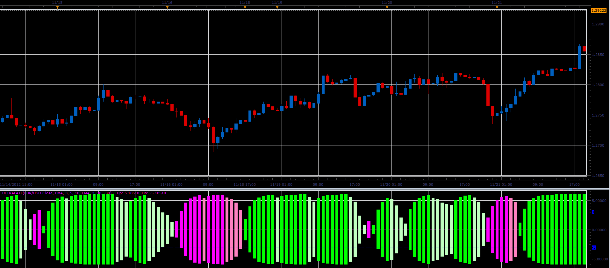

# Ultra FATL indicator

> Source: https://fxcodebase.com/code/viewtopic.php?f=17&t=27886  
> Forum: 17 · Topic 27886 · 2 post(s)

---

## Ultra FATL indicator

**Alexander.Gettinger** · Fri Dec 21, 2012 5:34 pm

This indicator is a ported MQL5 indicator from [viewtopic.php?f=27&t=27724&p=48578#p48578](https://fxcodebase.com/code/viewtopic.php?f=27&t=27724&p=48578#p48578)

 

Download:

 [UltraFatl.lua](files/48931/UltraFatl.lua)

For this indicator must be installed Averages indicator ([viewtopic.php?f=17&t=2430](https://fxcodebase.com/code/viewtopic.php?f=17&t=2430)) and FATL indicator ([viewtopic.php?f=17&t=27885](https://fxcodebase.com/code/viewtopic.php?f=17&t=27885)).

The indicator was revised and updated

---

## Re: Ultra FATL indicator

**Apprentice** · Thu Apr 27, 2017 4:29 am

Indicator was revised and updated.
