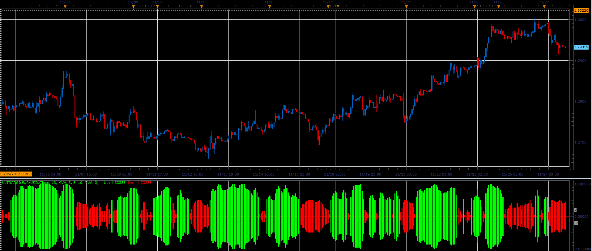

# Ultra RSI indicator

> Source: https://fxcodebase.com/code/viewtopic.php?f=17&t=26991  
> Forum: 17 · Topic 26991 · 4 post(s)

---

## Ultra RSI indicator

**Alexander.Gettinger** · Tue Nov 27, 2012 3:47 pm

This indicator is a ported indicator from [viewtopic.php?f=27&t=25712&p=44199#p44199](https://fxcodebase.com/code/viewtopic.php?f=27&t=25712&p=44199#p44199)

 

Download:

 [UltraRSI.lua](files/46947/UltraRSI.lua)

For this indicator must be installed Averages indicator ([viewtopic.php?f=17&t=2430](https://fxcodebase.com/code/viewtopic.php?f=17&t=2430)).

The indicator was revised and updated

---

## Re: Ultra RSI indicator

**davidnwatson** · Sun May 25, 2014 3:31 pm

How about a strategy to buy or sell when the color changes?

---

## Re: Ultra RSI indicator

**Apprentice** · Mon May 26, 2014 7:27 am

Requested can be found here.
[viewtopic.php?f=31&t=60728](https://fxcodebase.com/code/viewtopic.php?f=31&t=60728)

---

## Re: Ultra RSI indicator

**Apprentice** · Tue Jul 18, 2017 6:41 am

The indicator was revised and updated.
