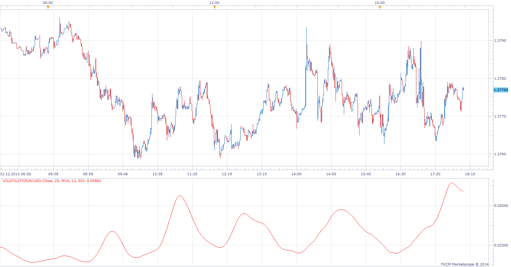
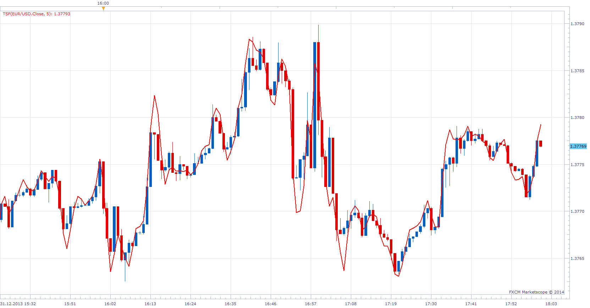
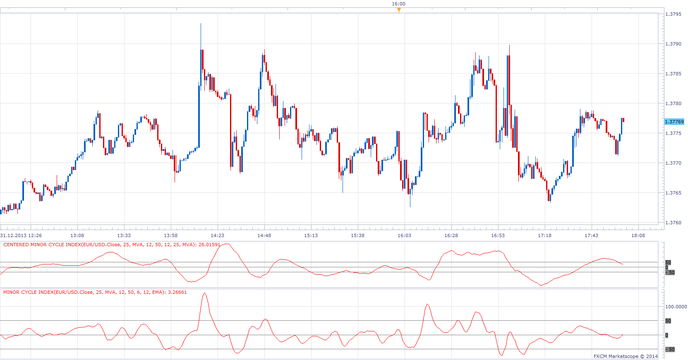

# Universal Cycle Index (UCI)

> Source: https://fxcodebase.com/code/viewtopic.php?f=17&t=60163  
> Forum: 17 · Topic 60163 · 5 post(s)

---

## Universal Cycle Index (UCI)

**Apprentice** · Wed Jan 01, 2014 7:20 am

Universal Cycle Index (UCI) comes from the May 2005 issue of Stocks & Commodities magazine by
Stuart Belknap, PhD: "The UCI is nothing more than a normalized Moving Average
Converging/Diverging (MACD) indicator."

 

Volatility or Sigom % is First indicator from series.

 [Volatility.lua](files/91783/Volatility.lua)

 

Time Series Forecast

 [TSF.lua](files/91783/TSF.lua)

 

Minor cycle index

 [Minor cycle index.lua](files/91783/Minor%20cycle%20index.lua)

 [Centered minor cycle index.lua](files/91783/Centered%20minor%20cycle%20index.lua)

---

## Secondary cycle index

**Apprentice** · Wed Jan 01, 2014 11:29 am

 [Secondary cycle index.lua](files/91784/Secondary%20cycle%20index.lua)

 [Centered secondary cycle index.lua](files/91784/Centered%20secondary%20cycle%20index.lua)

---

## Intermediate cycle index

**Apprentice** · Wed Jan 01, 2014 11:43 am

Intermediate cycle index

 [Intermediate cycle index.lua](files/91785/Intermediate%20cycle%20index.lua)

 [Centered intermediate cycle index.lua](files/91785/Centered%20intermediate%20cycle%20index.lua)

---

## Centered channel lines

**Apprentice** · Wed Jan 01, 2014 12:16 pm

 [Centered channel lines.lua](files/91786/Centered%20channel%20lines.lua)

 [Real-time channel lines.lua](files/91786/Real-time%20channel%20lines.lua)

---

## Re: Universal Cycle Index (UCI)

**Apprentice** · Sun Feb 18, 2018 7:42 am

The indicator was revised and updated.
