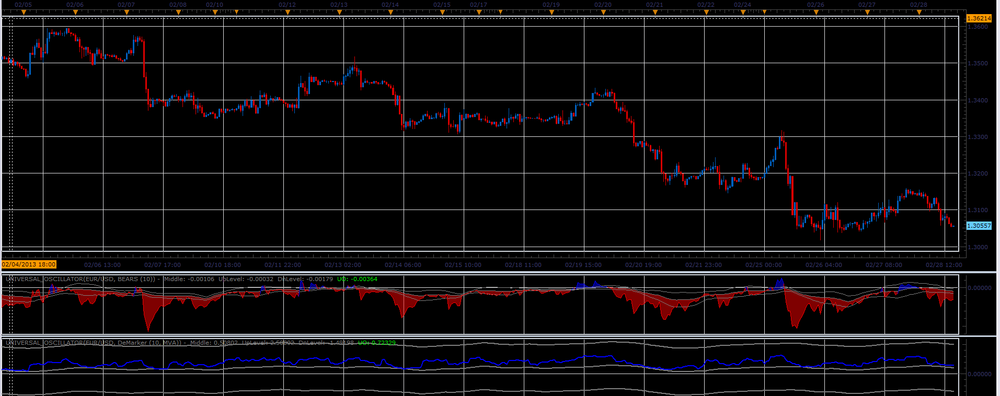

# Universal oscillator

> Source: https://fxcodebase.com/code/viewtopic.php?f=17&t=32547  
> Forum: 17 · Topic 32547 · 2 post(s)

---

## Universal oscillator

**Alexander.Gettinger** · Thu Feb 28, 2013 5:26 pm

This indicator was required: [viewtopic.php?f=27&t=32181](https://fxcodebase.com/code/viewtopic.php?f=27&t=32181)

 

Download:

 [Universal_Oscillator.lua](files/55441/Universal_Oscillator.lua)

For this indicator must be installed Bulls and Bears power indicators ([viewtopic.php?f=17&t=1376&p=2648](https://fxcodebase.com/code/viewtopic.php?f=17&t=1376&p=2648)), DeMarker oscillator ([viewtopic.php?f=17&t=22&p=23](https://fxcodebase.com/code/viewtopic.php?f=17&t=22&p=23)) and Momentum ([viewtopic.php?f=17&t=896&p=1638](https://fxcodebase.com/code/viewtopic.php?f=17&t=896&p=1638)).

The indicator was revised and updated

---

## Re: Universal oscillator

**Apprentice** · Mon May 01, 2017 7:00 am

Indicator was revised and updated.
