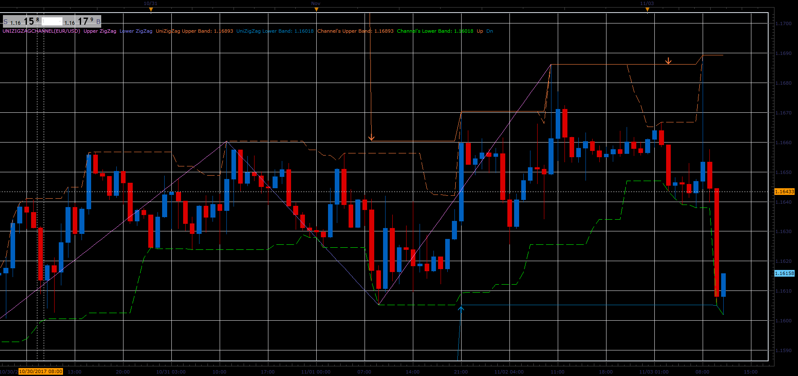

# Universal ZigZag

> Source: https://fxcodebase.com/code/viewtopic.php?f=17&t=65327  
> Forum: 17 · Topic 65327 · 7 post(s)

---

## Universal ZigZag

**Alexander.Gettinger** · Fri Nov 03, 2017 12:30 pm

Based on the request.
[viewtopic.php?f=27&t=65202](https://fxcodebase.com/code/viewtopic.php?f=27&t=65202)

 

Download:

 [UniZigZagChannel.lua](files/115824/UniZigZagChannel.lua)

Strategy based on this indicator.
[viewtopic.php?f=31&t=65356&p=116002#p116002](https://fxcodebase.com/code/viewtopic.php?f=31&t=65356&p=116002#p116002)

---

## Re: Universal ZigZag

**papynou34** · Fri Nov 10, 2017 7:30 am

Hello,
 is it possible to do a strategy with this indicator?
BUY with the DN signal.
sell with the UP signal.

And the following shown in pictures.

Thanks in advance

 

 

---

## Re: Universal ZigZag

**Apprentice** · Sun Nov 12, 2017 1:05 pm

Strategy based on this indicator.
[viewtopic.php?f=31&t=65356&p=116002#p116002](https://fxcodebase.com/code/viewtopic.php?f=31&t=65356&p=116002#p116002)
Signal line added, make sure you re-download it.

---

## Re: Universal ZigZag

**papynou34** · Wed Nov 22, 2017 11:21 am

Hello,
Is it possible to add an alert with sound. One when the Up arrow appears, an other one when the down arrows appears.

Rhanks a lot in advance

---

## Re: Universal ZigZag

**Apprentice** · Thu Nov 23, 2017 6:52 am

Your request is added to the development list under Id Number 3958

---

## Re: Universal ZigZag

**Apprentice** · Sun Nov 26, 2017 9:08 am

Try this version.

 [UniZigZagChannel.lua](files/116221/UniZigZagChannel.lua)

---

## Re: Universal ZigZag

**Apprentice** · Tue Jul 03, 2018 7:12 am

The Indicator was revised and updated.
