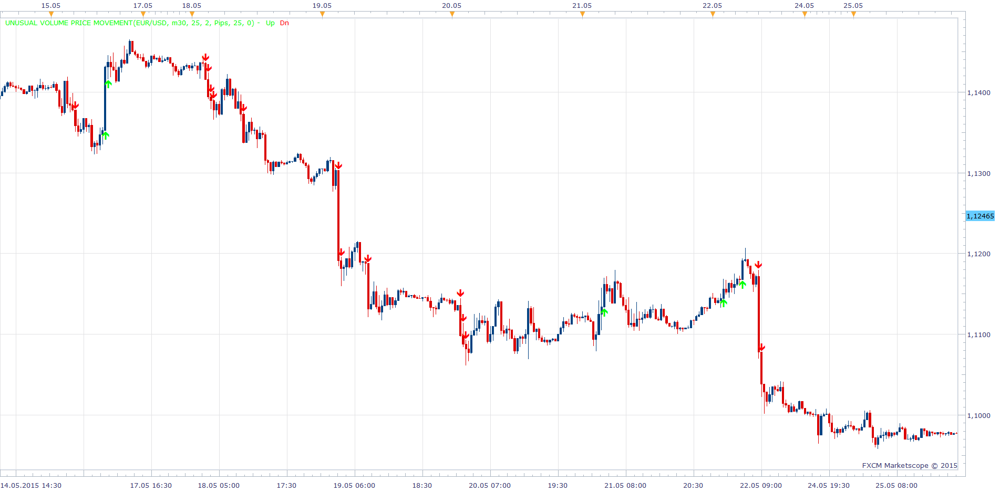

# Unusual Volume Price Movement

> Source: https://fxcodebase.com/code/viewtopic.php?f=17&t=62324  
> Forum: 17 · Topic 62324 · 17 post(s)

---

## Unusual Volume Price Movement

**Apprentice** · Wed Jun 17, 2015 5:11 am

Based on the request.
[viewtopic.php?f=27&t=62157#p100107](https://fxcodebase.com/code/viewtopic.php?f=27&t=62157#p100107)

An indication will be given if we have a break on high volume

Up Arrow
Volume> Average_Volume * Multiplier
Price> Highest Price for Last N candle, plus set, Pip / Percentage Value
Down Arrow
Volume> Average_Volume * Multiplier
Price <Lowest Price for Last N candle, minus set, Pip / Percentage Value

 [Unusual Volume Price Movement.lua](files/100987/Unusual%20Volume%20Price%20Movement.lua)

 [Unusual Volume Price Movement with Alert.lua](files/100987/Unusual%20Volume%20Price%20Movement%20with%20Alert.lua)

MT4/MQ4 version.
[viewtopic.php?f=38&t=66190](https://fxcodebase.com/code/viewtopic.php?f=38&t=66190)

---

## Re: Unusual Volume Price Movement

**Alexander.Gettinger** · Wed Jul 29, 2015 7:37 am

MQL4 version of Unusual Volume Price Movement indicator: [viewtopic.php?f=38&t=62485](http://www.fxcodebase.com/code/viewtopic.php?f=38&t=62485).

---

## Re: Unusual Volume Price Movement

**supertrader123** · Mon Aug 03, 2015 8:32 am

hi,
may i request a strategy based on this indicator with cci

indicators:
1.cci (period-50)

buy level;0
sell level;0
2.Unusual Volume Price Movement with default parameters
**buy:

 1.cci > buy level
 2.and Volume> Average_Volume * Multiplier
3. and Price> Highest Price for Last N candle, plus set, Pip / Percentage Value
sell:
1. cci < sell level
2.and Volume> Average_Volume * Multiplier
3.and Price <Lowest Price for Last N candle, minus set, Pip / Percentage Value**

---

## Re: Unusual Volume Price Movement

**Apprentice** · Wed Aug 05, 2015 7:19 am

Your request is added to the development list.

---

## Re: Unusual Volume Price Movement

**newton** · Wed Sep 16, 2015 2:13 pm

can you create a strategy based on this indicator

buy when upper arrow forms
sell when down arrow forms

---

## Re: Unusual Volume Price Movement

**Apprentice** · Fri Sep 18, 2015 3:26 am

newton, Requested can be found here.
[viewtopic.php?f=31&t=62668](https://fxcodebase.com/code/viewtopic.php?f=31&t=62668)

---

## Re: Unusual Volume Price Movement

**Apprentice** · Fri Sep 25, 2015 4:00 am

CCI Unusual Volume Price Movement Strategy Added
[viewtopic.php?f=31&t=62668&p=102400#p102400](https://fxcodebase.com/code/viewtopic.php?f=31&t=62668&p=102400#p102400)

---

## Re: Unusual Volume Price Movement

**stan18** · Tue Sep 29, 2015 10:03 am

Can you make MT4 version of this strategy ?

> **Apprentice wrote:**
> CCI Unusual Volume Price Movement Strategy Added
> [http://fxcodebase.com/code/viewtopic.ph ... 00#p102400](https://fxcodebase.com/code/viewtopic.php?f=31&t=62668&p=102400#p102400)

---

## Re: Unusual Volume Price Movement

**Apprentice** · Wed Sep 30, 2015 3:46 am

Your request is added to the development list.

---

## Re: Unusual Volume Price Movement

**Apprentice** · Tue Jul 25, 2017 11:23 am

The indicator was revised and updated.

---

## Re: Unusual Volume Price Movement

**Apprentice** · Tue Jun 12, 2018 11:33 am

MT4/MQ4 version.
[viewtopic.php?f=38&t=66190](https://fxcodebase.com/code/viewtopic.php?f=38&t=66190)

---

## Re: Unusual Volume Price Movement

**Reymondpolanco** · Tue Jun 12, 2018 8:52 pm

Can you add the option to open a trade automaticall when a short or long signal given and a selector to close automatic the trades.

If a short signal open short trade, when a long signal appears close all short trade and open a long trade.

If a long signal open a long trade, when a short signal appears close all long trade and open a short trade.

---

## Re: Unusual Volume Price Movement

**Apprentice** · Wed Jun 13, 2018 6:09 am

Like this one?
[viewtopic.php?f=31&t=62668](https://fxcodebase.com/code/viewtopic.php?f=31&t=62668)

---

## Re: Unusual Volume Price Movement

**GonzoOz** · Wed Jul 01, 2020 12:17 am

Hello this is a very useful indicator. Is there a possibility to add a sound alert? Also in the strategy, there is an option for a cci filter- could this be added to the chart indicator?

Thank you

---

## Re: Unusual Volume Price Movement

**Apprentice** · Wed Jul 01, 2020 3:26 am

Your request is added to the development list.
Development reference 1598.

---

## Re: Unusual Volume Price Movement

**Apprentice** · Wed Jul 01, 2020 6:36 am

Unusual Volume Price Movement with Alert.lua added.

---

## Re: Unusual Volume Price Movement

**GonzoOz** · Wed Jul 01, 2020 8:33 am

Thank you sir!
