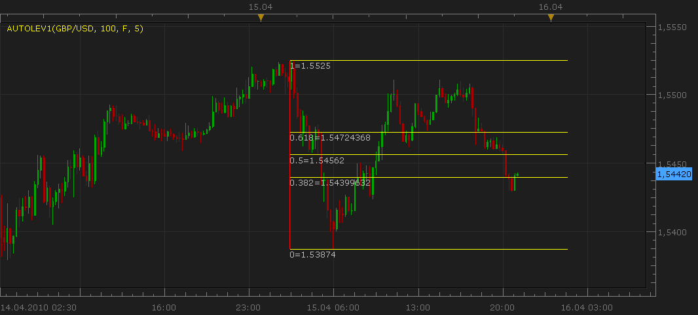
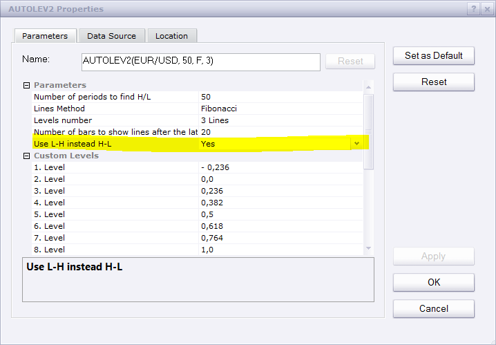
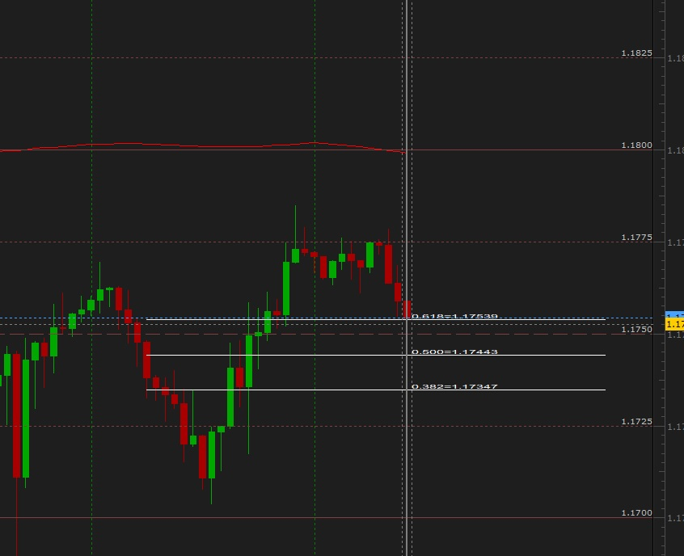

# [Upd Oct, 08] Automatic Levels Indicator (Fibonacci, Gann)

> Source: https://fxcodebase.com/code/viewtopic.php?f=17&t=659  
> Forum: 17 · Topic 659 · 53 post(s)

---

## [Upd Oct, 08] Automatic Levels Indicator (Fibonacci, Gann)

**Nikolay.Gekht** · Thu Apr 15, 2010 8:18 pm

The indicator draws the Fibonacci or Gann levels between the highest high and lowest low value for the specified number of the latest bars. When new price arrives and highest high or lowest low are changed, the levels are moved.

You can select either fibonacci or gann levels and how much lines to show (variants: 3, 5, 7 or 9).

 

Update Oct, 08 2010
1) New lines set 3 lines (alt) is added. 0/50%/100% levels are used.
2) Label now are options, you can switch them off.
3) Now you can see the level and the price by moving mouse cursor over the line and wait a bit until tooltip appears.
4) Styles and line width are added.
5) Indicator code is a bit optimized.

Update Aug, 14 2015
The ability to flip the indicator has been added.

Download the new version of indicator:

 [AUTOLEV2.lua](files/1188/AUTOLEV2.lua)

Download the indicator (older version):

 [AUTOLEV1.lua](files/1188/AUTOLEV1.lua)

Have Historical option.

 [AUTOLEV3.lua](files/1188/AUTOLEV3.lua)

---

## Re: Automatic Levels Indicator (Fibonacci, Gann)

**beni40** · Tue Apr 27, 2010 2:35 am

nice work
is it posible to get fib levels -27 and - 68

best regards
bent

---

## Re: Automatic Levels Indicator (Fibonacci, Gann)

**Nikolay.Gekht** · Wed May 05, 2010 4:19 pm

I'm afraid that complex settings of the indicators will dramatically reduce the easiness of usage. However, anyone can create their own version of the indicator.

It is very easy to change the indicator to support these levels as you wish. Below is a part of the indicator which is responsible for the levels. I also added a lot of comment which explain how you can change them. Just find this code in the indicator and make any changes.

Code: [Select all](https://fxcodebase.com/code/)
`function CalcLevels()
    levels = {};
    index = {};
    if M == "F" then
        --- here is all possible levels for the fibonacci.
        --- The number inside the square bracket is a number of the line,
        --- the value after = is the level.
        --- You can change the value of the level to any level you wish.
        levels[1] = -0.236;
        levels[2] = 0;
        levels[3] = 0.236;
        levels[4] = 0.382;
        levels[5] = 0.5;
        levels[6] = 0.618;
        levels[7] = 0.764;
        levels[8] = 1;
        levels[9] = 1.272;
        --- here is lists of levels for 3, 5, 7 and 9 lines. You can select any other levels if you wish
        index["3"] = {4, 5, 6};
        index["5"] = {2, 4, 5, 6, 8};
        index["7"] = {2, 3, 4, 5, 6, 7, 8};
        index["9"] = {1, 2, 3, 4, 5, 6, 7, 8, 9};
    else
        --- here is all possible levels for the gann. You can change them exactly like the fibonacci levels
        levels[1] = 0;
        levels[2] = 0.125;
        levels[3] = 0.25;
        levels[4] = 0.375;
        levels[5] = 0.5;
        levels[6] = 0.625;
        levels[7] = 0.75;
        levels[8] = 0.875;
        levels[9] = 1;
        index["3"] = {3, 5, 7};
        index["5"] = {1, 3, 5, 7, 9};
        index["7"] = {1, 3, 4, 5, 6, 7, 9};
        index["9"] = {1, 2, 3, 4, 5, 6, 7, 8, 9};
    end
end`

---

## Re: Automatic Levels Indicator (Fibonacci, Gann)

**cmac0351** · Tue Jul 20, 2010 10:57 pm

Hello,

Is there any way to get this to lock in to a specific time frame instead of it refreshing when new candles open? I would like to have it for 1:00 AM - 4:00 AM EST each day. Thank you.

---

## Re: Automatic Levels Indicator (Fibonacci, Gann)

**Nikolay.Gekht** · Tue Jul 27, 2010 10:09 am

Yes, it's possible. Added to the development queue.

---

## Re: Automatic Levels Indicator (Fibonacci, Gann)

**sedraude** · Wed Oct 06, 2010 8:45 pm

Hi Nikolay,

Thank you for your great indi, Can you help me to make this indi has a option to display only the High-level (100%), Low (0%) and Middle (50%) as well?

Thank you in advance.

---

## Re: [Upd Oct, 08] Automatic Levels Indicator (Fibonacci, Gann)

**Nikolay.Gekht** · Fri Oct 08, 2010 12:10 pm

Update Oct, 08 2010
1) New lines set 3 lines (alt) is added. 0/50%/100% levels are used.
2) Label now are options, you can switch them off.
3) Now you can see the level and the price by moving mouse cursor over the line and wait a bit until tooltip appears.
4) Styles and line width are added.
5) Indicator code is a bit optimized.

See AUTOLEV2.lua in [the first post](https://fxcodebase.com/code/viewtopic.php?f=17&t=659).

---

## Re: [Upd Oct, 08] Automatic Levels Indicator (Fibonacci, Gann)

**sedraude** · Sat Oct 09, 2010 11:51 pm

wow, very fast yah...

Thank you Nikolay, great indi and very usefull!

---

## Re: [Upd Oct, 08] Automatic Levels Indicator (Fibonacci, Gann)

**arindam89** · Wed Jun 13, 2012 6:01 am

> **Nikolay.Gekht wrote:**
> Update Oct, 08 2010
> 1) New lines set 3 lines (alt) is added. 0/50%/100% levels are used.
> 2) Label now are options, you can switch them off.
> 3) Now you can see the level and the price by moving mouse cursor over the line and wait a bit until tooltip appears.
> 4) Styles and line width are added.
> 5) Indicator code is a bit optimized.
>
> See AUTOLEV2.lua in [the first post](https://fxcodebase.com/code/viewtopic.php?f=17&t=659).

hi Nikolay.Gekht
this is one of the greatest works mankind has ever made .I have a very very simple request for you ....
can you make this a strategy that goes short at 0.382 and long on 0.618 please
thanks
by arindam roy

---

## Re: [Upd Oct, 08] Automatic Levels Indicator (Fibonacci, Gann)

**arindam89** · Thu Jun 14, 2012 9:28 pm

> **arindam89 wrote:**
>
>
> > **Nikolay.Gekht wrote:**
> > Update Oct, 08 2010
> > 1) New lines set 3 lines (alt) is added. 0/50%/100% levels are used.
> > 2) Label now are options, you can switch them off.
> > 3) Now you can see the level and the price by moving mouse cursor over the line and wait a bit until tooltip appears.
> > 4) Styles and line width are added.
> > 5) Indicator code is a bit optimized.
> >
> > See AUTOLEV2.lua in [the first post](https://fxcodebase.com/code/viewtopic.php?f=17&t=659).
>
>
>
> hi Nikolay.Gekht
> this is one of the greatest works mankind has ever made .I have a very very simple request for you ....
> can you make this a strategy that goes short at 0.382 and long on 0.618 please
> thanks
> by arindam roy

hi Nikolay.Gekht
I am eagerly waiting with great expectation that you will make my strategy
1.open short when market touches from above or below the 0.382
2.open long when market touches from above or below the 0.618
please can you code this this
thanks
by
arindam roy
india
9830538277
[[email protected]](https://fxcodebase.com/cdn-cgi/l/email-protection#81e0f3e8efe5e0ecb9b8c1f8e0e9eeeeafe2eeec)

---

## Re: [Upd Oct, 08] Automatic Levels Indicator (Fibonacci, Gann)

**nazaar** · Sat Oct 27, 2012 2:25 pm

Hello,

this is a excellent tool and I am glad I found it. At present it draws fib levels for a chosen number of periods back from the Highest High to the the Lowest Low, Brilliant! But, the point A is always greater than the point B which is good when price moves down and then retraces up.

To include the other side, can you ad an option to flip the A and B? This way we can get fib levels quickly for either up retrace or down retrace. That is a option to choose, the fib levels will be drawn from the Lowest low to the highest high of the period. So, the point A is lower than the B.

Thanks.

---

## Re: [Upd Oct, 08] Automatic Levels Indicator (Fibonacci, Gan

**ThemBonez** · Thu Aug 21, 2014 7:03 pm

Hello Nikolay,
I have been using the Strategy Wizard to create strategies. I found this indicator and would like to add it to one of my strategies where buy and sell signals only happen when price occurs between the .382 and .618 lines; however, when I get to expressions and choose this indicator there are no options available under output stream. Is it possible to put the list of fibonacci levels in the output stream so and expression can be created such as "data source < .618 .and. data source > .382"
Thank You

---

## Re: [Upd Oct, 08] Automatic Levels Indicator (Fibonacci, Gan

**Apprentice** · Fri Aug 22, 2014 2:34 am

Current Indicator version will NOT provide output values.
Two directions are possible.
Calculation within strategy, or, and, indicator redesign.

---

## Re: [Upd Oct, 08] Automatic Levels Indicator (Fibonacci, Gan

**ThemBonez** · Sat Aug 23, 2014 4:59 pm

Thank you Apprentice, I would like to request that indicator so that the output streams are available and to add options for .768, 1.618, and 1.272

---

## Re: [Upd Oct, 08] Automatic Levels Indicator (Fibonacci, Gan

**Apprentice** · Sun Aug 24, 2014 4:16 am

Please Re-Download AUTOLEV2.lua
I introduced the Custom method.
For which you can choose any level.

---

## Re: [Upd Oct, 08] Automatic Levels Indicator (Fibonacci, Gan

**ThemBonez** · Sun Aug 24, 2014 11:03 am

That's the one I have, but it doesn't have the output streams....that'swhat I really need. So in the strategy I can access the values of the different levels.

---

## Re: [Upd Oct, 08] Automatic Levels Indicator (Fibonacci, Gan

**Apprentice** · Mon Aug 25, 2014 2:16 am

The best way is to re-calculate this value from within strategy.

---

## Re: [Upd Oct, 08] Automatic Levels Indicator (Fibonacci, Gan

**ThemBonez** · Mon Aug 25, 2014 5:15 am

What algorithm is used in this indicator do determine the high and low levels to base these fib calcs on?
Thx

---

## Re: [Upd Oct, 08] Automatic Levels Indicator (Fibonacci, Gan

**Apprentice** · Tue Aug 26, 2014 2:37 am

In this indicator we use min/max value of last N periods.
Number of periods to find H/L in parameter section.

---

## Re: [Upd Oct, 08] Automatic Levels Indicator (Fibonacci, Gan

**ThemBonez** · Tue Aug 26, 2014 8:17 am

Is it possible to use this in the Strategy Wizard? How would I do so?

---

## Re: [Upd Oct, 08] Automatic Levels Indicator (Fibonacci, Gan

**Apprentice** · Thu Aug 28, 2014 5:32 am

We need to hard code this.
Can you describe your strategy.

---

## Re: [Upd Oct, 08] Automatic Levels Indicator (Fibonacci, Gan

**ThemBonez** · Sat Aug 30, 2014 10:11 am

Hi Apprentice,
Attached is the basic entry protocol I created with the Strategy Wizard.
The basic entry criteria are:
Long
Daily Stoch RSI K >25 and stochrsi K>D
Hourly Stochrsi (ASK) <25 and crossover k, D

Short
Daily Stoch RSI K <75 and stochrsi K>D
Hourly Stochrsi (BID) >75 and crossunder k, D

What I want to add is a criteria that in order to initiate the entry, the current price on the HOURLY chart must be between 2 selected fib ratios (Chosen from .236, .382, .5., .618, .786, 1. with a default of .382 and .618) for a selected period, default at 50 hourly bars. I would also like to add the option in the parameters to choose the two time frames to use in the strategy, such as daily and 1 hr or 4hr and 15 min, etc.

I have an idea for the exit strategy, but lets get the entry working right first.Smile

Thanx
ThemBonez

 [StochRSI FIB.lua](files/95628/StochRSI%20FIB.lua)

---

## Re: [Upd Oct, 08] Automatic Levels Indicator (Fibonacci, Gan

**angelalzate** · Mon Mar 09, 2015 4:54 pm

Good afternoon , hope is well . Thanks for this indicator is great. I wonder if you can make a fibo with standard levels but these, we can change to text, ie where you go write some text 61.8 . Levels also can change their color. Thanks and happy evening

---

## Re: [Upd Oct, 08] Automatic Levels Indicator (Fibonacci, Gan

**Apprentice** · Tue Mar 10, 2015 3:34 am

Your request is added to the development list.

---

## Re: [Upd Oct, 08] Automatic Levels Indicator (Fibonacci, Gan

**swifteagle** · Mon Jul 13, 2015 12:11 pm

Hello Apprentice,
Please can you send me the link to the current updated Automatic Fibonacci levels? thanks

---

## Re: [Upd Oct, 08] Automatic Levels Indicator (Fibonacci, Gan

**4x4359** · Tue Jul 14, 2015 11:07 am

would appreciate this also THANX

Please can you send me the link to the current updated Automatic Fibonacci levels?

---

## Re: [Upd Oct, 08] Automatic Levels Indicator (Fibonacci, Gan

**vikraj** · Fri Aug 14, 2015 12:34 pm

This indicator is extremely good and very much fit to my needs. Thanks for this. Could you please include an option to flip the measurement? means instead of measuring high to low indicator calculate values from low to high. Your efforts will be appreciated.
Vik

---

## Re: [Upd Oct, 08] Automatic Levels Indicator (Fibonacci, Gan

**Apprentice** · Sun Aug 16, 2015 4:03 am

---

## Re: [Upd Oct, 08] Automatic Levels Indicator (Fibonacci, Gan

**dandee** · Sat Nov 07, 2015 7:26 pm

Hi there, can this indicator be turned into a strategy where it will open a trade if proce retrace to a user-define level, example if I set the trade level at 50% a position will be open when price retrace to that level and posible to have stop set to 1.05%

---

## Re: [Upd Oct, 08] Automatic Levels Indicator (Fibonacci, Gan

**Apprentice** · Mon Nov 09, 2015 4:14 am

Your request is added to the development list.

---

## Re: [Upd Oct, 08] Automatic Levels Indicator (Fibonacci, Gan

**dandee** · Mon Nov 09, 2015 5:48 am

> **Apprentice wrote:**
> Your request is added to the development list.

Thanks

---

## Re: Automatic Levels Indicator (Fibonacci, Gann)

**dandee** · Tue Dec 08, 2015 11:59 am

Is there a way toturn this into a strategy where it would open a position on retracing to a level example open buy/sell when price retrace to 0.618?

> **Nikolay.Gekht wrote:**
> I'm afraid that complex settings of the indicators will dramatically reduce the easiness of usage. However, anyone can create their own version of the indicator.
>
> It is very easy to change the indicator to support these levels as you wish. Below is a part of the indicator which is responsible for the levels. I also added a lot of comment which explain how you can change them. Just find this code in the indicator and make any changes.
>
>
>
> Code: [Select all](https://fxcodebase.com/code/)
> `function CalcLevels()
>     levels = {};
>     index = {};
>     if M == "F" then
>         --- here is all possible levels for the fibonacci.
>         --- The number inside the square bracket is a number of the line,
>         --- the value after = is the level.
>         --- You can change the value of the level to any level you wish.
>         levels[1] = -0.236;
>         levels[2] = 0;
>         levels[3] = 0.236;
>         levels[4] = 0.382;
>         levels[5] = 0.5;
>         levels[6] = 0.618;
>         levels[7] = 0.764;
>         levels[8] = 1;
>         levels[9] = 1.272;
>         --- here is lists of levels for 3, 5, 7 and 9 lines. You can select any other levels if you wish
>         index["3"] = {4, 5, 6};
>         index["5"] = {2, 4, 5, 6, 8};
>         index["7"] = {2, 3, 4, 5, 6, 7, 8};
>         index["9"] = {1, 2, 3, 4, 5, 6, 7, 8, 9};
>     else
>         --- here is all possible levels for the gann. You can change them exactly like the fibonacci levels
>         levels[1] = 0;
>         levels[2] = 0.125;
>         levels[3] = 0.25;
>         levels[4] = 0.375;
>         levels[5] = 0.5;
>         levels[6] = 0.625;
>         levels[7] = 0.75;
>         levels[8] = 0.875;
>         levels[9] = 1;
>         index["3"] = {3, 5, 7};
>         index["5"] = {1, 3, 5, 7, 9};
>         index["7"] = {1, 3, 4, 5, 6, 7, 9};
>         index["9"] = {1, 2, 3, 4, 5, 6, 7, 8, 9};
>     end
> end`

---

## Re: [Upd Oct, 08] Automatic Levels Indicator (Fibonacci, Gan

**Apprentice** · Thu Dec 10, 2015 6:18 am

Sure.

---

## Re: [Upd Oct, 08] Automatic Levels Indicator (Fibonacci, Gan

**dandee** · Fri Dec 11, 2015 11:21 am

> **Apprentice wrote:**
> Sure.

Hi there, can you cancel my request to turn this into a strategy, I've just found the highly adaptable pivot strategy which should do what I want it to do (hopefully)

---

## Re: [Upd Oct, 08] Automatic Levels Indicator (Fibonacci, Gan

**Cactus** · Sat Aug 06, 2016 10:03 am

May you add a version of this where it gives output streams for the levels? For use with strategies. So that each periods has "0.382","0.618" etc levels with a price next to it after clicking the chart.

---

## Re: [Upd Oct, 08] Automatic Levels Indicator (Fibonacci, Gan

**Apprentice** · Mon Aug 08, 2016 3:06 am

Your request is added to the development list, Under Id Number 3587
 If someone is interested to do this or any task other from list please contact me.

---

## Re: [Upd Oct, 08] Automatic Levels Indicator (Fibonacci, Gan

**Paul W** · Fri Dec 23, 2016 2:20 pm

very handy

if you get the chance

could you include a transparency feature - would like to push indicator into the background on the technicals chart I use

thanks

---

## Re: [Upd Oct, 08] Automatic Levels Indicator (Fibonacci, Gan

**Cactus** · Fri Apr 28, 2017 9:07 pm

> **Cactus wrote:**
> May you add a version of this where it gives output streams for the levels? For use with strategies. So that each periods has "0.382","0.618" etc levels with a price next to it after clicking the chart.

Bump

---

## Re: [Upd Oct, 08] Automatic Levels Indicator (Fibonacci, Gan

**Cactus** · Thu May 18, 2017 9:29 am

Ok forget the output streams. Can you make a "period" parameter similar to what is in "ZigZag with output" indicator, which would shift the fibonacci retracement x periods back? So that we can see historical levels too?

---

## Re: [Upd Oct, 08] Automatic Levels Indicator (Fibonacci, Gan

**Apprentice** · Sat May 20, 2017 8:31 am

AUTOLEV3.lua added
As it is all versions have last candle as reference.

---

## Re: [Upd Oct, 08] Automatic Levels Indicator (Fibonacci, Gan

**Cactus** · Sat May 20, 2017 11:08 am

That's great, thank you for your work.
Two things, after re-downloading AUTOLEV2 it gives the following error

Code: [Select all](https://fxcodebase.com/code/)
`AUTOLEV2.lua:172:  attempt to perform arithmetic on global 'd' (a nil value).`
And what is the difference between AUTOLEV2 and AUTOLEV3 then? I see they both have "lookback" parameter now.

And could you make a modification to AUTOLEV3, to make the lines extend infinitely, at the moment it is capped at "100 bars maximum".

---

## Re: [Upd Oct, 08] Automatic Levels Indicator (Fibonacci, Gan

**Cactus** · Sat May 20, 2017 11:36 am

Ok so I realise in order to extend if to more bars I had to edit this line

Code: [Select all](https://fxcodebase.com/code/)
`("E", "Number of bars to show lines after the latest bar char", "", 20, 1, 100000000)`
Where 100000000 was 100 before.

However, I notice an issue with the lines, they disappear... Just try moving the chart (scroll or zoom) and you can see they are "flickering". Is there a way to make sure the lines do not behave as such and stay drawn at all times... The extending bit is disappearing as you drag the chart.

---

## Re: [Upd Oct, 08] Automatic Levels Indicator (Fibonacci, Gan

**Cactus** · Sat May 20, 2017 11:43 am

Sorry for the double posts, perhaps I jump into conclusions too hasty. I think the problem of lines "flickering" is only when the chart is zoomed out a lot. When it is zoomed in more they stay in place.

One other thing I noticed is that the "lookback" might not work correctly, sometimes when the specified lookback is too big there are 0 lines drawn... and sometimes there isn't the same number of swings as the lookback (for example I set lookback to 20 but could only see 3 retracements (red dashed lines) on 1m chart where it should be 20?) closing the chart and re-applying indicator helps with this.

---

## Re: [Upd Oct, 08] Automatic Levels Indicator (Fibonacci, Gan

**Cactus** · Sat May 20, 2017 11:46 am

Ok one last time, I did not intend to spam this much, just have no way of edit the posts as they need to be approved. I believe there is nothing wrong with the lookback not working correctly, I think it comes down to not enough candles being available. If you choose a big lookback number, make sure to zoom out the chart as much as possible and then the lines should appear. Then you can zoom back in...

---

## Re: [Upd Oct, 08] Automatic Levels Indicator (Fibonacci, Gan

**Apprentice** · Mon May 22, 2017 2:51 am

Try version 2 now.
Have update the wrong version.

---

## Re: [Upd Oct, 08] Automatic Levels Indicator (Fibonacci, Gan

**douvanik** · Fri Aug 11, 2017 4:06 am

Can you extend the lines to the vertical line from right to left like the photo? It's about AUTOLEV3.Thanks.

---

## Re: [Upd Oct, 08] Automatic Levels Indicator (Fibonacci, Gan

**douvanik** · Fri Aug 11, 2017 10:24 am

Can you make also AUTOLEV3 N bars back stable? Don't move forward the base of fibo when a new candle prints.Thanks.

---

## Re: [Upd Oct, 08] Automatic Levels Indicator (Fibonacci, Gan

**Apprentice** · Sun Aug 13, 2017 2:32 am

Your request is added to the development list, Under Id Number 3844
 If someone is interested to do this task, please contact me.

---

## Re: [Upd Oct, 08] Automatic Levels Indicator (Fibonacci, Gan

**Alexander.Gettinger** · Tue Oct 10, 2017 12:19 pm

Please, try this indicator:

 [AUTOLEV3_2.lua](files/115373/AUTOLEV3_2.lua)

---

## Re: [Upd Oct, 08] Automatic Levels Indicator (Fibonacci, Gan

**Apprentice** · Sun Oct 21, 2018 5:13 am

The Indicator was revised and updated.

---

## Re: [Upd Oct, 08] Automatic Levels Indicator (Fibonacci, Gan

**AEKARAOLE** · Fri Apr 12, 2019 6:59 am

Hi,
Can you make a strategy with the Fibonacci levels (AUTOLEV2) ?
At any Fibonacci level should be the following options:
No action/ sell/ buy/ close / alert

Thank you

---

## Re: [Upd Oct, 08] Automatic Levels Indicator (Fibonacci, Gan

**Apprentice** · Sun Apr 14, 2019 6:06 am

Your request is added to the development list under Id Number 4593

---

## Re: [Upd Oct, 08] Automatic Levels Indicator (Fibonacci, Gan

**Apprentice** · Mon Apr 15, 2019 5:23 am

Try this version.
[viewtopic.php?f=31&t=68339](https://fxcodebase.com/code/viewtopic.php?f=31&t=68339)
